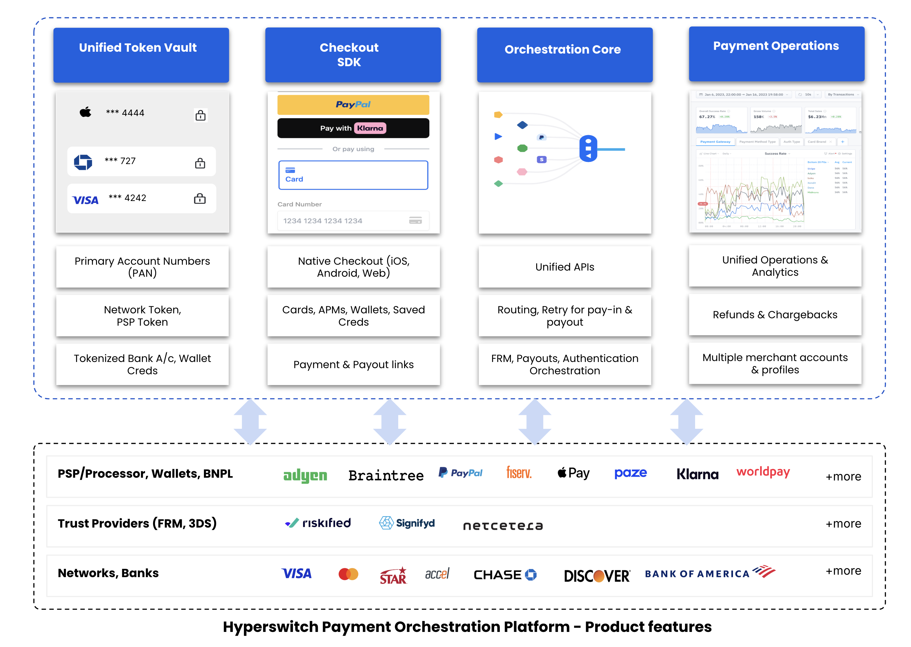
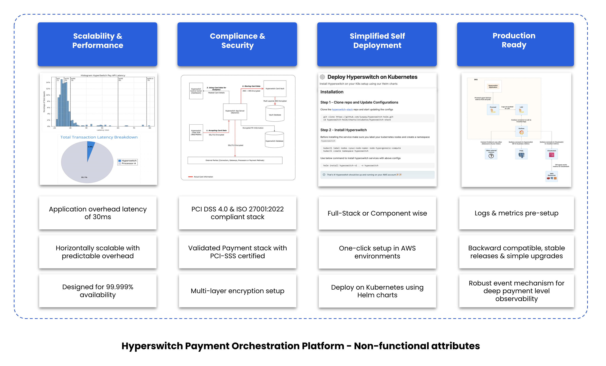
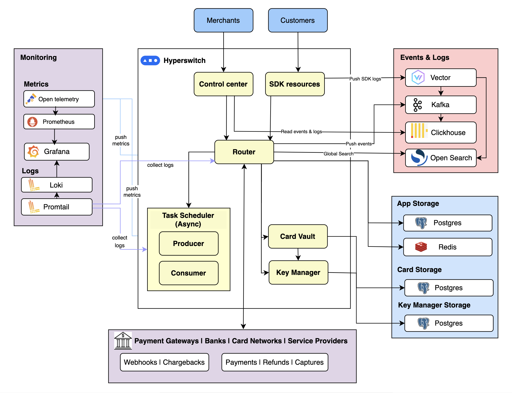

<p align="center">
  
  
</p>

<h1 align="center">Composable Open-Source Payments Infrastructure</h1>

<p align="center">
  
</p>


<!-- @import "[TOC]" {cmd="toc" depthFrom=1 depthTo=6 orderedList=false} -->

<p align="center">
  <a href="https://github.com/juspay/hyperswitch/actions?query=workflow%3ACI+branch%3Amain">
    
  </a>
  <a href="https://github.com/juspay/hyperswitch/blob/main/LICENSE">
    
  </a>
  <a href="https://github.com/juspay/hyperswitch/blob/main/LICENSE">
    
  </a>
</p>

<p align="center">
  <a href="https://www.linkedin.com/company/hyperswitch/">
    
  </a>
  <a href="https://x.com/hyperswitchio">
    
  </a>
  <a href="https://inviter.co/hyperswitch-slack">
    
  </a>
</p>

<hr/>

<details>
<summary><strong>📁 Table of Contents</strong></summary>

- [What Can I Do with Hyperswitch?](#-what-can-i-do-with-hyperswitch)
- [Quickstart (Local Setup)](#-quickstart-local-setup)
- [Cloud Deployment](#cloud-deployment)
- [Hosted Sandbox (No Setup Required)](#hosted-sandbox-no-setup-required)
- [Why Hyperswitch?](#-why-hyperswitch)
- [Architectural Overview](#architectural-overview)
- [Our Vision](#our-vision)
- [Community & Contributions](#community--contributions)
- [Feature Requests & Bugs](#feature-requests--bugs)
- [Versioning](#versioning)
- [License](#copyright-and-license)
- [Team Behind Hyperswitch](#team-behind-hyperswitch)

</details>

<summary><h2> What Can I Do with Hyperswitch?</h2></summary>

Hyperswitch offers a modular, open-source payments infrastructure designed for flexibility and control. Apart from our Payment Suite offering, this solution allows businesses to pick and integrate only the modules they need on top of their existing payment stack — without unnecessary complexity or vendor lock-in.

Each module is independent and purpose-built to optimize different aspects of payment processing.

<h3> Learn More About The Payment Modules </h3>
<details>

- **Cost Observability**  
  Advanced observability tools to audit, monitor, and optimize your payment costs. Detect hidden fees, downgrades, and penalties with self-serve dashboards and actionable insights.  
  _[Read more](https://docs.hyperswitch.io/about-hyperswitch/payments-modules/ai-powered-cost-observability)_

- **Revenue Recovery**  
  Combat passive churn with intelligent retry strategies tuned by card bin, region, method, and more. Offers fine-grained control over retry algorithms, penalty budgets, and recovery transparency.  
  _[Read more](https://docs.hyperswitch.io/about-hyperswitch/payments-modules/revenue-recovery)_

- **Vault**  
  A PCI-compliant vault service to store cards, tokens, wallets, and bank credentials. Provides a unified, secure, and reusable store of customer-linked payment methods.  
  _[Read more](https://docs.hyperswitch.io/about-hyperswitch/payments-modules/vault)_

- **Intelligent Routing**  
  Route each transaction to the PSP with the highest predicted auth rate. Reduce retries, avoid downtime, and minimize latency while maximizing first attempt success.  
  _[Read more](https://docs.hyperswitch.io/about-hyperswitch/payments-modules/intelligent-routing)_

- **Reconciliation**  
  Automate 2-way and 3-way reconciliation with backdated support, staggered scheduling, and customizable outputs. Reduces manual ops effort and increases audit confidence.  
  _[Read more](https://docs.hyperswitch.io/about-hyperswitch/payments-modules/reconciliation)_

- **Alternate Payment Methods**  
  Drop-in widgets for PayPal, Apple Pay, Google Pay, Samsung Pay, Pay by Bank, and BNPL providers like Klarna. Maximizes conversions with seamless one-click checkout.  
  _[Read more](https://docs.hyperswitch.io/about-hyperswitch/payments-modules/enable-alternate-payment-method-widgets)_

</details>

## Quickstart 

<h3> Local Setup via Docker </h3>

```bash
# One-click local setup

git clone --depth 1 --branch latest https://github.com/juspay/hyperswitch

cd hyperswitch

scripts/setup.sh
```
<details>
  <summary><strong>This script: </strong></summary>

  - Detects Docker/Podman  
  - Offers multiple deployment profiles:
    - **Standard**: App server + Control Center  
    - **Full**: Includes monitoring + schedulers  
    - **Minimal**: Standalone App server  
  - Provides access links when done

  If you need further help, check out our [video tutorial](https://docs.hyperswitch.io/hyperswitch-open-source/overview/unified-local-setup-using-docker).  

  👉 After setup, [configure a connector](https://docs.hyperswitch.io/hyperswitch-open-source/account-setup/using-hyperswitch-control-center#add-a-payment-processor) and [test a payment](https://docs.hyperswitch.io/hyperswitch-open-source/account-setup/test-a-payment).
</details>


<h3>Hosted Sandbox (No Setup Required)</h3>

Hyperswitch offers a fully hosted sandbox environment that requires no setup. You can explore the Control Center, configure payment connectors, and test payments directly from the UI.

   <a href="https://app.hyperswitch.io">
     
   </a>


<details>
  <summary><strong> What you can do in the Hosted Sandbox</strong></summary>

  - Access the full Control Center  
  - Configure payment connectors  
  - View logs, routing rules, and retry strategies  
  - Try payments directly from the UI  
</details>

<h3><strong>Cloud Deployment</strong></h3>

You can deploy to AWS, GCP, or Azure using Helm or CDK scripts. Fastest path:

Click to deploy via AWS:

   <a href="https://console.aws.amazon.com/cloudformation/home?region=us-east-1#/stacks/new?stackName=HyperswitchBootstarp&templateURL=https://hyperswitch-synth.s3.eu-central-1.amazonaws.com/hs-starter-config.yaml">
     
   </a>

<details>
  <summary><strong>Cloud Deployment Instructions</strong></summary>

  1. Click the AWS deployment button above to launch the stack.  
  2. Follow the guided steps in the AWS Console (approx. 30–45 mins).  

  ✅ This setup provisions Hyperswitch on your cloud account using CloudFormation.  

  📘 For full instructions and Helm-based deployments, check out the  
  <a href="https://docs.hyperswitch.io/hyperswitch-open-source/deploy-on-kubernetes-using-helm">Cloud Install Guide</a>.
</details>


<a href="#architectural-overview">
  <h2 id="architectural-overview">Architectural Overview</h2>
</a>




## Why Hyperswitch?

Hyperswitch is a commercial open-source payments stack purpose-built for scale, flexibility, and developer experience. Designed with a modular architecture, Hyperswitch lets you pick only the components you need—whether it’s routing, retries, vaulting, or observability—without vendor lock-in or bloated integrations.

Built in Rust for performance and reliability, Hyperswitch supports global payment methods (cards, wallets, BNPL, UPI, Pay by Bank), exposes smart routing and retry logic, and provides a visual workflow builder in the Control Center. Whether you're integrating a full payment suite or augmenting an existing stack with a single module, Hyperswitch meets you where you are.

<strong>“Linux for Payments”</strong> — Hyperswitch is a well-architected reference for teams who want to own their payments stack.

We believe in:

- <strong> Embracing Payment Diversity:</strong> Innovation comes from enabling choice—across payment methods, processors, and flows.

- <strong> Open Source by Default:</strong> Transparency drives trust and builds better, reusable software.

- <strong> Community-Driven Development:</strong> Our roadmap is shaped by real-world use cases and contributors. 

- <strong> Systems-Level Engineering:</strong> We hold ourselves to a high bar for reliability, security, and performance.

- <strong> Maximizing Value Creation:</strong> For developers, customers, and partners alike.

- <strong> Community-Driven, Enterprise-Tested:</strong> Hyperswitch is built in the open with real-world feedback from developers and contributors, and maintained by Juspay, the team powering payment infrastructure for 400+ leading enterprises worldwide.

## Contributing

We welcome contributors from around the world to help build Hyperswitch. Whether you're fixing bugs, improving documentation, or adding new features, your help is appreciated.

Please read our [contributing guidelines](https://github.com/juspay/hyperswitch/blob/main/docs/CONTRIBUTING.md) to get started.

Join the conversation on [Slack](https://inviter.co/hyperswitch-slack) or explore open issues on [GitHub](https://github.com/juspay/hyperswitch/issues).

<a href="#feature-requests">
  <h2 id="feature-requests">Feature requests & Bugs</h2>
</a>

For new product features, enhancements, roadmap discussions, or to share queries and ideas, visit our [GitHub Discussions](https://github.com/juspay/hyperswitch/discussions)

For reporting a bug, please read the issue guidelines and search for [existing and closed issues](https://github.com/juspay/hyperswitch/issues). If your problem or idea is not addressed yet, please [open a new issue](https://github.com/juspay/hyperswitch/issues/new/choose).

<a href="#versioning">
  <h2 id="versioning">Versioning</h2>
</a>

Check the [CHANGELOG.md](./CHANGELOG.md) file for details.

<a href="#copyright-and-license">
  <h2 id="copyright-and-license">Copyright and License</h2>
</a>

This product is licensed under the [Apache 2.0 License](LICENSE).

<a href="#team-behind-hyperswitch">
  <h2 id="team-behind-hyperswitch">Team behind Hyperswitch</h2>
</a>

The core team of 150+ engineers building Hyperswitch. Keep up the great work! 🥂

<a href="https://github.com/juspay/hyperswitch/graphs/contributors">
  
</a>
