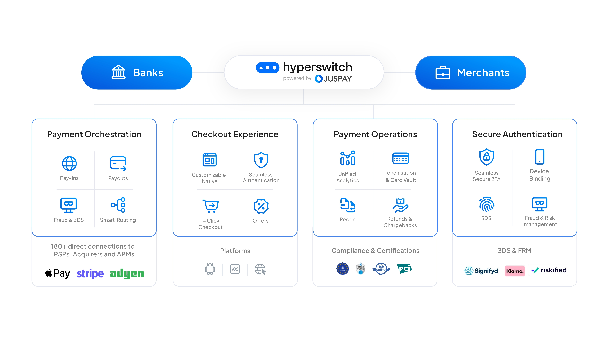
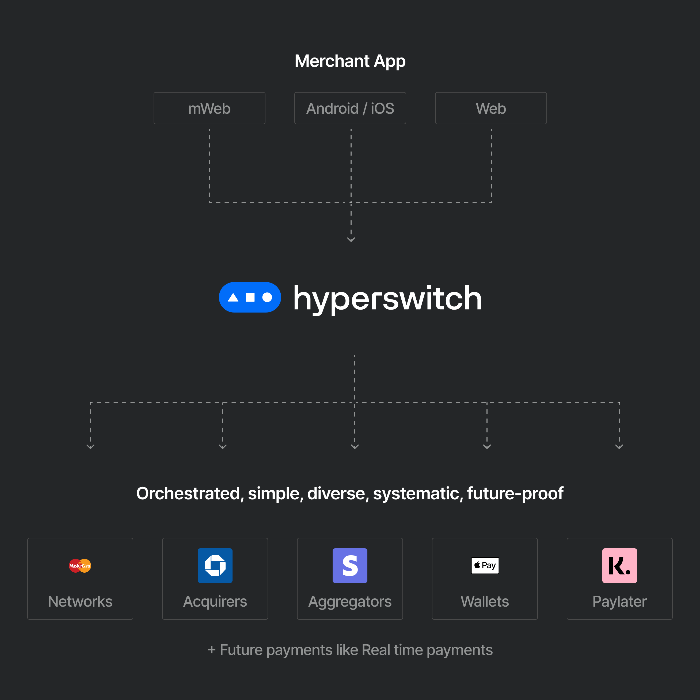

<p align="center">
  
  
</p>

<h1 align="center">The open-source payments switch</h1>

<div align="center" >
The single API to access payment ecosystems across 130+ countries</div>

<p align="center">
  <a href="#%EF%B8%8F-quick-start-guide">Quick Start Guide</a> •
  <a href="https://github.com/juspay/hyperswitch/blob/main/docs/try_local_system.md">Local Setup Guide</a> •
  <a href="#-fast-integration-for-stripe-users">Fast Integration for Stripe Users</a> •
  <a href="https://api-reference.hyperswitch.io/introduction"> API Docs </a> •
  <a href="#-supported-features">Supported Features</a> •
  <br>
  <a href="#whats-included">What's Included</a> •
  <a href="#-join-us-in-building-hyperswitch">Join us in building HyperSwitch</a> •
  <a href="#-community">Community</a> •
  <a href="#-bugs-and-feature-requests">Bugs and feature requests</a> •
  <a href="#-FAQs">FAQs</a> •
  <a href="#-versioning">Versioning</a> •
  <a href="#%EF%B8%8F-copyright-and-license">Copyright and License</a>
</p>

<p align="center">
  <a href="https://github.com/juspay/hyperswitch/actions?query=workflow%3ACI+branch%3Amain">
    
  </a>
  <a href="https://github.com/juspay/hyperswitch/blob/main/LICENSE">
    
  </a>
  <a href="https://github.com/juspay/hyperswitch/blob/main/LICENSE">
    
  </a>
</p>

<hr>


Hyperswitch is a community-led, open payments switch to enable access to the best payments infrastructure for every digital business.

Using Hyperswitch, you can:

- ⬇️ **Reduce dependency** on a single processor like Stripe or Braintree
- 🧑‍💻 **Reduce Dev effort** by 90% to add & maintain integrations
- 🚀 **Improve success rates** with seamless failover and auto-retries
- 💸 **Reduce processing fees** with smart routing
- 🎨 **Customize payment flows** with full visibility and control
- 🌐 **Increase business reach** with local/alternate payment methods

<br>


<a href="#Quick Start Guide">
  <h2 id="Quick Start Guide">⚡️ Quick Start Guide</h2>
</a>

### One-click deployment on AWS cloud

The fastest and easiest way to try Hyperswitch is via our CDK scripts

1. Click on the following button for a quick standalone deployment on AWS, suitable for prototyping.
   No code or setup is required in your system and the deployment is covered within the AWS free-tier setup.

   <a href="https://console.aws.amazon.com/cloudformation/home?region=us-east-1#/stacks/new?stackName=HyperswitchBootstarp&templateURL=https://hyperswitch-synth.s3.eu-central-1.amazonaws.com/hs-starter-config.yaml"></a>

2. Sign-in to your AWS console.

3. Follow the instructions provided on the console to successfully deploy Hyperswitch

For an early access to the production-ready setup fill this <a href="https://forms.gle/v6ru55XDZFufVPnu9">Early Access Form</a>

### Run it on your system

You can run Hyperswitch on your system using Docker Compose after cloning this repository:

```shell
docker compose up -d
```

This will start the payments router, the primary component within Hyperswitch.

Check out the [local setup guide][local-setup-guide] for a more comprehensive
setup, which includes the [scheduler and monitoring services][docker-compose-scheduler-monitoring].

[local-setup-guide]: /docs/try_local_system.md
[docker-compose-scheduler-monitoring]: /docs/try_local_system.md#run-the-scheduler-and-monitoring-services

<a href="#Fast-Integration-for-Stripe-Users">
  <h2 id="Fast Integration for Stripe Users">🔌 Fast Integration for Stripe Users</h2>
</a>

If you are already using Stripe, integrating with Hyperswitch is fun, fast & easy.
Try the steps below to get a feel for how quick the setup is:

1. Get API keys from our [dashboard].
2. Follow the instructions detailed on our
   [documentation page][migrate-from-stripe].

[dashboard]: https://app.hyperswitch.io/register
[migrate-from-stripe]: https://hyperswitch.io/docs/migrateFromStripe

<a href="#Supported-Features">
  <h2 id="Supported Features">✅ Supported Features</h2>
</a>

### 🌟 Supported Payment Processors and Methods

As of Sept 2023, we support 50+ payment processors and multiple global payment methods.
In addition, we are continuously integrating new processors based on their reach and community requests.
Our target is to support 100+ processors by H2 2023.
You can find the latest list of payment processors, supported methods, and features [here][supported-connectors-and-features].

[supported-connectors-and-features]: https://hyperswitch.io/pm-list

### 🌟 Hosted Version

In addition to all the features of the open-source product, our hosted version
provides features and support to manage your payment infrastructure, compliance,
analytics, and operations end-to-end:

- **System Performance & Reliability**

  - Scalable to support 50000 tps
  - System uptime of up to 99.99%
  - Deployment with very low latency
  - Hosting option with AWS or GCP

- **Value Added Services**

  - Compliance Support, incl. PCI, GDPR, Card Vault etc
  - Customise the integration or payment experience
  - Control Center with elaborate analytics and reporting
  - Integration with Risk Management Solutions
  - Integration with other platforms like Subscription, E-commerce, Accounting,
    etc.

- **Enterprise Support**

  - 24x7 Email / On-call Support
  - Dedicated Relationship Manager
  - Custom dashboards with deep analytics, alerts, and reporting
  - Expert team to consult and improve business metrics

You can [try the hosted version in our sandbox][dashboard].

<a href="#FAQs">
  <h2 id="FAQs">🤔 FAQs</h2>
</a>

Got more questions?
Please refer to our [FAQs page][faqs].

[faqs]: https://hyperswitch.io/docs/devSupport

<!--
## Documentation

Please refer to the following documentation pages:

- Getting Started Guide [Link]
- API Reference [Link]
- Payments Fundamentals [Link]
- Installation Support [Link]
- Router Architecture [Link]
 -->

<a href="#what's-Included❓">
  <h2 id="what's-Included❓">What's Included❓</h2>
</a>

Within the repositories, you'll find the following directories and files,
logically grouping common assets and providing both compiled and minified
variations.

### Repositories

The current setup contains a single repo, which contains the core payment router
and the various connector integrations under the `src/connector` sub-directory.

<!-- ### Sub-Crates -->

### 🌳 Files Tree Layout

<!-- FIXME: this table should either be generated by a script or smoke test
should be introduced, checking it agrees with the actual structure -->

```text
.
├── config                             : Initial startup config files for the router
├── connector-template                 : boilerplate code for connectors
├── crates                             : sub-crates
│   ├── api_models                     : Request/response models for the `router` crate
│   ├── cards                          : Types to handle card masking and validation
│   ├── common_enums                   : Enums shared across the request/response types and database types
│   ├── common_utils                   : Utilities shared across `router` and other crates
│   ├── data_models                    : Represents the data/domain models used by the business/domain layer
│   ├── diesel_models                  : Database models shared across `router` and other crates
│   ├── drainer                        : Application that reads Redis streams and executes queries in database
│   ├── external_services              : Interactions with external systems like emails, AWS KMS, etc.
│   ├── masking                        : Personal Identifiable Information protection
│   ├── redis_interface                : A user-friendly interface to Redis
│   ├── router                         : Main crate of the project
│   ├── router_derive                  : Utility macros for the `router` crate
│   ├── router_env                     : Environment of payment router: logger, basic config, its environment awareness
│   ├── scheduler                      : Scheduling and executing deferred tasks like mail scheduling
│   ├── storage_impl                   : Storage backend implementations for data structures & objects
│   └── test_utils                     : Utilities to run Postman and connector UI tests
├── docs                               : hand-written documentation
├── loadtest                           : performance benchmarking setup
├── migrations                         : diesel DB setup
├── monitoring                         : Grafana & Loki monitoring related configuration files
├── openapi                            : automatically generated OpenAPI spec
├── postman                            : postman scenarios API
└── scripts                            : automation, testing, and other utility scripts
```

<a href="#Join-us-in-building-Hyperswitch">
  <h2 id="Join-us-in-building-Hyperswitch">💪 Join us in building Hyperswitch</h2>
</a>

### 🤝 Our Belief

> Payments should be open, fast, reliable and affordable to serve
> the billions of people at scale.

Globally payment diversity has been growing at a rapid pace.
There are hundreds of payment processors and new payment methods like BNPL,
RTP etc.
Businesses need to embrace this diversity to increase conversion, reduce cost
and improve control.
But integrating and maintaining multiple processors needs a lot of dev effort.
Why should devs across companies repeat the same work?
Why can't it be unified and reused? Hence, Hyperswitch was born to create that
reusable core and let companies build and customise it as per their specific requirements.

### ✨ Our Values

1. Embrace Payments Diversity: It will drive innovation in the ecosystem in
   multiple ways.
2. Make it Open Source: Increases trust; Improves the quality and reusability of
   software.
3. Be community driven: It enables participatory design and development.
4. Build it like Systems Software: This sets a high bar for Reliability,
   Security and Performance SLAs.
5. Maximise Value Creation: For developers, customers & partners.

### 🤍 Contributing

This project is being created and maintained by [Juspay](https://juspay.in),
South Asia's largest payments orchestrator/switch, processing more than 50
Million transactions per day. The solution has 1Mn+ lines of Haskell code built
over ten years.
Hyperswitch leverages our experience in building large-scale, enterprise-grade &
frictionless payment solutions.
It is built afresh for the global markets as an open-source product in Rust.
We are long-term committed to building and making it useful for the community.

The product roadmap is open for the community's feedback.
We shall evolve a prioritisation process that is open and community-driven.
We welcome contributions from the community. Please read through our
[contributing guidelines](/docs/CONTRIBUTING.md).
Included are directions for opening issues, coding standards, and notes on
development.

- We appreciate all types of contributions: code, documentation, demo creation, or some new way you want to contribute to us.
  We will reward every contribution with a Hyperswitch branded t-shirt.
- 🦀 **Important note for Rust developers**: We aim for contributions from the community across a broad range of tracks.
  Hence, we have prioritised simplicity and code readability over purely idiomatic code.
  For example, some of the code in core functions (e.g., `payments_core`) is written to be more readable than pure-idiomatic.

<a href="#Community">
  <h2 id="Community">👥 Community</h2>
</a>

Get updates on Hyperswitch development and chat with the community:

- [Discord server][discord] for questions related to contributing to hyperswitch, questions about the architecture, components, etc.
- [Slack workspace][slack] for questions related to integrating hyperswitch, integrating a connector in hyperswitch, etc.
- [GitHub Discussions][github-discussions] to drop feature requests or suggest anything payments-related you need for your stack.

[discord]: https://discord.gg/wJZ7DVW8mm
[slack]: https://join.slack.com/t/hyperswitch-io/shared_invite/zt-2awm23agh-p_G5xNpziv6yAiedTkkqLg
[github-discussions]: https://github.com/juspay/hyperswitch/discussions

<div style="display: flex;  justify-content: center;">
    <div style="margin-right:10px">
    <a href="https://www.producthunt.com/posts/hyperswitch-2?utm_source=badge-top-post-badge&utm_medium=badge&utm_souce=badge-hyperswitch&#0045;2" target="_blank">
        
    </a>
    </div>
    <div style="margin-right:10px">
    <a href="https://www.producthunt.com/posts/hyperswitch-2?utm_source=badge-top-post-topic-badge&utm_medium=badge&utm_souce=badge-hyperswitch&#0045;2" target="_blank">
        
    </a>
  </div>
  <div style="margin-right:10px">
    <a href="https://www.producthunt.com/posts/hyperswitch-2?utm_source=badge-top-post-topic-badge&utm_medium=badge&utm_souce=badge-hyperswitch&#0045;2" target="_blank">
        
    </a>
  </div>
</div>

<a href="#Bugs and feature requests">
  <h2 id="Bugs and feature requests">🐞 Bugs and feature requests</h2>
</a>

Please read the issue guidelines and search for [existing and closed issues].
If your problem or idea is not addressed yet, please [open a new issue].

[existing and closed issues]: https://github.com/juspay/hyperswitch/issues
[open a new issue]: https://github.com/juspay/hyperswitch/issues/new/choose

<a href="#Versioning">
  <h2 id="Versioning">🔖 Versioning</h2>
</a>

Check the [CHANGELOG.md](./CHANGELOG.md) file for details.

<a href="#©Copyright and License">
  <h2 id="©Copyright and License">©️ Copyright and License</h2>
</a>

This product is licensed under the [Apache 2.0 License](LICENSE).

<a href="#Thanks to all contributors">
  <h2 id="Thanks to all contributors">✨ Thanks to all contributors</h2>
</a>

Thank you for your support in hyperswitch's growth. Keep up the great work! 🥂

<a href="https://github.com/juspay/hyperswitch/graphs/contributors">
  
</a>
