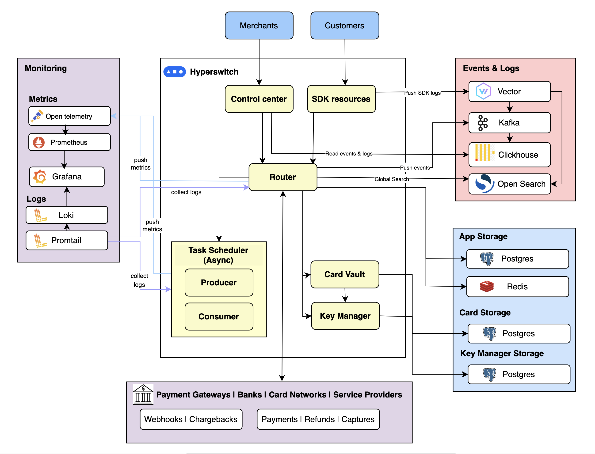

  
  

<h1 align="center">Open-Source Payments Orchestration</h1>

Single API to access the payments ecosystem and its features

  
  
  

  
  
  

Juspay, founded in 2012, is a global leader in payment orchestration and checkout solutions, trusted by 400+ leading enterprises and brands worldwide. Hyperswitch is Juspay's new generation of composable, commercial open-source payments platform for merchant and brands. It is an enterprise-grade, transparent and modular payments platform designed to provide digital businesses access to the best payments infrastructure.

Here are the key components of Hyperswitch that deliver the whole solution:

* [Hyperswitch Backend](https://github.com/juspay/hyperswitch): Hyperswitch backend enables seamless payment processing with comprehensive support for various payment flows - authorization, authetication, void and capture workflows along with robust management of post-payment processes like refunds and chargeback handling. Additionally, Hyperswitch supports non-payment use cases by enabling connections with external FRM or authentication providers as part of the payment flow. The backend optimizes payment routing with customizable workflows, including success rate-based routing, rule-based routing, volume distribution, fallback handling, and intelligent retry mechanisms for failed payments based on specific error codes.

* [SDK (Frontend)](https://github.com/juspay/hyperswitch-web): The SDK, available for web, [Android, and iOS](https://github.com/juspay/hyperswitch-client-core), unifies the payment experience across various methods such as cards, wallets, BNPL, bank transfers, and more, while supporting the diverse payment flows of underlying PSPs. When paired with the locker, it surfaces the user's saved payment methods.    

* [Control Centre](https://github.com/juspay/hyperswitch-control-center): The Control Center enables users to manage the entire payments stack without any coding. It allows the creation of workflows for routing, payment retries, and defining conditions to invoke 3DS, fraud risk management (FRM), and surcharge modules. The Control Center provides access to transaction, refund, and chargeback operations across all integrated PSPs, transaction-level logs for initial debugging, and detailed analytics and insights into payment performance.

Read more at [Hyperswitch docs](https://docs.hyperswitch.io/).

<a href="#Try Hyperswitch">
  <h2 id="Try Hyperswitch">Try Hyperswitch</h2>
</a>

### 1. Local Setup

You can run Hyperswitch on your system using Docker compose after cloning this repository. Check out the [local setup guide][local-setup-guide] for a more details on setting up the entire stack or component wise. This takes 15-mins and gives the following output 

### 2. Deployment on cloud

The fastest and easiest way to try Hyperswitch on AWS is via our CDK scripts

1. Click on the following button for a quick standalone deployment on AWS, suitable for prototyping.
   No code or setup is required in your system and the deployment is covered within the AWS free-tier setup.

   

2. Sign-in to your AWS console.

3. Follow the instructions provided on the console to successfully deploy Hyperswitch. This takes 30-45mins and gives the following output 

We support deployment on GCP and Azure via Helm charts which takes 30-45mins. You can read more at [Hyperswitch docs](https://docs.hyperswitch.io/hyperswitch-open-source/deploy-on-kubernetes-using-helm). 

### 3. Hosted Sandbox

You can experience the product by signing up for our [hosted sandbox](https://app.hyperswitch.io/). The signup process accepts any email ID and provides access to the entire Control Center. You can set up connectors, define workflows for routing and retries, and even try payments from the dashboard.

[docs-link-for-enterprise]: https://docs.hyperswitch.io/hyperswitch-cloud/quickstart
[docs-link-for-developers]: https://docs.hyperswitch.io/hyperswitch-open-source/overview
[contributing-guidelines]: docs/CONTRIBUTING.md
[dashboard-link]: https://app.hyperswitch.io/
[website-link]: https://hyperswitch.io/
[learning-resources]: https://docs.hyperswitch.io/learn-more/payment-flows
[local-setup-guide]: /docs/try_local_system.md
[docker-compose-scheduler-monitoring]: /docs/try_local_system.md#running-additional-services

<a href="Support & Feature requests">
  <h2 id="Support & Feature requests">Support & Feature requests</h2>
</a>

For new product features, enhancements, roadmap discussions, or to share queries and ideas, visit our [GitHub Discussions](https://github.com/juspay/hyperswitch/discussions)

For any support, join the conversation in [Slack](https://join.slack.com/t/hyperswitch-io/shared_invite/zt-2jqxmpsbm-WXUENx022HjNEy~Ark7Orw)

<a href="Our Vision">
  <h2 id="Our Vision">Our Vision</h2>
</a>

> Linux for Payments

Payments are evolving rapidly worldwide, with hundreds of processors, fraud detection systems, authentication modules, and new payment methods and flows emerging. Businesses building or managing their own payment stacks often face similar challenges, struggle with comparable issues, and find it hard to innovate at the desired pace.

Hyperswitch serves as a well-architected designed reference platform, built on best-in-class design principles, empowering businesses to own and customize their payment stack. It provides a reusable core payments stack that can be tailored to specific requirements while relying on the Hyperswitch team for enhancements, support, and continuous innovation.

### Our Values

1. Embrace Payments Diversity: It will drive innovation in the ecosystem in
   multiple ways.
2. Make it Open Source: Increases trust; Improves the quality and reusability of
   software.
3. Be community driven: It enables participatory design and development.
4. Build it like Systems Software: This sets a high bar for Reliability,
   Security and Performance SLAs.
5. Maximise Value Creation: For developers, customers & partners.

This project is being created and maintained by [Juspay](https://juspay.io)

<a href="#Bugs and feature requests">
  <h2 id="bugs-and-feature-requests">Bugs and feature requests</h2>
</a>

Please read the issue guidelines and search for [existing and closed issues].
If your problem or idea is not addressed yet, please [open a new issue].

[existing and closed issues]: https://github.com/juspay/hyperswitch/issues
[open a new issue]: https://github.com/juspay/hyperswitch/issues/new/choose

<a href="#Versioning">
  <h2 id="versioning">Versioning</h2>
</a>

Check the [CHANGELOG.md](./CHANGELOG.md) file for details.

<a href="#©Copyright and License">
  <h2 id="copyright-and-license">Copyright and License</h2>
</a>

This product is licensed under the [Apache 2.0 License](LICENSE).

<a href="Team behind Hyperswitch">
  <h2 id="Team behind Hyperswitch">Team behind Hyperswitch</h2>
</a>

The core team of 150+ engineers building Hyperswitch. Keep up the great work! 🥂

