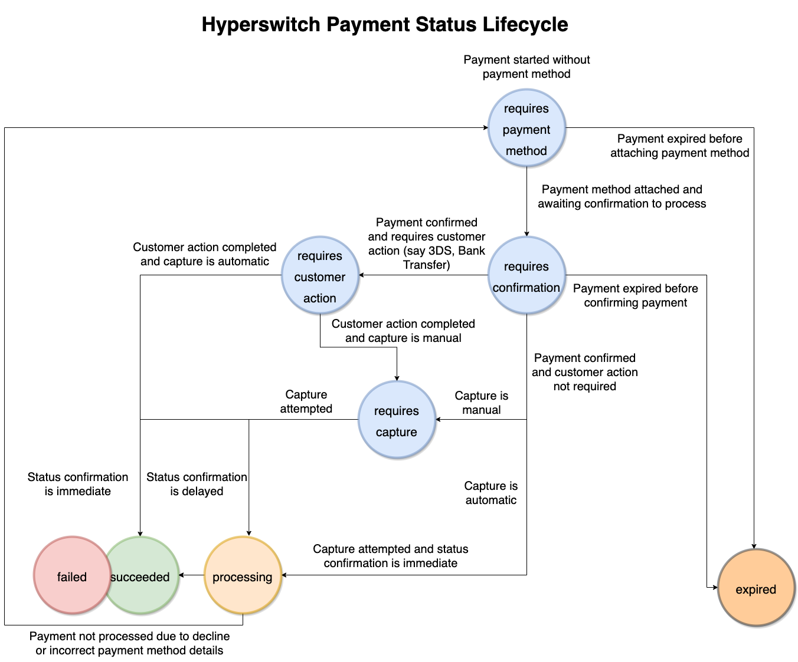

Hyperswitch provides a collection of APIs that enable you to process and manage payments. Our APIs accept and return JSON in the HTTP body and return standard HTTP response codes. You can consume the APIs directly using your favorite HTTP/REST library.

<CardGroup cols={2}>
  <Card title="Try a Payment" icon="money-bill" horizontal={false} href="https://api-reference.hyperswitch.io/v1/payments/payments--create">
    Create your first payment using Hyperswitch APIs.
  </Card>
  <Card title="Payment Flows" icon="receipt" horizontal={false} href="https://api-reference.hyperswitch.io/v1/payments/payment--flows">
    Discover how to process one-time and recurring payments, save payment methods, and more.
  </Card>
  <Card title="Save a payment method" icon="vault" iconType="regular" horizontal={false} href="https://api-reference.hyperswitch.io/v1/payment-methods/paymentmethods--create">
    Save customer payment methods securely for future transactions
  </Card>
  <Card title="Self Hosted?" icon="circle-down" horizontal={false} href="https://api-reference.hyperswitch.io/v1/organization/organization--create">
    Host Hyperswitch on-premise? Utilize our full API suite.
  </Card>
</CardGroup>

## Environment

We have a testing environment referred to <Tooltip tip="Testing environment!">"sandbox</Tooltip>," which you can set up to test API calls without affecting production data. You can sign up on our Dashboard to get API keys to access Hyperswitch API.

Use the following base URLs when making requests to the APIs:

| Environment | Base URL                       |
| ----------- | ------------------------------ |
| Sandbox     | https://sandbox.hyperswitch.io |
| Production  | https://api.hyperswitch.io     |

<Note>
  If you **do not hold a PCI certification** to collect and store card data on your servers, we recommend using [**Unified Checkout**](https://hyperswitch.io/docs/sdkIntegrations/unifiedCheckoutWeb/#unified-checkout) to accept card information from users.
</Note>

## Authentication and API keys

Hyperswitch authenticates your API requests using your account’s API keys. Each account has two API keys for authentication:

| Key                  | Example         | When to Use                                                                                                                              |
| -------------------- | --------------- | ---------------------------------------------------------------------------------------------------------------------------------------- |
| Secret key (API-key) | `snd_c69***`    | Used to authenticate API requests from your merchant server. **Don’t expose this key** on a website or embed it in a mobile application. |
| Publishable key      | `pk_snd_3b3***` | Used to authenticate API requests from your app’s client. Can be publicly-accessible in your web or mobile app’s client-side code.       |

<Check>
  Get your [API key](https://app.hyperswitch.io/developers?tabIndex=1) and [Publishable Key](https://app.hyperswitch.io/home)
</Check>

<Check>
  [Postman Collection](https://www.postman.com/hyperswitch/workspace/hyperswitch-development/collection/25176162-630b5353-7002-44d1-8ba1-ead6c230f2e3)
</Check>

## Payment Status Lifecycle

Hyperswitch handles the complex functionality of a comprehensive payments flow through the Payments object that transitions through multiple states during its payments lifecycle. Given below are the various statuses a payment can have:

| Payment Status           | Description                                                                                                                                                                                                 |
| ------------------------ | ----------------------------------------------------------------------------------------------------------------------------------------------------------------------------------------------------------- |
| requires_payment_method  | Once you create a payment through payments/create endpoint with no payment method attached to it, the payments object transitions to ‘requires_payment_method’.                                             |
| requires_confirmation    | After attaching a payment method through payments/update endpoint, the payments object requires you to confirm the payment.                                                                                 |
| requires_customer_action | Once the payment is confirmed through payments/confirm endpoint, if additional authentication is required, the payments object transitions to this state.                                                   |
| requires_capture         | If you want to do separate authorize and capture, setting capture field to ‘manual’ during payments/create or confirm call will transition the payment object to this state after customer action succeeds. |
| processing               | In case of automatic capture, the payments object transitions to processing state post confirm call and subsequent customer authentication if available.                                                    |
| succeeded                | The payments object reaches success state post confirmation of successful processing from the payment processor.                                                                                            |
| failed                   | The payments object transitions to a failed state when the payment processor confirms the processing failure.                                                                                               |

## Payment Lifecycle - more payment states

| Payment Status           | Description                                                                                                                                                                                                 |
| ------------------------ | ----------------------------------------------------------------------------------------------------------------------------------------------------------------------------------------------------------- |
| Merchant Action Required | The payment is waiting on some action from the merchant (e.g., manual fraud approval)                                                                                                                       |
| Partially Captured       | The payment has been captured partially, and the remaining amount cannot be captured                                                                                                                        |
| Partially Captured and Capturable | The payment has been captured partially and the remaining amount is capturable                                                                                                                     |
| Partially Authorized and Requires Capture | The payment has been authorized for a partial amount and requires capture                                                                                                              |
| Conflicted               | There has been a discrepancy between the amount/currency sent in the request and the amount/currency received by the processor. Applicable for Crypto payments and Bank transfer payments (EU) where user can change the amount on Bank page |
| Expired                  | The payment expired before it could be captured                                                                                                                                                             |

## Redirect URL

This is what a url looks like after redirection

`https://app.hyperswitch.io?status=succeeded&payment_intent_client_secret=pay_NCv9vc19f8aa75OpFxH8_secret_V4zAc7V0C8WAw6FECMKM&amount=10000&manual_retry_allowed=false&signature=4fae0cfa775e4551db9356563d4b98b55662fe3c1c945fe215d90ccf3541282c535909ae901d82174d6b1e46ba1684aa0aa4c8861be0e2a9ef6f950a975d5014&signature_algorithm=HMAC-SHA512`

The available parameters are as follows:

- **status** - can have values of `succeeded`, `processing`and `failed`.
- **payment_intent_client_secret** - This is the client secret associated with the payment. This can be used to retrieve the payment status from hyperswitch.
- **manual_retry_allowed** - whether this payment can be retried or not.
- **signature** - A HMAC signature of the payload, this can be verified using the `payment_response_hash_key`.
- **signature_algorithm** - The HMAC algorithm used to calculate the signature.
