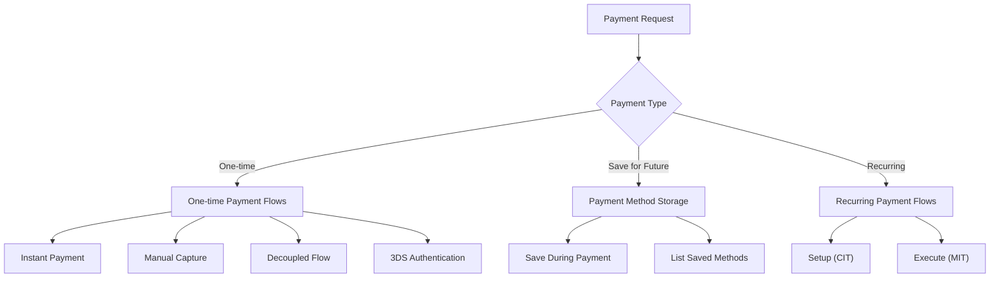
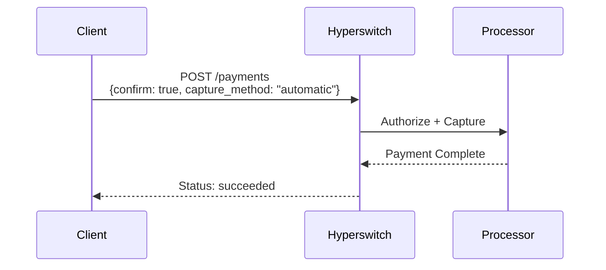
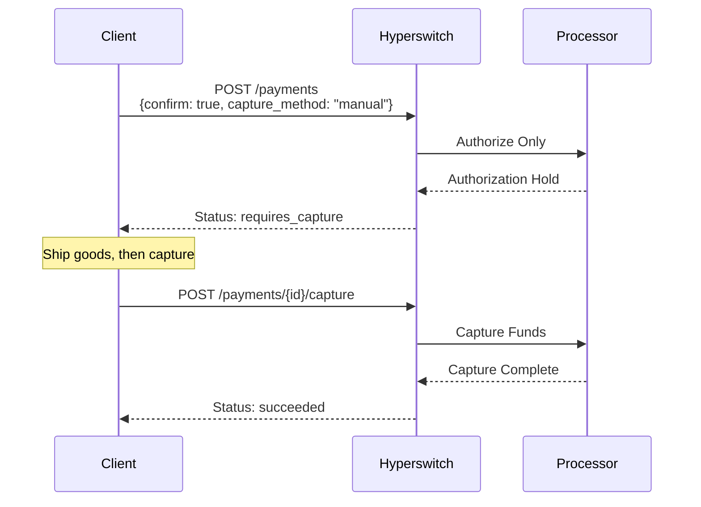
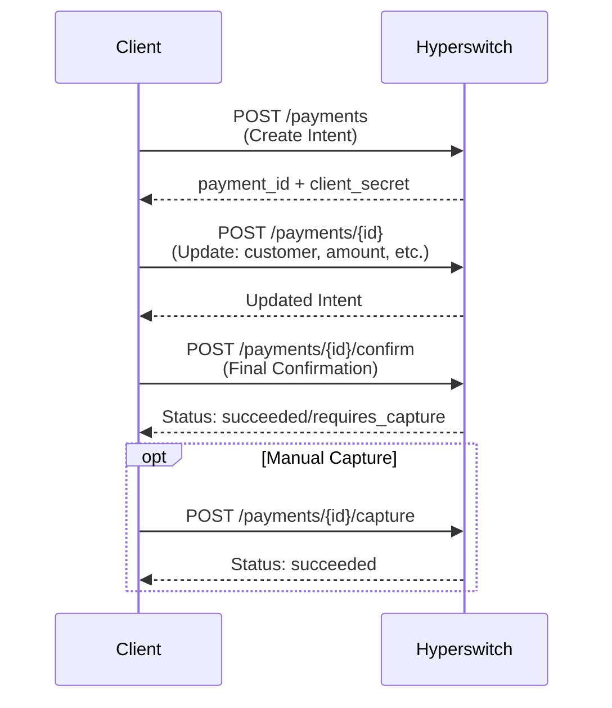
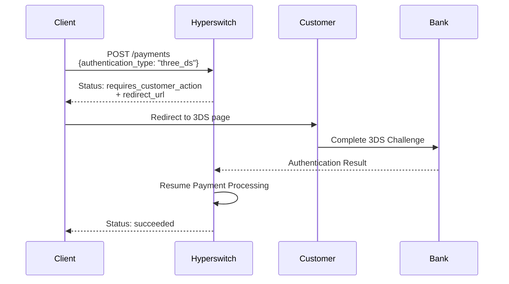
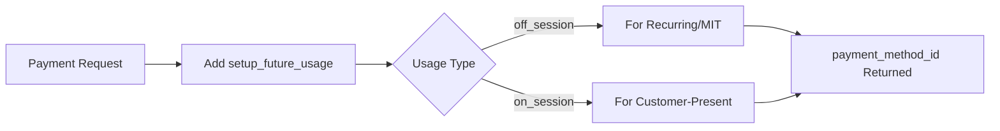
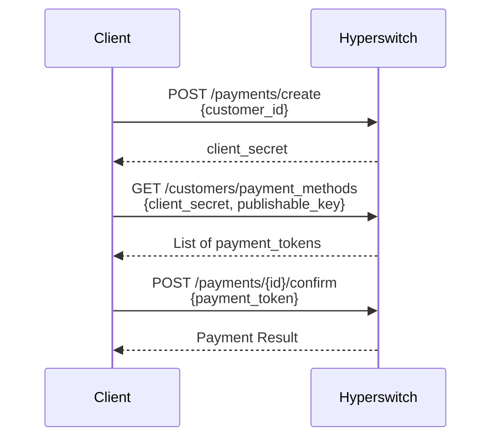
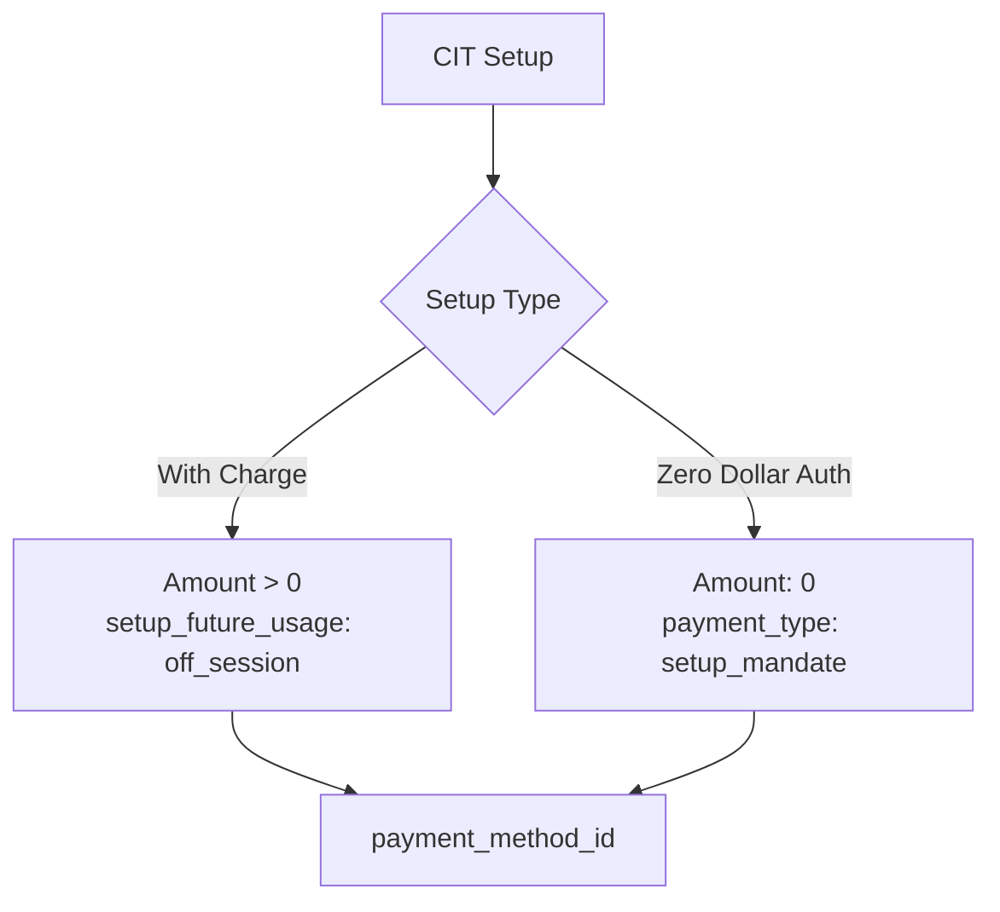
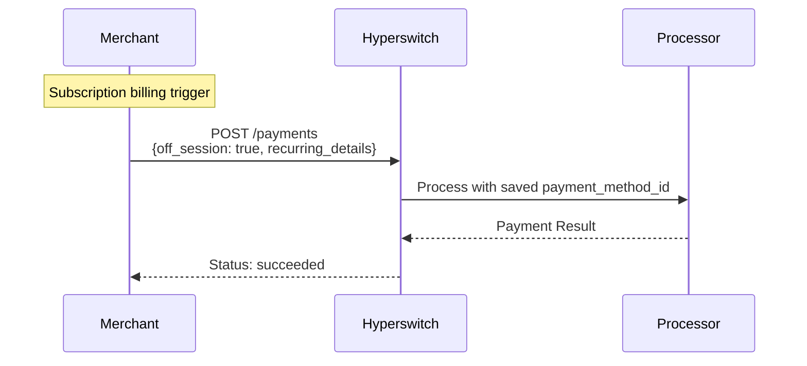
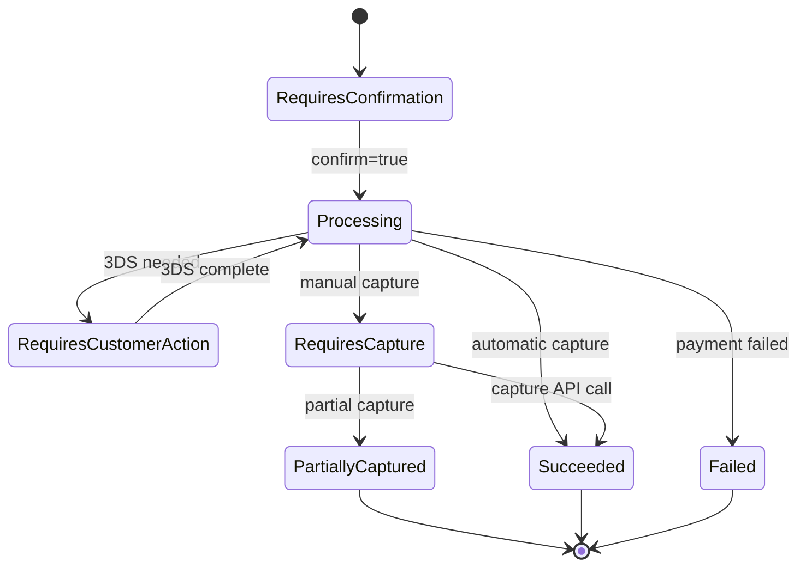

Hyperswitch provides flexible payment processing with multiple flow patterns to accommodate different business needs. The system supports one-time payments, saved payment methods, and recurring billing through a comprehensive API design.

## One-Time Payment Patterns

### 1. Instant Payment (Automatic Capture)
**Use Case:** Simple, immediate payment processing

**Endpoint:**
`POST /payments`

**Required Fields:**
- `confirm: true`
- `capture_method: "automatic"`
- `payment_method`

**Final Status:** `succeeded`

### 2. Two-Step Manual Capture
**Use Case:** Deferred settlement (e.g., ship before charging)

**Flow:**
1. **Authorize:** `POST /payments` with `capture_method: "manual"`
2. **Status:** `requires_capture`
3. **Capture:** `POST /payments/{payment_id}/capture`
4. **Final Status:** `succeeded`

### 3. Fully Decoupled Flow
**Use Case:** Complex checkout journeys with multiple modification steps. Useful in headless checkout or B2B portals where data is filled progressively.

**Endpoints:**
- **Create:**
  `POST /payments`
- **Update:**
  `POST /payments/{payment_id}`
- **Confirm:**
  `POST /payments/{payment_id}/confirm`
- **Capture:**
  `POST /payments/{payment_id}/capture` (if manual)

### 4. 3D Secure Authentication Flow
**Use Case:** Enhanced security with customer authentication

**Additional Fields:**
- `authentication_type: "three_ds"`

**Status Progression:** `processing` → `requires_customer_action` → `succeeded`

## Payment Method Management

### 1. Saving Payment Methods

**During Payment Creation:**
- Add `setup_future_usage: "off_session"` or `"on_session"`
- Include `customer_id`
- **Result:** `payment_method_id` returned on success

**Understanding `setup_future_usage`:**
- **`on_session`**: Use when the customer is actively present during the transaction. This is typical for scenarios like saving card details for faster checkouts in subsequent sessions where the customer will still be present to initiate the payment (e.g., card vaulting for e-commerce sites).
- **`off_session`**: Use when you intend to charge the customer later without their active involvement at the time of charge. This is suitable for subscriptions, recurring billing, or merchant-initiated transactions (MITs) where the customer has pre-authorized future charges.

### 2. Using Saved Payment Methods

**Steps:**
1. **Initiate:** Create payment with `customer_id`
2. **List:** Get saved cards via `GET /customers/payment_methods`
3. **Confirm:** Use selected `payment_token` in confirm call

### PCI Compliance and `payment_method_id`
Storing `payment_method_id` (which is a token representing the actual payment instrument, which could be a payment token, network token, or payment processor token) significantly reduces your PCI DSS scope. Hyperswitch securely stores the sensitive card details and provides you with this token. While you still need to ensure your systems handle `payment_method_id` and related customer data securely, you avoid the complexities of storing raw card numbers. Always consult with a PCI QSA to understand your specific compliance obligations.

## Recurring Payment Flows

### 3. Customer-Initiated Transaction (CIT) Setup

**Option 1 - Setup with Charge:**
- `setup_future_usage: "off_session"`
- `amount > 0`

**Option 2 - Zero Dollar Authorization:**
- `setup_future_usage: "off_session"`
- `amount: 0`
- `payment_type: "setup_mandate"`

### 4. Merchant-Initiated Transaction (MIT) Execution

**Required Fields:**
- `off_session: true`
- `recurring_details: {
        "type": "payment_method_id",
        "data": "<from_setup>"}`

**Use Case:** Subscription charges, scheduled billing without customer interaction

## Status Flow Summary

## Notes

- **Terminal States:** `succeeded`, `failed`, `cancelled`, `partially_captured` are terminal states requiring no further action
- **Capture Methods:** System supports `automatic` (funds captured immediately), `manual` (funds captured in a separate step), `manual_multiple` (funds captured in multiple partial amounts via separate steps), and `scheduled` (funds captured automatically at a future predefined time) capture methods.
- **Authentication:** 3DS authentication automatically resumes payment processing after customer completion
- **MIT Compliance:** Off-session recurring payments follow industry standards for merchant-initiated transactions
