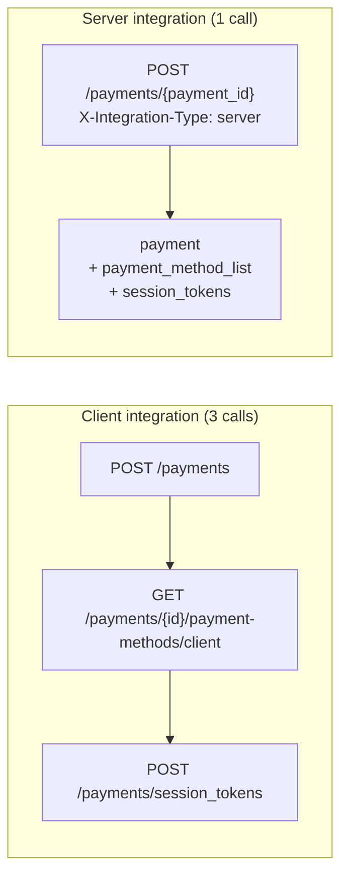

A server-to-server integration drives checkout from your own backend. Your server holds the
merchant API key, calls Hyperswitch, and hands the result to whatever renders your checkout,
whether that is your own UI, a mobile app, or a partner surface.

The obstacle is that a checkout screen needs three things before it can draw anything: the payment
itself, the payment methods available for it, and the wallet session tokens. Fetching them
separately means three sequential round trips, with the client secret threaded through two of them.

Sending `X-Integration-Type: server` collapses that into one call. The response is the payment you
already get, plus the two sections your checkout would otherwise have fetched.



## The header

| Value | Response |
| --- | --- |
| `server` | The payment, plus `payment_method_list` and `session_tokens` |
| `client` | The payment response, unchanged |
| absent | The payment response, unchanged |

Two rules are worth knowing before you send it.

The header is honoured only with **merchant API key authentication**. This route also accepts a
publishable key with a client secret, and a caller authenticated that way gets the ordinary
response even if it sends `server`. The extra sections are built with merchant-level access, so a
client-side caller must not be able to opt into them by setting a header.

An **unrecognised value reads as `client`**. A typo will not fail your payment; it will quietly
give you the ordinary response, which is worth checking first if the sections are missing.

## Walkthrough

### 1. Create the payment

Create the intent as you normally would, without confirming it.

```bash
curl --location 'https://sandbox.hyperswitch.io/payments' \
  --header 'api-key: YOUR_API_KEY' \
  --header 'Content-Type: application/json' \
  --data '{
    "amount": 6540,
    "currency": "USD",
    "confirm": false,
    "capture_method": "automatic",
    "customer_id": "cus_abcdefgh",
    "email": "guest@example.com"
  }'
```

The response carries the `payment_id` and `client_secret` you will need next.

```json
{
  "payment_id": "pay_mbabizu24mvu3mela5njyhpit4",
  "status": "requires_payment_method",
  "amount": 6540,
  "currency": "USD",
  "client_secret": "pay_mbabizu24mvu3mela5njyhpit4_secret_el9ksDkiB8hi6j9N78yo",
  "customer_id": "cus_abcdefgh",
  "profile_id": "pro_abcdefghijklmnop"
}
```

### 2. Fetch everything your checkout needs

Update the intent with the header set. You can update real fields at the same time, or send only
the fields you want to change; the sections are attached either way.

```bash
curl --location 'https://sandbox.hyperswitch.io/payments/pay_mbabizu24mvu3mela5njyhpit4' \
  --header 'api-key: YOUR_API_KEY' \
  --header 'X-Integration-Type: server' \
  --header 'Content-Type: application/json' \
  --data '{
    "amount": 7654
  }'
```

The response is the payment you already know, with two sections added.

```json
{
  "payment_id": "pay_mbabizu24mvu3mela5njyhpit4",
  "status": "requires_payment_method",
  "amount": 7654,
  "currency": "USD",
  "client_secret": "pay_mbabizu24mvu3mela5njyhpit4_secret_el9ksDkiB8hi6j9N78yo",
  "customer_id": "cus_abcdefgh",
  "profile_id": "pro_abcdefghijklmnop",

  "payment_method_list": {
    "payment_methods_enabled": [
      {
        "payment_method": "card",
        "payment_method_type": "credit",
        "card_networks": ["Visa", "Mastercard"],
        "customer_acceptance_support": "supported"
      }
    ],
    "customer_payment_methods": [
      {
        "payment_token": "token_7ebf443fa0504067",
        "payment_method": "card",
        "payment_method_type": "credit",
        "requires_cvv": true,
        "payment_method_data": {
          "card": {
            "last4_digits": "4242",
            "card_network": "Visa",
            "expiry_month": "12",
            "expiry_year": "2030"
          }
        }
      }
    ],
    "sdk_next_action": { "next_action": "confirm" },
    "intent_data": {
      "payment_id": "pay_mbabizu24mvu3mela5njyhpit4",
      "status": "requires_payment_method",
      "amount": 7654,
      "currency": "USD"
    }
  },

  "session_tokens": {
    "payment_id": "pay_mbabizu24mvu3mela5njyhpit4",
    "client_secret": "pay_mbabizu24mvu3mela5njyhpit4_secret_el9ksDkiB8hi6j9N78yo",
    "session_token": [],
    "vault_details": {
      "vault_type": "hyperswitch",
      "vault_data": {
        "sdk_authorization": "cHJvZmlsZV9pZD1wcm9mXzEyMyxwdWJsaXNoYWJsZV9rZXk9cGtfbGl2ZV8xMjM="
      }
    }
  }
}
```

### 3. Confirm

Render your checkout from those two sections, then confirm the payment. A saved card is confirmed
with the `payment_token` that came back in `customer_payment_methods`.

```bash
curl --location 'https://sandbox.hyperswitch.io/payments/pay_mbabizu24mvu3mela5njyhpit4/confirm' \
  --header 'api-key: YOUR_API_KEY' \
  --header 'Content-Type: application/json' \
  --data '{
    "payment_method": "card",
    "payment_method_type": "credit",
    "payment_token": "token_7ebf443fa0504067"
  }'
```

## What the two sections contain

`payment_method_list` is the same object that
[`GET /payments/{payment_id}/payment-methods/client`](/v1/payment-methods/list-payment-methods-for-a-payment-via-client-sdk)
returns. It carries the payment methods the merchant has enabled for this payment, the customer's
saved payment methods with a usable `payment_token` for each, the next action the SDK should take,
and the intent data your checkout needs to render.

`session_tokens` is the same object that
[`POST /payments/session_tokens`](/v1/payments/payments--session-token) returns. It
carries the wallet session tokens, and `vault_details` with the SDK authorization for the vault
session.

Because both are the same objects the standalone endpoints return, anything already parsing those
responses works unchanged.

## When a section cannot be built

The payment write has already committed by the time these sections are built. A section that fails
therefore reports its own error inline rather than failing the request, so a committed state change
is never hidden from you by a problem in a read that came after it.

A failed section is replaced by an `error` object, in the same envelope the standalone endpoint
would have returned.

```json
{
  "payment_id": "pay_mbabizu24mvu3mela5njyhpit4",
  "status": "requires_payment_method",
  "amount": 7654,

  "payment_method_list": {
    "payment_methods_enabled": [],
    "customer_payment_methods": [],
    "sdk_next_action": { "next_action": "confirm" },
    "intent_data": { "payment_id": "pay_mbabizu24mvu3mela5njyhpit4" }
  },

  "session_tokens": {
    "error": {
      "type": "api",
      "message": "Something went wrong",
      "code": "HE_00"
    }
  }
}
```

Check for an `error` key on each section before using it. The payment itself is unaffected, so you
can proceed with the section that did arrive and retry the other, or fall back to its standalone
endpoint.

## Choosing an integration type

| | Client integration | Server integration |
| --- | --- | --- |
| Header | `client`, or none | `server` |
| Authentication | Publishable key with client secret, or merchant API key | Merchant API key only |
| Round trips before rendering | 3 | 1 |
| Where the credentials live | Browser or app, with a client secret | Your backend, with the API key |
| Response shape | Payment only | Payment, plus both sections |

A client integration remains the right choice when the checkout is driven by the Hyperswitch SDK in
a browser or mobile app, because the SDK fetches what it needs itself. Reach for a server
integration when your own backend orchestrates checkout and you would rather make one call than
three.

<Note>
Adding the header never changes the payment itself. The same update, sent with `client` or with no
header at all, does exactly the same thing to the payment; only the response shape differs. An
existing integration that has never heard of this header is unaffected.
</Note>
