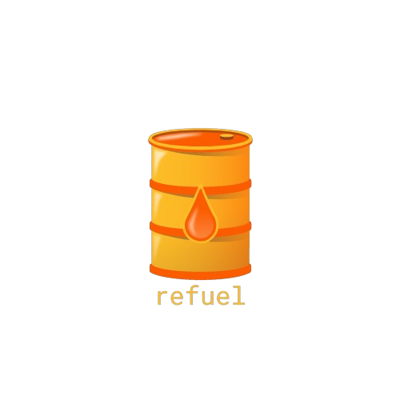

# Refuel
<p align="center">
  
</p>

`refuel` is a simple diesel Postgres migration tool. It is designed to simply running a Postgres database migration with diesel.

## Installing refuel
`refuel` can be installed using `cargo`
```shell
cargo install refuel
```

## Using refuel
Using `refuel` is simple. All you need to do is run the following command.
```shell
refuel --toml-file [path/to/TOML/file]
```

provide `refuel` with a TOML file containing the following keys:
```toml
username = "your_username"
password = "your_password"
dbname = "your_db_name"
```

Simply run the command and let `refuel` handle the rest.
