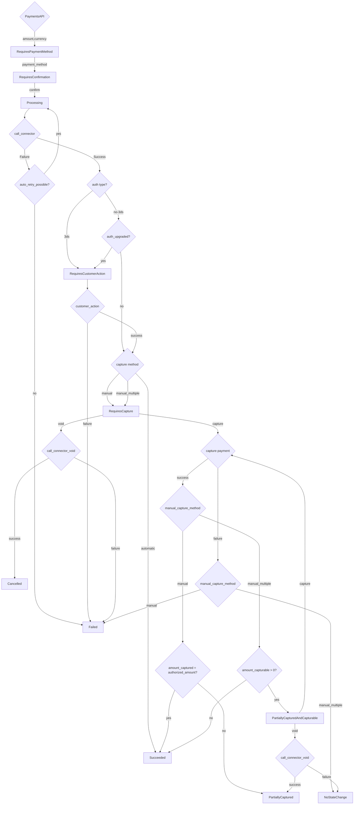

A finite state machine is a machine which provides accurate representation of states as per the given state and input. It is used for validation and provide the next state based on given inputs.

In the context of payments, a state machine validates and provides the next state a payment should be in. This would prevent unsupported state transitions to happen, for ex: A state transition from Success to Processing would be prevented by the state machine.

The two states that are to be intercepted by the state machine are

Responsibilities of a finite state machine

- Validate state transition based on given state and event.
- Transition state based on current state and event.

- Payment Intent state machine



```
