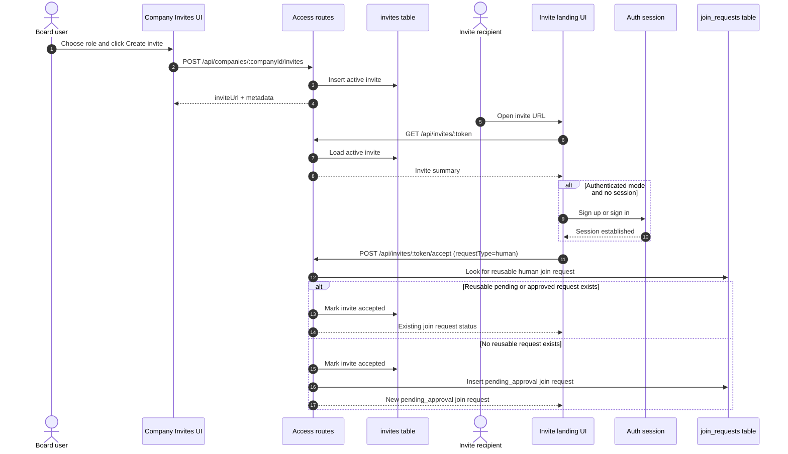
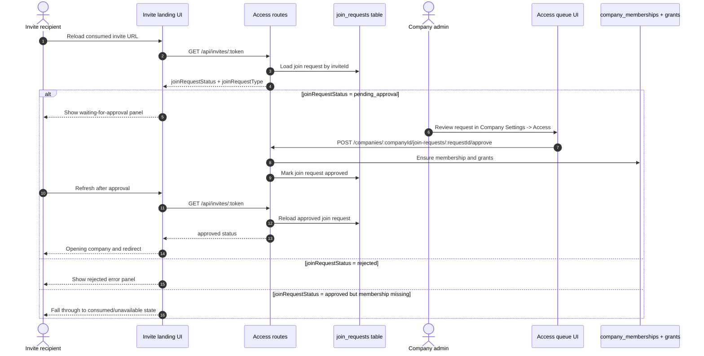
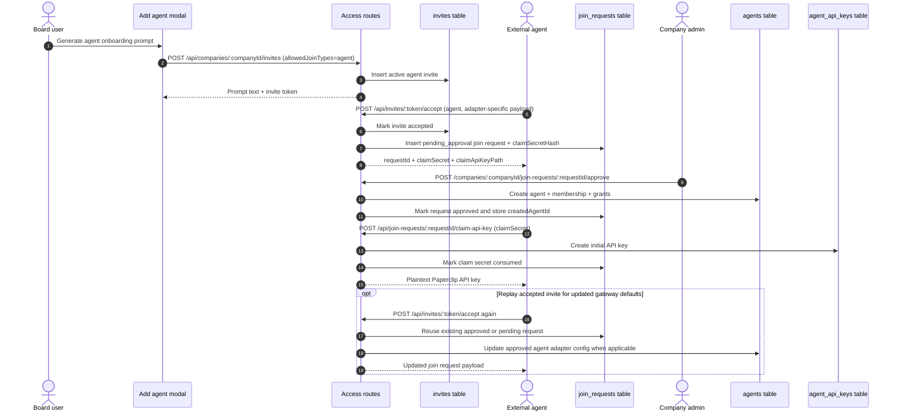

# Invite Flow State Map

Status: Current implementation map
Date: 2026-04-13

This document maps the current invite creation and acceptance states implemented in:

- `ui/src/pages/CompanyInvites.tsx`
- `ui/src/components/NewAgentDialog.tsx`
- `ui/src/pages/InviteLanding.tsx`
- `server/src/routes/access.ts`
- `server/src/lib/join-request-dedupe.ts`

## State Legend

- Invite state: `active`, `revoked`, `accepted`, `expired`
- Join request status: `pending_approval`, `approved`, `rejected`
- Claim secret state for agent joins: `available`, `consumed`, `expired`
- Invite type: `company_join` or `bootstrap_ceo`
- Join type: `human`, `agent`, or `both`

## Entity Lifecycle

```mermaid
flowchart TD
  Board[Board user on invite or add-agent screen]
  HumanInvite[Create human company invite]
  AgentInvite[Generate agent onboarding prompt]
  Active[Invite state: active]
  Revoked[Invite state: revoked]
  Expired[Invite state: expired]
  Accepted[Invite state: accepted]
  BootstrapDone[Bootstrap accepted<br/>no join request]
  HumanReuse{Matching human join request<br/>already exists for same user/email?}
  HumanPending[Join request<br/>pending_approval]
  HumanApproved[Join request<br/>approved]
  HumanRejected[Join request<br/>rejected]
  AgentPending[Agent join request<br/>pending_approval<br/>+ optional claim secret]
  AgentApproved[Agent join request<br/>approved]
  AgentRejected[Agent join request<br/>rejected]
  ClaimAvailable[Claim secret available]
  ClaimConsumed[Claim secret consumed]
  ClaimExpired[Claim secret expired]
  OpenClawReplay[Special replay path:<br/>accepted invite can be POSTed again<br/>for openclaw_gateway only]

  Board --> HumanInvite --> Active
  Board --> AgentInvite --> Active
  Active --> Revoked: revoke
  Active --> Expired: expiresAt passes

  Active --> BootstrapDone: bootstrap_ceo accept
  BootstrapDone --> Accepted

  Active --> HumanReuse: human accept
  HumanReuse --> HumanPending: reuse existing pending request
  HumanReuse --> HumanApproved: reuse existing approved request
  HumanReuse --> HumanPending: no reusable request<br/>create new request
  HumanPending --> HumanApproved: board approves
  HumanPending --> HumanRejected: board rejects
  HumanPending --> Accepted
  HumanApproved --> Accepted

  Active --> AgentPending: agent accept
  AgentPending --> Accepted
  AgentPending --> AgentApproved: board approves
  AgentPending --> AgentRejected: board rejects
  AgentApproved --> ClaimAvailable: createdAgentId + claimSecretHash
  ClaimAvailable --> ClaimConsumed: POST claim-api-key succeeds
  ClaimAvailable --> ClaimExpired: secret expires

  Accepted --> OpenClawReplay
  OpenClawReplay --> AgentPending
  OpenClawReplay --> AgentApproved
```

## Board-Side Screen States

```mermaid
stateDiagram-v2
  [*] --> CompanySelection

  CompanySelection --> NoCompany: no company selected
  CompanySelection --> LoadingHistory: selectedCompanyId present
  LoadingHistory --> HistoryError: listInvites failed
  LoadingHistory --> Ready: listInvites succeeded

  state Ready {
    [*] --> EmptyHistory
    EmptyHistory --> PopulatedHistory: invites exist
    PopulatedHistory --> LoadingMore: View more
    LoadingMore --> PopulatedHistory: next page loaded

    PopulatedHistory --> RevokePending: Revoke active invite
    RevokePending --> PopulatedHistory: revoke succeeded
    RevokePending --> PopulatedHistory: revoke failed

    EmptyHistory --> CreatePending: Create invite
    PopulatedHistory --> CreatePending: Create invite
    CreatePending --> LatestInviteVisible: create succeeded
    CreatePending --> Ready: create failed
    LatestInviteVisible --> CopiedToast: clipboard copy succeeded
    LatestInviteVisible --> Ready: navigate away or refresh
  }

  CompanySelection --> AgentPromptReady: Add-agent modal prompt generator
  AgentPromptReady --> AgentPromptPending: Generate agent onboarding prompt
  AgentPromptPending --> AgentSnippetVisible: prompt generated
  AgentPromptPending --> AgentPromptReady: generation failed
```

## Invite Landing Screen States

```mermaid
stateDiagram-v2
  [*] --> TokenGate

  TokenGate --> InvalidToken: token missing
  TokenGate --> Loading: token present
  Loading --> InviteUnavailable: invite fetch failed or invite not returned
  Loading --> CheckingAccess: signed-in session and invite.companyId
  Loading --> InviteResolved: invite loaded without membership check
  Loading --> AcceptedInviteSummary: invite already consumed<br/>but linked join request still exists

  CheckingAccess --> RedirectToBoard: current user already belongs to company
  CheckingAccess --> InviteResolved: membership check finished and no join-request summary state is active
  CheckingAccess --> AcceptedInviteSummary: membership check finished and invite has joinRequestStatus

  state InviteResolved {
    [*] --> Branch
    Branch --> AgentForm: company_join + allowedJoinTypes=agent
    Branch --> InlineAuth: authenticated mode + no session + join is not agent-only
    Branch --> AcceptReady: bootstrap invite or human-ready session/local_trusted

    InlineAuth --> InlineAuth: toggle sign-up/sign-in
    InlineAuth --> InlineAuth: auth validation or auth error message
    InlineAuth --> RedirectToBoard: auth succeeded and company membership already exists
    InlineAuth --> AcceptPending: auth succeeded and invite still needs acceptance

    AgentForm --> AcceptPending: submit request
    AgentForm --> AgentForm: validation or accept error

    AcceptReady --> AcceptPending: Accept invite
    AcceptReady --> AcceptReady: accept error
  }

  AcceptPending --> BootstrapComplete: bootstrapAccepted=true
  AcceptPending --> RedirectToBoard: join status=approved
  AcceptPending --> PendingApprovalResult: join status=pending_approval
  AcceptPending --> RejectedResult: join status=rejected

  state AcceptedInviteSummary {
    [*] --> SummaryBranch
    SummaryBranch --> PendingApprovalReload: joinRequestStatus=pending_approval
    SummaryBranch --> OpeningCompany: joinRequestStatus=approved<br/>and human invite user is now a member
    SummaryBranch --> RejectedReload: joinRequestStatus=rejected
    SummaryBranch --> ConsumedReload: approved agent invite or other consumed state
  }

  PendingApprovalResult --> PendingApprovalReload: reload after submit
  RejectedResult --> RejectedReload: reload after board rejects
  RedirectToBoard --> OpeningCompany: brief pre-navigation render when approved membership is detected
  OpeningCompany --> RedirectToBoard: navigate to board
```



## Sequence Diagrams

### Human Invite Creation And First Acceptance



### Human Approval And Reload Path



### Agent Invite Approval, Claim, And Replay



## Notes

- `GET /api/invites/:token` treats `revoked` and `expired` invites as unavailable. Accepted invites remain resolvable when they already have a linked join request, and the summary now includes `joinRequestStatus` plus `joinRequestType`.
- Human acceptance consumes the invite immediately and then either creates a new join request or reuses an existing `pending_approval` or `approved` human join request for the same user/email.
- The landing page has two layers of post-accept UI:
  - immediate mutation-result UI from `POST /api/invites/:token/accept`
  - reload-time summary UI from `GET /api/invites/:token` once the invite has already been consumed
- Reload behavior for accepted company invites is now status-sensitive:
  - `pending_approval` re-renders the waiting-for-approval panel
  - `rejected` renders the "This join request was not approved." error panel
  - `approved` only becomes a success path for human invites after membership is visible to the current session; otherwise the page falls through to the generic consumed/unavailable state
- `GET /api/invites/:token/logo` still rejects accepted invites, so accepted-invite reload states may fall back to the generated company icon even though the summary payload still carries `companyLogoUrl`.
- The only accepted-invite replay path in the current implementation is `POST /api/invites/:token/accept` for `agent` requests with `adapterType=openclaw_gateway`, and only when the existing join request is still `pending_approval` or already `approved`.
- `bootstrap_ceo` invites are one-time and do not create join requests.
