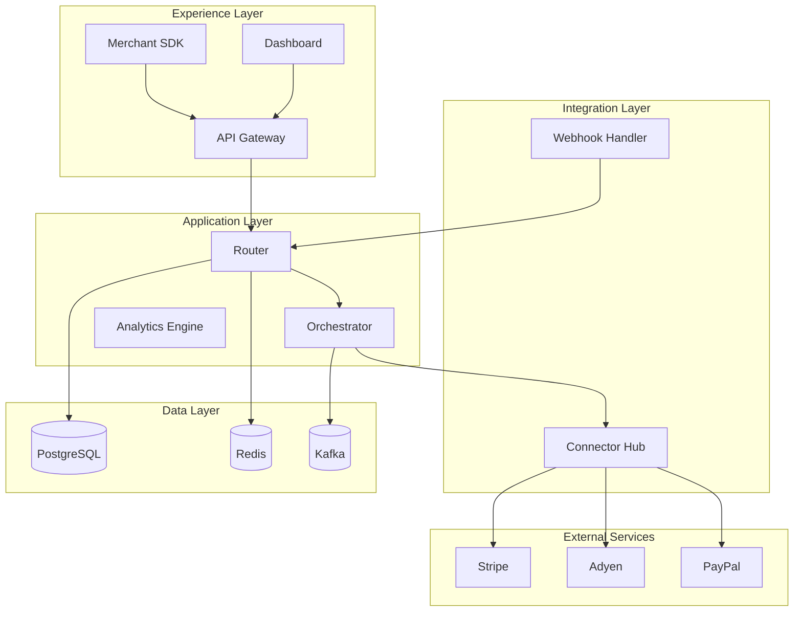
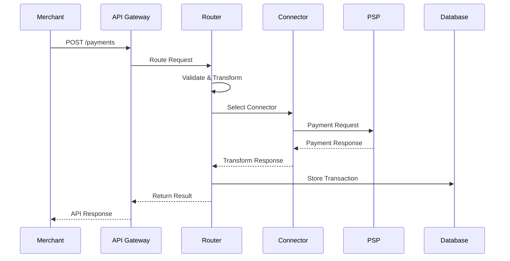

# Hyperswitch Architecture Diagrams

This document provides templates and specifications for architecture diagrams in Hyperswitch documentation.

## 1. Diagram Types Overview

### 1.1 System Architecture Diagrams

High-level overview of the entire Hyperswitch system showing all major components and their interactions.

**Purpose**: Onboarding, system understanding, architectural decisions
**Audience**: Developers, architects, DevOps engineers

### 1.2 Component Architecture Diagrams

Detailed view of specific components showing internal structure and dependencies.

**Purpose**: Implementation guidance, dependency analysis
**Audience**: Developers working on specific components

### 1.3 Integration Architecture Diagrams

Shows how Hyperswitch integrates with external systems, PSPs, and third-party services.

**Purpose**: Integration planning, connector development
**Audience**: Integration engineers, partner teams

## 2. Layer Structure

### 2.1 Three-Tier Architecture Model

Hyperswitch follows a layered architecture pattern. Each layer has distinct responsibilities:

```
┌─────────────────────────────────────────────────────────────┐
│                    EXPERIENCE LAYER                         │
│         (Merchant-facing APIs, SDKs, Dashboards)            │
│                      Color: Green                           │
├─────────────────────────────────────────────────────────────┤
│                    APPLICATION LAYER                        │
│       (Router, Orchestrator, Business Logic)                │
│                       Color: Blue                           │
├─────────────────────────────────────────────────────────────┤
│                    INTEGRATION LAYER                        │
│      (Connectors, External Services, Webhooks)              │
│                      Color: Purple                          │
├─────────────────────────────────────────────────────────────┤
│                    DATA LAYER                               │
│         (Database, Cache, Message Queue)                    │
│                      Color: Gray                            │
└─────────────────────────────────────────────────────────────┘
```

### 2.2 Layer Color Mapping

| Layer | Primary Color | Fill Color | Components |
|-------|--------------|------------|------------|
| Experience | `#4CAF50` | `#C5E8C0` | API Gateway, SDK, Dashboard |
| Application | `#5B9BD5` | `#B3D9F2` | Router, Orchestrator, Analytics |
| Integration | `#9B72CF` | `#D8C8E8` | Connectors, Webhooks, Callbacks |
| Data | `#E0E0E0` | `#F5F5F5` | PostgreSQL, Redis, Kafka |
| External | `#F5A623` | `#F9B872` | PSPs, Banks, Third-party |

## 3. Architecture Diagram Templates

### 3.1 High-Level System Architecture

**SVG Placeholder**: Insert system architecture diagram here

```
[SVG: docs/assets/system-architecture.svg]
```

**Mermaid Equivalent**:



### 3.2 Payment Flow Architecture

**SVG Placeholder**: Insert payment flow architecture diagram

```
[SVG: docs/assets/payment-flow-architecture.svg]
```

**Mermaid Equivalent**:



### 3.3 Connector Architecture

**SVG Placeholder**: Insert connector architecture diagram

```
[SVG: docs/assets/connector-architecture.svg]
```

**Components**:

- Connector Interface
- Request Transformer
- Response Transformer
- Error Handler
- Retry Logic
- Webhook Parser

### 3.4 Data Flow Architecture

**SVG Placeholder**: Insert data flow diagram

```
[SVG: docs/assets/data-flow-architecture.svg]
```

**Data Stores**:

| Store | Purpose | Read/Write Patterns |
|-------|---------|---------------------|
| PostgreSQL | Transactional data | ACID, heavy writes |
| Redis | Cache, sessions | High read, TTL-based |
| Kafka | Event streaming | Append-only, partitions |
| S3 | File storage | Write-once, infrequent read |

## 4. Component Specifications

### 4.1 Component Box Sizing

| Component Type | Width | Height | Description |
|----------------|-------|--------|-------------|
| Service | 140px | 60px | Microservice component |
| Database | 80px | 80px | Data store (cylinder) |
| Queue | 100px | 60px | Message queue |
| API | 120px | 50px | REST/GraphQL endpoint |
| External | 130px | 55px | Third-party service |

### 4.2 Connection Patterns

**Synchronous (HTTP)**:
```
Solid line → Filled arrowhead
Color: #333333
Width: 2px
```

**Asynchronous (Events)**:
```
Solid line → Open arrowhead
Color: #9B72CF
Width: 1.5px
```

**Data Flow**:
```
Dashed line → No arrowhead (bidirectional)
Color: #666666
Width: 1px
```

### 4.3 Grouping Patterns

**Logical Grouping (Dashed Border)**:
```
Border: 1.5px dashed #B8B8F0
Background: Transparent or very light fill
Padding: 16px
```

**Physical Grouping (Solid Border)**:
```
Border: 2px solid [layer-color]
Background: Light fill [layer-fill-color]
Padding: 20px
Corner radius: 12px
```

## 5. Diagram Sections

### 5.1 Header Section

Every architecture diagram should include:

```
┌────────────────────────────────────────────────┐
│ [Diagram Title]                      [Version] │
│ [Brief description of what this shows]         │
├────────────────────────────────────────────────┤
│                                                │
│              [Diagram Content]                 │
│                                                │
└────────────────────────────────────────────────┘
```

### 5.2 Legend Section

Required for diagrams with multiple component types:

```
┌───────────────────────────────────┐
│ Legend:                           │
│ ┌─────┐ Experience Layer          │
│ │     │ (Merchant-facing)         │
│ └─────┘                           │
│ ┌─────┐ Application Layer         │
│ │     │ (Core logic)              │
│ └─────┘                           │
│ ...                               │
└───────────────────────────────────┘
```

### 5.3 Notes Section

For important clarifications:

```
┌───────────────────────────────────┐
│ ℹ️ Notes:                         │
│ • Note about scaling              │
│ • Security consideration          │
│ • Implementation detail           │
└───────────────────────────────────┘
```

## 6. SVG Templates

### 6.1 Layer Container Template

```svg
<svg width="600" height="150" xmlns="http://www.w3.org/2000/svg">
  <defs>
    <style>
      .layer { fill: #C5E8C0; stroke: #4CAF50; stroke-width: 2; }
      .header { fill: #4CAF50; }
      .title { font-family: Inter; font-size: 14px; fill: white; 
               font-weight: 600; }
    </style>
  </defs>
  <!-- Main container -->
  <rect class="layer" x="1" y="1" width="598" height="148" rx="12"/>
  <!-- Header -->
  <path class="header" d="M1,13 L1,1 Q1,1 13,1 L587,1 Q599,1 599,13 L599,35 L1,35 Z"/>
  <text class="title" x="300" y="24" text-anchor="middle">Experience Layer</text>
</svg>
```

### 6.2 Service Component Template

```svg
<svg width="140" height="60" xmlns="http://www.w3.org/2000/svg">
  <style>
    .service { fill: #B3D9F2; stroke: #5B9BD5; stroke-width: 2; }
    .label { font-family: Inter; font-size: 12px; fill: #333333; }
  </style>
  <rect class="service" x="1" y="1" width="138" height="58" rx="8"/>
  <text class="label" x="70" y="35" text-anchor="middle">Router Service</text>
</svg>
```

### 6.3 Database Component Template

```svg
<svg width="80" height="80" xmlns="http://www.w3.org/2000/svg">
  <style>
    .db-body { fill: #E0E0E0; stroke: #999999; stroke-width: 2; }
    .db-top { fill: #F5F5F5; stroke: #999999; stroke-width: 2; }
    .label { font-family: Inter; font-size: 10px; fill: #333333; }
  </style>
  <!-- Cylinder body -->
  <rect class="db-body" x="10" y="25" width="60" height="40"/>
  <!-- Top ellipse -->
  <ellipse class="db-top" cx="40" cy="25" rx="30" ry="10"/>
  <!-- Bottom ellipse (visible part) -->
  <path d="M10,65 Q40,85 70,65" fill="none" stroke="#999999" stroke-width="2"/>
  <text class="label" x="40" y="50" text-anchor="middle">PostgreSQL</text>
</svg>
```

## 7. Best Practices

### 7.1 Clarity

- Limit components per diagram to 15-20 maximum
- Use consistent spacing (minimum 20px between elements)
- Align elements on a grid
- Avoid crossing lines where possible

### 7.2 Consistency

- Same component type = same visual style
- Use the diagram style guide colors
- Maintain consistent text sizing
- Apply uniform border radiuses

### 7.3 Completeness

- Include all relevant components
- Show data flow directions
- Label all connections
- Add notes for edge cases

### 7.4 Maintenance

- Version diagrams with code
- Update when architecture changes
- Include last-updated date
- Link to relevant documentation

## 8. Diagram Checklist

Before publishing an architecture diagram, verify:

- [ ] All components are labeled
- [ ] Legend is included (if multiple types)
- [ ] Color coding follows style guide
- [ ] Connections are properly directed
- [ ] Text is readable at target size
- [ ] Diagram fits intended display width
- [ ] Alternative text description exists
- [ ] Mermaid/code equivalent provided
- [ ] Last-updated date is current
- [ ] Related documentation is linked

---

## Quick Navigation

- [Diagram Style Guide](./DIAGRAM_STYLE_GUIDE.md)
- [Sequence Diagrams](./SEQUENCE_DIAGRAMS.md)
- [Documentation Home](./README.md)
