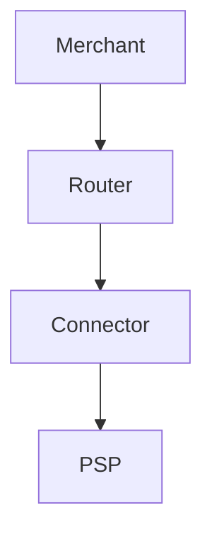

# Hyperswitch Documentation Standards

This directory contains the official documentation style guides and standards for the Hyperswitch project. These standards ensure consistency and quality across all technical documentation.

## Directory Structure

```
docs/
├── README.md                    # This file - documentation overview
├── DIAGRAM_STYLE_GUIDE.md       # Visual style guide for all diagrams
├── ARCHITECTURE_DIAGRAMS.md     # Architecture diagram templates and specs
└── SEQUENCE_DIAGRAMS.md         # Sequence diagram templates and specs
```

## Quick Start

### For Diagram Creators

1. **Read the Style Guide First**: [DIAGRAM_STYLE_GUIDE.md](./DIAGRAM_STYLE_GUIDE.md)
   - Color palette with hex codes
   - Typography specifications
   - Shape and box specifications
   - Arrow and line styles

2. **Choose Your Diagram Type**:
   - **Architecture Diagrams**: System overview, component relationships → [ARCHITECTURE_DIAGRAMS.md](./ARCHITECTURE_DIAGRAMS.md)
   - **Sequence Diagrams**: API flows, request/response patterns → [SEQUENCE_DIAGRAMS.md](./SEQUENCE_DIAGRAMS.md)

### For Documentation Writers

All diagrams in Hyperswitch documentation should:

1. Follow the color palette defined in the style guide
2. Use Inter font family (or similar sans-serif)
3. Include text alternatives (Mermaid code or descriptions)
4. Be versioned alongside code

## Color Palette Quick Reference

| Layer/Type | Primary Color | Fill Color |
|------------|--------------|------------|
| Experience/Merchant | `#4CAF50` | `#C5E8C0` |
| Application/Backend | `#5B9BD5` | `#B3D9F2` |
| External/PSP | `#F5A623` | `#F9B872` |
| Integration | `#9B72CF` | `#D8C8E8` |
| DevOps/Tools | `#4DD0B8` | `#C0F0E8` |
| Process/Neutral | `#E0E0E0` | `#F5F5F5` |

## Document Index

### [DIAGRAM_STYLE_GUIDE.md](./DIAGRAM_STYLE_GUIDE.md)

The master style guide for all visual diagrams. Contains:
- Complete color palette with hex codes
- Typography specifications (font family, sizes, weights)
- Shape and box specifications (corners, borders, sizing)
- Arrow and line styles (sync, async, return)
- SVG template code snippets
- Accessibility considerations
- Export guidelines

**Use this when**: Creating any new diagram or updating existing ones.

### [ARCHITECTURE_DIAGRAMS.md](./ARCHITECTURE_DIAGRAMS.md)

Templates and specifications for architecture diagrams. Contains:
- Three-tier layer structure
- Component specifications
- Connection patterns
- SVG templates for layers, services, databases
- Mermaid code equivalents
- Best practices and checklists

**Use this when**: Documenting system architecture, component relationships, or deployment diagrams.

### [SEQUENCE_DIAGRAMS.md](./SEQUENCE_DIAGRAMS.md)

Templates and specifications for sequence diagrams. Contains:
- Participant types and color coding
- Message types (sync, async, return, self)
- Swimlane specifications
- Control structures (loop, alt, opt)
- Sample templates for common flows:
  - Payment creation
  - Webhook processing
  - Refund flow
  - Error handling
- Process boxes and notes

**Use this when**: Documenting API flows, request/response patterns, or interaction sequences.

## Diagram Decision Tree

```
What are you documenting?
│
├── System structure or component relationships?
│   └── Use ARCHITECTURE_DIAGRAMS.md
│       └── Choose: System, Component, or Integration architecture
│
├── API request/response flows?
│   └── Use SEQUENCE_DIAGRAMS.md
│       └── Choose: Payment, Webhook, Refund, or Error flow
│
├── Data transformations?
│   └── Use SEQUENCE_DIAGRAMS.md (with process boxes)
│
└── Deployment or infrastructure?
    └── Use ARCHITECTURE_DIAGRAMS.md
        └── Choose: Three-tier or Integration architecture
```

## Creating New Diagrams

### Step 1: Plan

1. Identify the diagram type
2. List all components/participants
3. Determine the flow or relationships
4. Choose appropriate colors from the palette

### Step 2: Create

1. Use the SVG templates from the relevant guide
2. Apply the correct color coding
3. Use consistent spacing and sizing
4. Add labels and notes

### Step 3: Document

1. Provide a Mermaid code equivalent
2. Write a text description
3. Add alternative text for accessibility
4. Include the diagram in relevant documentation

### Step 4: Review

Use the checklist from the relevant guide:
- [ ] All elements labeled
- [ ] Colors match style guide
- [ ] Text is readable
- [ ] Alternative description provided
- [ ] Mermaid equivalent included

## Tools and Resources

### Recommended Tools

- **Draw.io / diagrams.net**: Free, supports SVG export
- **Mermaid**: Text-to-diagram, included in GitHub/GitLab
- **Figma**: Collaborative design, SVG export
- **PlantUML**: Text-based diagrams, good for sequence diagrams

### Mermaid Integration

All diagrams should have Mermaid equivalents for:
- Version control (text-based)
- Accessibility (readable by screen readers)
- Quick updates without tooling

Example:


## Contributing

When adding or updating diagrams:

1. Follow the style guide exactly
2. Test diagrams at different zoom levels
3. Verify accessibility (color contrast, alternative text)
4. Include both SVG and Mermaid versions
5. Update this README if adding new documentation files

## Version History

| Version | Date | Changes |
|---------|------|---------|
| 1.0.0 | 2026-03-02 | Initial documentation standards |

## Questions?

- **Style questions**: Refer to [DIAGRAM_STYLE_GUIDE.md](./DIAGRAM_STYLE_GUIDE.md)
- **Architecture diagrams**: Refer to [ARCHITECTURE_DIAGRAMS.md](./ARCHITECTURE_DIAGRAMS.md)
- **Sequence diagrams**: Refer to [SEQUENCE_DIAGRAMS.md](./SEQUENCE_DIAGRAMS.md)

---

Maintained by the Hyperswitch Documentation Team.
