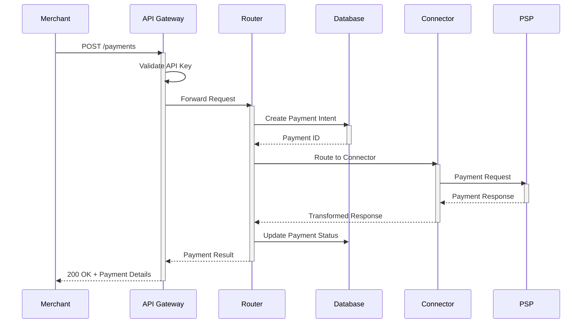
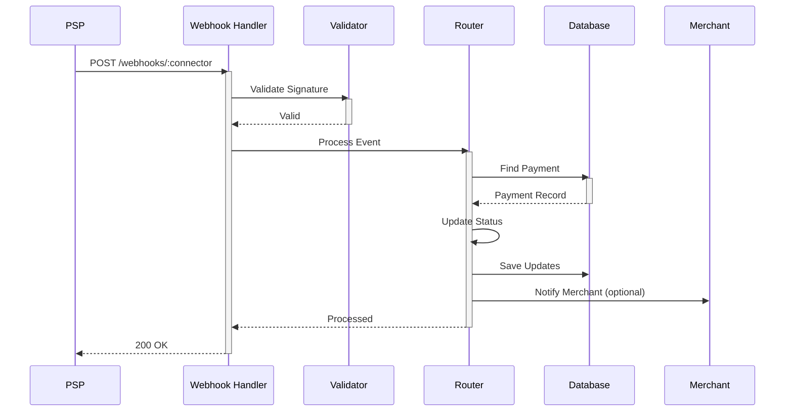
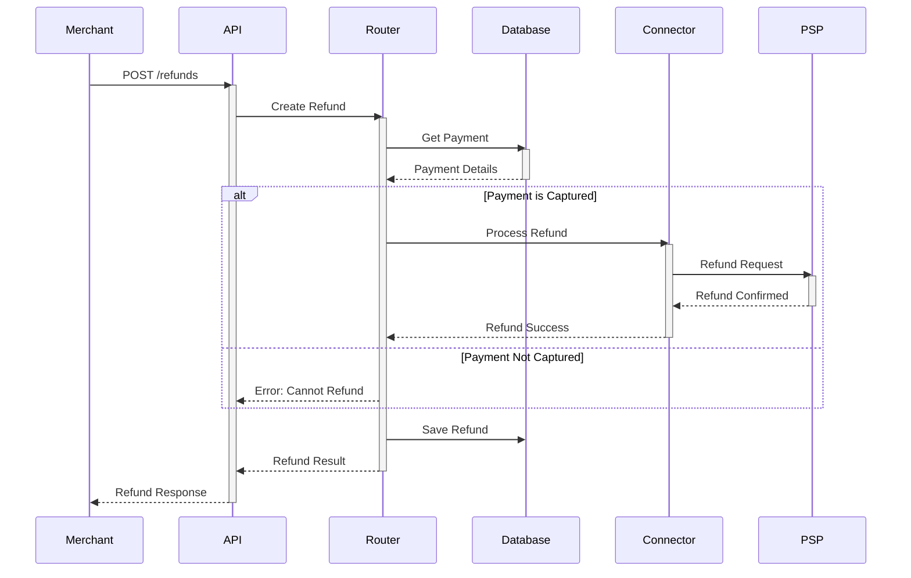
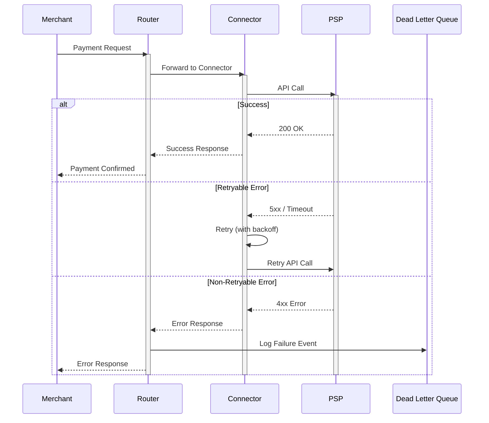

# Hyperswitch Sequence Diagrams

This document provides templates and specifications for sequence diagrams in Hyperswitch documentation.

## 1. Sequence Diagram Overview

Sequence diagrams show interactions between components over time, illustrating the flow of messages and the order of operations.

### 1.1 When to Use Sequence Diagrams

- Documenting API request/response flows
- Explaining payment processing workflows
- Showing webhook handling sequences
- Illustrating error handling flows
- Describing authentication flows

### 1.2 Key Elements

| Element | Visual | Purpose |
|---------|--------|---------|
| Participant | Colored box at top | Actor or component in the flow |
| Lifeline | Dashed vertical line | Timeline for participant |
| Activation | Solid rectangle on lifeline | Period of activity |
| Message | Horizontal arrow | Request or response |
| Note | Box with text | Annotations |
| Loop/Alt | Framed region | Control structures |

## 2. Participant Types and Colors

### 2.1 Color Coding by Type

| Participant Type | Header Color | Fill Color | Examples |
|-----------------|--------------|------------|----------|
| **Merchant/Client** | `#4CAF50` | `#C5E8C0` | Merchant App, SDK, Dashboard |
| **Gateway/API** | `#1A73E8` | `#E8F0FE` | API Gateway, Load Balancer |
| **Service** | `#5B9BD5` | `#B3D9F2` | Router, Orchestrator, Analytics |
| **Connector** | `#9B72CF` | `#D8C8E8` | Stripe Connector, PayPal Connector |
| **External/PSP** | `#F5A623` | `#F9B872` | Stripe, Adyen, PayPal |
| **Data Store** | `#E0E0E0` | `#F5F5F5` | PostgreSQL, Redis, Kafka |
| **Process Box** | `#E0E0E0` | `#F5F5F5` | Process descriptions |

### 2.2 Participant Box Dimensions

| Type | Width | Height |
|------|-------|--------|
| Primary Participant | 100-120px | 40px |
| Secondary Participant | 80-100px | 35px |
| External Service | 90-110px | 38px |

## 3. Message Types

### 3.1 Synchronous Messages

**Visual**: Solid line with filled arrowhead

```
┌─────────┐                    ┌─────────┐
│ Service │ ──────────────────▶│ Target  │
│    A    │      request()     │    B    │
└─────────┘                    └─────────┘
```

**Use for**:
- HTTP requests
- Function calls
- Database queries
- Blocking operations

**SVG Code**:
```svg
<line x1="120" y1="50" x2="280" y2="50" 
      stroke="#333333" stroke-width="2"/>
<polygon points="280,47 290,50 280,53" fill="#333333"/>
<text x="200" y="45" font-family="Inter" font-size="10" 
      fill="#666666" text-anchor="middle">request()</text>
```

### 3.2 Asynchronous Messages

**Visual**: Solid line with open arrowhead

```
┌─────────┐                    ┌─────────┐
│ Service │ ──────────────────▷│ Target  │
│    A    │      async(msg)    │    B    │
└─────────┘                    └─────────┘
```

**Use for**:
- Event emissions
- Message queue publishing
- Non-blocking notifications

### 3.3 Return Messages

**Visual**: Dashed line with open arrowhead

```
┌─────────┐                    ┌─────────┐
│ Service │ ◄──────────────────│ Target  │
│    A    │       response     │    B    │
└─────────┘                    └─────────┘
```

**Use for**:
- Function return values
- HTTP responses
- Callback results

**SVG Code**:
```svg
<line x1="280" y1="70" x2="120" y2="70" 
      stroke="#333333" stroke-width="1.5" stroke-dasharray="6,3"/>
<polygon points="120,67 110,70 120,73" fill="none" 
         stroke="#333333" stroke-width="1.5"/>
<text x="200" y="65" font-family="Inter" font-size="10" 
      fill="#666666" text-anchor="middle">response</text>
```

### 3.4 Self-Message

**Visual**: Arrow looping back to same participant

```
┌─────────┐
│ Service │    ┌───────┐
│    A    │ ◀──┘self() │
└─────────┘
```

**Use for**:
- Internal processing
- Local function calls
- State updates

## 4. Swimlane Specifications

### 4.1 Swimlane Structure

```
│←  Swim  │←  Swim  │←  Swim  │
│  Lane 1 │  Lane 2 │  Lane 3 │
│         │         │         │
│    ▼    │    ▼    │    ▼    │  Participant Headers
│    │    │    │    │    │    │
│    │    │    │    │    │    │  Lifelines
│    │    │    │    │    │    │
│    ├────┼────▶│    │    │    │  Messages
│    │    │    │    │    │    │
```

### 4.2 Swimlane Dimensions

| Element | Size |
|---------|------|
| Lane width | 120-160px |
| Header height | 40px |
| Lifeline dash length | 5px |
| Lifeline gap | 5px |
| Message spacing | 40px minimum |
| Activation width | 10px |

### 4.3 Activation Bar Specifications

```svg
<rect x="115" y="80" width="10" height="60" 
      fill="#5B9BD5" stroke="#5B9BD5" rx="2"/>
```

**Properties**:
- Width: 10px
- Border radius: 2px
- Color: Match participant header
- Position: Centered on lifeline

## 5. Control Structures

### 5.1 Loop Frame

```
┌─────────────────────────────────────────┐
│ loop [condition]                        │
│   ┌─────────┐         ┌─────────┐      │
│   │    A    │ ───────▶│    B    │      │
│   └─────────┘         └─────────┘      │
└─────────────────────────────────────────┘
```

**SVG Template**:
```svg
<rect x="20" y="100" width="360" height="80" 
      fill="none" stroke="#666666" stroke-width="1"/>
<rect x="20" y="100" width="80" height="20" fill="#666666"/>
<text x="60" y="114" font-family="Inter" font-size="10" 
      fill="white" text-anchor="middle">loop [i < 3]</text>
```

### 5.2 Alternative Frame (Alt)

```
┌─────────────────────────────────────────┐
│ alt [success]                           │
│   ┌─────────┐         ┌─────────┐      │
│   │    A    │ ───────▶│    B    │      │
│   └─────────┘         └─────────┘      │
│ ─────────────────────────────────────  │
│ [else/failure]                          │
│   ┌─────────┐         ┌─────────┐      │
│   │    A    │ ───────▶│ Error   │      │
│   └─────────┘         └─────────┘      │
└─────────────────────────────────────────┘
```

### 5.3 Optional Frame (Opt)

```
┌─────────────────────────────────────────┐
│ opt [condition]                         │
│   ┌─────────┐         ┌─────────┐      │
│   │    A    │ ───────▶│    B    │      │
│   └─────────┘         └─────────┘      │
└─────────────────────────────────────────┘
```

## 6. Sample Sequence Diagram Templates

### 6.1 Payment Creation Flow

**SVG Placeholder**: Insert payment creation sequence diagram

```
[SVG: docs/assets/sequence-payment-create.svg]
```

**Mermaid Equivalent**:



### 6.2 Webhook Processing Flow

**SVG Placeholder**: Insert webhook processing sequence diagram

```
[SVG: docs/assets/sequence-webhook.svg]
```

**Mermaid Equivalent**:



### 6.3 Refund Flow

**SVG Placeholder**: Insert refund sequence diagram

```
[SVG: docs/assets/sequence-refund.svg]
```

**Mermaid Equivalent**:



### 6.4 Error Handling Flow

**SVG Placeholder**: Insert error handling sequence diagram

```
[SVG: docs/assets/sequence-error-handling.svg]
```

**Mermaid Equivalent**:



## 7. Process Boxes

Process boxes describe operations without showing internal details.

### 7.1 Process Box Specifications

```
┌─────────────────────────────────────┐
│ Process: Validate Payment Request   │
│ • Check API key                     │
│ • Validate request body             │
│ • Verify merchant status            │
└─────────────────────────────────────┘
```

**Properties**:
- Background: `#E0E0E0` or `#F5F5F5`
- Border: `#D0D0D0`, 1px
- Border radius: 6px
- Padding: 8px 12px
- Font: Inter 10px

**SVG Template**:
```svg
<svg width="200" height="80" xmlns="http://www.w3.org/2000/svg">
  <style>
    .process-box { fill: #F5F5F5; stroke: #D0D0D0; stroke-width: 1; }
    .process-title { font-family: Inter; font-size: 11px; fill: #333333; font-weight: 500; }
    .process-item { font-family: Inter; font-size: 9px; fill: #666666; }
  </style>
  <rect class="process-box" x="1" y="1" width="198" height="78" rx="6"/>
  <text class="process-title" x="10" y="20">Process: Validate Request</text>
  <text class="process-item" x="15" y="38">• Check API key</text>
  <text class="process-item" x="15" y="52">• Validate body</text>
  <text class="process-item" x="15" y="66">• Verify merchant</text>
</svg>
```

## 8. Notes and Annotations

### 8.1 Note Types

| Type | Icon | Use |
|------|------|-----|
| Info | ℹ️ | Helpful context |
| Warning | ⚠️ | Important considerations |
| Note | 📝 | General annotations |

### 8.2 Note Placement

- Place notes to the right of the relevant message
- Connect with a dotted line to the element
- Keep note width under 150px

```
    ┌─────────┐         ┌─────────┐
    │    A    │ ───────▶│    B    │
    └─────────┘         └─────────┘
                           │
                           │ ┌────────────────────┐
                           └─┤ ℹ️ Note: This call │
                             │    may fail if...   │
                             └────────────────────┘
```

## 9. SVG Template Library

### 9.1 Complete Sequence Diagram Template

```svg
<svg width="800" height="500" xmlns="http://www.w3.org/2000/svg">
  <defs>
    <!-- Arrow markers -->
    <marker id="syncArrow" markerWidth="10" markerHeight="10" 
            refX="9" refY="3" orient="auto">
      <path d="M0,0 L0,6 L9,3 z" fill="#333333"/>
    </marker>
    <marker id="asyncArrow" markerWidth="10" markerHeight="10" 
            refX="9" refY="3" orient="auto">
      <path d="M0,0 L9,3 L0,6" fill="none" stroke="#333333" stroke-width="1.5"/>
    </marker>
    
    <style>
      .participant-merchant { fill: #C5E8C0; stroke: #4CAF50; stroke-width: 2; }
      .participant-service { fill: #B3D9F2; stroke: #5B9BD5; stroke-width: 2; }
      .participant-external { fill: #F9B872; stroke: #F5A623; stroke-width: 2; }
      .lifeline { stroke: #999999; stroke-width: 1; stroke-dasharray: 5,5; }
      .activation { fill: #5B9BD5; }
      .label { font-family: Inter, sans-serif; font-size: 11px; fill: #333333; }
      .message-label { font-family: Inter, sans-serif; font-size: 10px; fill: #666666; }
    </style>
  </defs>
  
  <!-- Participant Headers -->
  <g transform="translate(50, 20)">
    <rect class="participant-merchant" x="0" y="0" width="100" height="40" rx="6"/>
    <text class="label" x="50" y="25" text-anchor="middle">Merchant</text>
  </g>
  
  <g transform="translate(250, 20)">
    <rect class="participant-service" x="0" y="0" width="100" height="40" rx="6"/>
    <text class="label" x="50" y="25" text-anchor="middle">Router</text>
  </g>
  
  <g transform="translate(450, 20)">
    <rect class="participant-service" x="0" y="0" width="100" height="40" rx="6"/>
    <text class="label" x="50" y="25" text-anchor="middle">Connector</text>
  </g>
  
  <g transform="translate(650, 20)">
    <rect class="participant-external" x="0" y="0" width="100" height="40" rx="6"/>
    <text class="label" x="50" y="25" text-anchor="middle">PSP</text>
  </g>
  
  <!-- Lifelines -->
  <line class="lifeline" x1="100" y1="60" x2="100" y2="450"/>
  <line class="lifeline" x1="300" y1="60" x2="300" y2="450"/>
  <line class="lifeline" x1="500" y1="60" x2="500" y2="450"/>
  <line class="lifeline" x1="700" y1="60" x2="700" y2="450"/>
  
  <!-- Messages and activations would continue here -->
</svg>
```

## 10. Best Practices

### 10.1 Readability

- Keep diagrams under 10 participants
- Limit to 15-20 messages
- Use consistent spacing
- Left-to-right flow for main sequence

### 10.2 Completeness

- Show all relevant interactions
- Include error paths with `alt` frames
- Document activation periods
- Label all messages

### 10.3 Maintenance

- Version with code changes
- Update when APIs change
- Keep Mermaid equivalents in sync
- Include last-updated date

## 11. Diagram Checklist

- [ ] All participants are labeled
- [ ] Lifelines are properly aligned
- [ ] Message arrows are correct type
- [ ] Activations show processing time
- [ ] Control structures are properly framed
- [ ] Notes add helpful context
- [ ] Process boxes are readable
- [ ] Legend included if needed
- [ ] Mermaid equivalent provided
- [ ] Alternative text description exists

---

## Quick Navigation

- [Diagram Style Guide](./DIAGRAM_STYLE_GUIDE.md)
- [Architecture Diagrams](./ARCHITECTURE_DIAGRAMS.md)
- [Documentation Home](./README.md)
