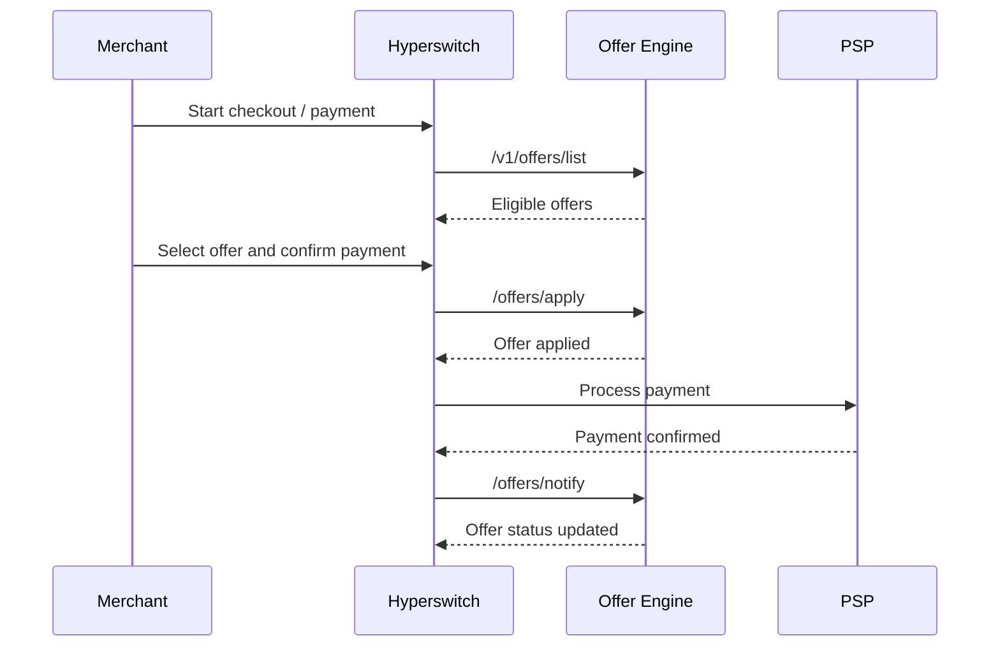

# Offer Engine Integration

## Overview

Offer Engine is a SaaS offering hosted in the India stack. Hyperswitch can be SaaS or self-deployed; this document focuses on self-deployed Hyperswitch merchants that want to use Offer Engine.

Hyperswitch will call Offer Engine on behalf of a merchant using reseller credentials.

## Setup

- Each self-deployed merchant that wants offers will have a reseller account in Offer Engine.
- The merchant will be created in Offer Engine under that reseller account.
- Hyperswitch will maintain a mapping from its merchant to the Offer Engine merchant.

```text
hyperswitch_merchant_id -> offer_engine_merchant_id
```

## Configuration

- Reseller credentials/private key will live in the Hyperswitch environment configuration.
- Merchant mapping and offer-related configuration will live in Hyperswitch merchant-related storage.
- The exact merchant table/config location is not finalized yet.

## Runtime Flow



## API Calls

| Hyperswitch stage | Offer Engine API | Purpose |
| --- | --- | --- |
| Eligibility | `/v1/offers/list` | List eligible offers |
| Payment confirmation | `/offers/apply` | Apply the selected offer |
| PSP confirmation | `/offers/notify` | Notify final payment/offer status |

## Authentication

Hyperswitch will use reseller credentials to generate the token/JWT required by Offer Engine.

For list offers, the request shape is:

```bash
curl --location "https://sandbox.juspay.in/v1/offers/list" \
  --header "Content-Type: application/json" \
  --data-binary "$(jq -n --arg jwt "$NESTED_JWT" '{JWT:$jwt}')"
```

## Open Items

- Exact Hyperswitch storage location for merchant mapping and offer configuration.
- Exact Hyperswitch call sites for list, apply, and notify.
- Retry, idempotency, and failure handling.
- Offer-related state that Hyperswitch should persist, if any.
