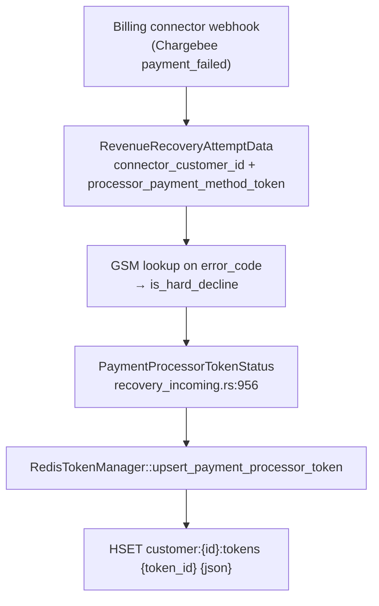

# Revenue Recovery — Payment Processor Token Storage in Redis

How recovery tokens are keyed, written, and selected, and where a PayPal billing
agreement id ends up in that structure.

Primary source: `crates/router/src/types/storage/revenue_recovery_redis_operation.rs`.

## 1. The key space

Two keys per connector customer, both built from the same string
(`revenue_recovery_redis_operation.rs:136-142`):

| Key | Type | Purpose |
|---|---|---|
| `customer:{connector_customer_id}:status` | string | Distributed lock. Value is the `GlobalPaymentId` currently working this customer. |
| `customer:{connector_customer_id}:tokens` | hash | The token bucket. One hash field per payment processor token. |

Both carry a TTL from `state.conf.revenue_recovery.redis_ttl_in_seconds`.

`connector_customer_id` is **not** a Hyperswitch customer id. It is the identifier
at the *payment* processor, derived from the billing connector's webhook payload
and then persisted on the payment intent under
`feature_metadata.payment_revenue_recovery_metadata.billing_connector_payment_details.connector_customer_id`
(`hyperswitch_domain_models/src/payments.rs:1016`). Every later Redis read pulls it
back from there, so whatever the webhook produced on first ingestion is the bucket
name forever.

### It is not only a Redis key — it is sent to the processor

This matters for any proposal to re-key the bucket. The same value flows into the
outgoing payment request:

```
payment_intent.feature_metadata…connector_customer_id
  → PaymentConfirmData::get_connector_customer_id   (payments.rs:1461-1464, `.or_else` fallback)
  → core/payments/transformers.rs:361
  → RouterData.connector_customer
  → the connector's own request body
```

`call_proxy_api` (`revenue_recovery/api.rs:93-105`) carries only the token, so the
customer id is invisible there — it is picked up further down, during router-data
construction, straight off the intent.

Whether that matters is **per connector**:

| Connector | Reads `connector_customer`? |
|---|---|
| Stripe | Yes — `customer:` on the PaymentIntent (`stripe/transformers.rs:2445, 2574`). An off-session MIT against a saved `pm_` requires it. |
| Adyen | Yes, optional — `shopper_reference` (`adyen/transformers.rs:2094`, `.ok()`). |
| GoCardless | Yes, but only in the Tokenization flow (`gocardless/transformers.rs:228`), which the recovery proxy-authorize path does not hit. |
| PayPal | No references at all. The value is inert. |

This is exactly why the `/` split exists: for card vaults the left-hand segment *is*
the processor's real customer id and has to stay that way.

## 2. The token bucket

`customer:{id}:tokens` is a Redis hash:

- **field** = the payment processor token id (`processor_payment_method_token`)
- **value** = `PaymentProcessorTokenStatus` serialized as JSON

```jsonc
// HGETALL customer:cus_ABC123:tokens
{
  "pm_1QXyz": {
    "payment_processor_token_details": {
      "payment_processor_token": "pm_1QXyz",
      "expiry_month": "12", "expiry_year": "2027",
      "card_issuer": "chase", "last_four_digits": "4242",
      "card_network": "Visa", "card_type": "credit", "card_isin": "424242"
    },
    "inserted_by_attempt_id": "12345_atmpt_...",
    "error_code": "insufficient_funds",
    "daily_retry_history": { "2026-08-04 13:00:00.0": 2 },
    "scheduled_at": "2026-08-06 09:00:00.0",
    "is_hard_decline": false,
    "modified_at": "2026-08-04 13:04:11.0",
    "is_active": true,
    "account_update_history": null,
    "decision_threshold": null
  }
}
```

A customer with several stored cards gets several fields in the one hash. That
plurality is the whole point: it is what lets recovery cascade from one token to
the next.

Deserialization is lenient per field — a field that fails to parse is logged and
skipped rather than failing the read (`:311-324`).

## 3. Write path



The connector transformer supplies both identifiers. For Chargebee that is
`ChargebeeCustomer::find_connector_ids()`
(`hyperswitch_connectors/src/connectors/chargebee/transformers.rs:852`), which splits
Chargebee's `customer.payment_method.reference_id` on `/`:

```rust
let mut parts = reference_id.split('/');
let customer_id = parts.next().unwrap_or(reference_id);
let mandate_id  = parts.next_back().unwrap_or(customer_id);
```

`upsert_payment_processor_token` (`:580`) reads the whole bucket, merges, writes it
back. On an existing field it accumulates `daily_retry_history` per hour-bucket,
refreshes the card details, and updates `error_code` / `is_hard_decline` **only if
the incoming `modified_at` is newer** than what is stored (`:624-642`) — so
out-of-order webhooks cannot regress a token's state. On a new field it inserts
wholesale. Returns `true` when the token was newly added.

Note this is a read-modify-write against the whole hash, not an atomic per-field
update. The `customer:{id}:status` lock is what keeps two concurrent recovery
workers off the same bucket.

## 4. Read path — token selection

`get_token_based_on_retry_type` (`:939`) dispatches on the profile's
`RevenueRecoveryAlgorithmType`:

- **`Smart`** → `get_payment_processor_token_with_schedule_time` (`:873`): scans the
  bucket's values and takes the first with `scheduled_at.is_some()`. With more than
  one scheduled token the winner is whatever `HashMap` iteration order yields — not
  deterministic.
- **`Cascading`** → `get_payment_processor_token_using_token_id` (`:896`): direct
  field lookup on the last token used.
- **`Monitoring`** → no token; logs and returns `None`.

Whatever comes back is then filtered: a token with `is_hard_decline == true` has its
`scheduled_at` cleared and is dropped (`:976-993`). `are_all_tokens_hard_declined`
(`:918`) is the bucket-level check that ends recovery for the customer.

The selected token's id is handed to the proxy payment API as the mandate reference
(`core/revenue_recovery/types.rs:512-520`), and on success
`handle_account_updater_token_update` (`:1217`) compares the token that came back in
`mandate_data` against the one used, producing `TokenUpdate` / `ExpiryUpdate` /
`ExistingToken` / `NoAction`.

## 5. Retry accounting

`daily_retry_history` maps an hour-truncated `PrimitiveDateTime` to a count.
`normalize_retry_window` (`:403`) trims it to a rolling window of
`RETRY_WINDOW_IN_HOUR = 720` (30 days). `payment_processor_token_retry_info` (`:503`)
turns that into `TokenRetryInfo { monthly_wait_hours, daily_wait_hours,
total_30_day_retries }`. Keys are written as `YYYY-MM-DD HH:MM:SS.f` but
`parse_datetime_key` (`:83`) also accepts bare `YYYY-MM-DD`, so older date-only
entries still load.

## 6. Where a PayPal billing agreement sits

PayPal (and Amazon) billing agreements arrive from Chargebee as a **bare**
`reference_id` with no `/`. `find_connector_ids`
(`chargebee/transformers.rs`) splits the value by shape. With no separator, the
same agreement id becomes both `connector_customer_id` and
`processor_payment_method_token`.

| | Card via Stripe | PayPal billing agreement |
|---|---|---|
| Chargebee `reference_id` | `cus_ABC123/pm_1QXyz` | `B-1AB23456CD789012E` |
| `connector_customer_id` | `cus_ABC123` | `B-1AB23456CD789012E` |
| `processor_payment_method_token` | `pm_1QXyz` | `B-1AB23456CD789012E` |
| Redis lock key | `customer:cus_ABC123:status` | `customer:B-1AB23456CD789012E:status` |
| Redis bucket key | `customer:cus_ABC123:tokens` | `customer:B-1AB23456CD789012E:tokens` |
| Hash field | `pm_1QXyz` | `B-1AB23456CD789012E` |

Locking, TTL, retry accounting, hard-decline handling and `Cascading` selection all
work on string identity and never inspect card fields, so an agreement id is a
valid key and hash field. PayPal also does not read `connector_customer`, so sending
the agreement id in that field has no effect on its request.

Two limitations follow from this representation:

1. **Each PayPal agreement gets its own bucket.** If one Chargebee customer has
   multiple agreements, recovery cannot cascade between them because there is no
   shared customer key.
2. **All card fields are `null`.** This is harmless for storage, but account-updater
   expiry handling does not apply to billing agreements.

## 7. Open issue — missing or multiple references

When `content.customer` is absent, conversion fails with
`MissingRequiredField { connector_mandate_details }`; there is no fallback to
Chargebee's `invoice.customer_id`. That fallback would not by itself solve the
problem because the processor token is also required and Chargebee's customer id
is not a valid mandate token.

Grouping multiple PayPal agreements under `invoice.customer_id` is possible in
principle because PayPal ignores `connector_customer`, but it would change Redis
keys for new webhooks and require an explicit migration decision for in-flight
recoveries. The current implementation deliberately makes no key migration.

Last updated 2026-08-04.
