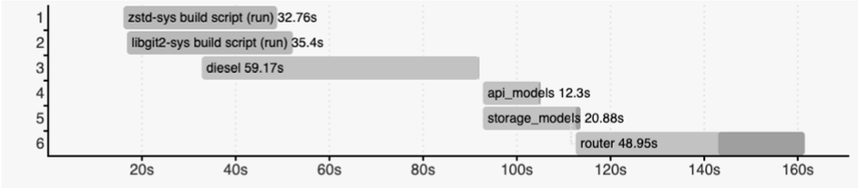
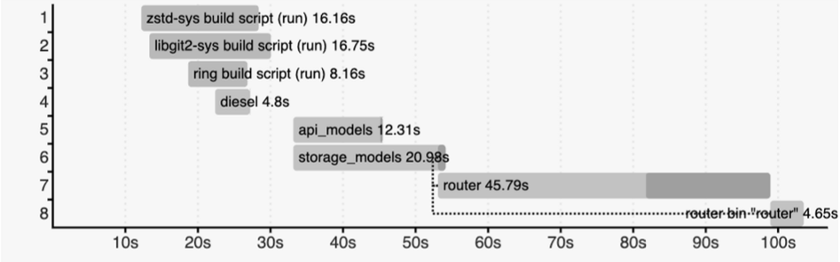

## RFC 001: Hyperswitch compile time optimization

### I. Objective

Optimizing the compile time of Hyperswitch while preserving (and/or improving) the runtime performance. This would ensure accessibility across machines and improve developer experience for the community

### II. Proposal
While the Rust compiler provides various options like zero-cost abstractions or compiler code optimizations, there is always a trade-off between compile time and runtime performance. Through this RFC, we intend to improve the compile time without losing any runtime performance. Compile time enhances developer experience by improving iteration speed and hence developer productivity. It enables machines with limited computing resources (especially machines with 4 GB RAMs) to work on Hyperswitch. Currently the target directory occupies ~6.4 GB of disk space for debug builds and checks.

The focus of this RFC is on external dependencies and the dependency tree which has a significant impact on the compilation time. Sometimes adding redundant features to dependencies can also have a severe impact on the compilation time, one such improvement is mentioned in the Past Improvements section. Dependencies might be repeated or be present with different versions. Reduced compile time also implies faster deployment and lower cost incurred for compiling the project on a sandbox / production environment.

Another area for optimization is code generation. Rust provides means to extend the existing functionality of the code with constructs like `monomorphization` and `proc_macros`. These patterns help the developer reduce code repetition but it comes at the cost of compile time. Adding to this, there are some data structures in the codebase which might have redundant `derive` implementations, which could also contribute to code generation, i.e. generating redundant code which isn't used.

### III. Open Questions
* How can we reduce the depth of the crate dependency tree?
* Can we remove some of the procedural macros used, for an OOTB (out of the box) solution available?
* Are there any other features in the overall dependencies which could be removed?
* Which `derive` macros can be removed to reduce code generation?

### IV. Past Improvements

Below mentioned are some of the PR's that were intended to improve the performance of the codebase:

* [#40](http://github.com/juspay/hyperswitch/pull/40): move `serde` implementations and date-time utils to `common_utils` crate
* [#356](http://github.com/juspay/hyperswitch/pull/356): cleanup unused `ApplicationError` variants
* [#413](http://github.com/juspay/hyperswitch/pull/413): Reusing request client for significant performance boost on the connector side.
* [#753](http://github.com/juspay/hyperswitch/pull/753): Removing redundant and unnecessary logs
* [#775](http://github.com/juspay/hyperswitch/pull/775): Removing unused features from diesel to improve the compile time:

    This is an example that was mentioned in the Proposal section that illustrated the performance boost from a relatively small change. Prior to this change diesel contributed a whopping *59.17s* to the compile time, though there are crates compiling alongside diesel, for the longest of time only diesel was compiling even after all the dependencies were compiled.

    
    After removing a redundant feature flag used for diesel in various crates, the performance boost was visibly significant, the compile time taken by diesel was a measly *4.8s*. This provided a *37.65%* improvement in the overall compile time.

    
    Note: these benchmarks were performed on an M1 pro chip with a ~250 Mbps connection.
