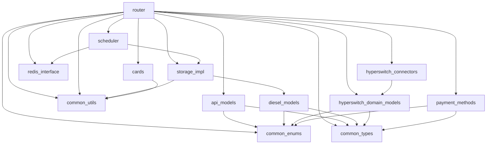

# Hyperswitch Crate Index

This document provides an overview of all the crates in the Hyperswitch project, their purposes, and relationships. Each crate has a specific responsibility in the overall architecture.

## Core Crates

### router
**Purpose**: The main application crate containing the core payment processing logic, API endpoints, and business logic.
**Key Components**:
- API routes and handlers
- Payment flow implementations
- Connector integrations
- Authentication and authorization
- Error handling
**Links**: [Detailed Documentation](./thematic/crates/router/overview.md)
**Dependencies**:
- api_models
- async-trait
- base64
- bytes
- chrono
- clap
- cookie
- diesel
- diesel_migrations
- dyn-clone
- error-stack
- futures
- hmac
- jsonwebtoken
- masking
- metrics
- num_enum
- opentelemetry
- pwhash
- redis
- reqwest
- router_derive
- router_env
- rust_decimal
- sea-orm
- serde
- serde_json
- sha2
- strum
- thiserror
- time
- tokio
- tracing
- utoipa
- validator
- vergen

### scheduler
**Purpose**: Handles scheduled tasks with two components: Producer (schedules tasks) and Consumer (executes tasks).
**Key Components**:
- Task scheduling
- Task execution
- Redis queue integration
**Links**: [Detailed Documentation](./thematic/crates/scheduler/overview.md) - Reviewed 2024-05-20
**Dependencies**:
- common_utils
- redis_interface
- serde
- tokio

### storage_impl
**Purpose**: Manages database interactions and data persistence.
**Key Components**:
- Repository implementations
- Database connection management
- Query builders and executors
**Links**: [Detailed Documentation](./thematic/crates/storage_impl/overview.md)
**Dependencies**:
- api_models
- common_enums
- common_utils
- diesel_models
- hyperswitch_domain_models
- masking
- redis_interface
- router_derive
- router_env
- async-bb8-diesel
- async-trait
- bb8
- bytes
- config
- crc32fast
- diesel
- dyn-clone
- error-stack
- futures
- moka
- once_cell
- serde
- serde_json
- thiserror
- tokio

### hyperswitch_connectors
**Purpose**: Implements integrations with various payment processors.
**Key Components**:
- Connector-specific API clients
- Request/response transformations
- Error handling and mapping
**Links**: [Detailed Documentation](./thematic/crates/hyperswitch_connectors/overview.md)
**Dependencies**:
- api_models
- common_enums
- common_types
- common_utils
- currency_conversion
- hyperswitch_domain_models
- masking
- redis_interface
- router_env
- serde
- serde_json
- tokio

## Model Crates

### api_models
**Purpose**: Defines the API request and response models.
**Key Components**:
- Request structures
- Response structures
- Validation logic
**Links**: [Detailed Documentation](./thematic/crates/api_models/overview.md)
**Dependencies**:
- common_enums
- common_types
- masking
- regex
- serde

### diesel_models
**Purpose**: Defines the database models using Diesel ORM.
**Key Components**:
- Table definitions
- Schema migrations
- Query methods
**Links**: [Detailed Documentation](./thematic/crates/diesel_models/overview.md)
**Dependencies**:
- common_enums
- common_types
- diesel
- num_enum
- serde

### hyperswitch_domain_models
**Purpose**: Defines the core domain models for the application.
**Key Components**:
- Business entities
- Domain logic
- Value objects
**Links**: [Detailed Documentation](./thematic/crates/hyperswitch_domain_models/overview.md)
**Dependencies**:
- common_enums
- common_types
- masking
- num_enum
- rust_decimal
- serde

### common_enums
**Purpose**: Defines shared enumerations used across the codebase.
**Key Components**:
- Status enums
- Type enums
- Error enums
**Links**: [Detailed Documentation](./thematic/crates/common_enums/overview.md) - Reviewed 2025-05-20
**Dependencies**:
- serde
- strum

### common_types
**Purpose**: Defines shared type definitions used across the codebase.
**Key Components**:
- Payment-related types
- Domain entities
- Split payment structures
- Primitive wrapper types
- Customer and payment method types
**Links**: [Detailed Documentation](./thematic/crates/common_types/overview.md) - Reviewed 2025-05-20
**Dependencies**:
- common_enums
- common_utils
- euclid
- diesel
- serde
- serde_json
- strum
- utoipa

## Utility Crates

### common_utils
**Purpose**: Provides utility functions and helpers used across the codebase.
**Key Components**:
- String manipulation
- Date/time utilities
- Cryptographic functions
- Logging utilities
**Links**: [Detailed Documentation](./thematic/crates/common_utils/overview.md) - Reviewed 2025-05-20
**Dependencies**:
- common_enums
- masking
- router_env (optional)
- async-trait (optional)
- base64
- base64-serde
- blake3
- bytes
- diesel
- error-stack
- futures (optional)
- globset
- hex
- http
- md5
- nanoid
- nutype
- once_cell
- phonenumber
- quick-xml
- rand
- regex
- reqwest
- ring
- rust_decimal
- rustc-hash
- semver
- serde
- serde_json
- serde_urlencoded
- signal-hook (optional)
- strum
- thiserror
- time
- tokio (optional)
- url
- utoipa
- uuid
- openssl (optional)
- signal-hook-tokio (optional, target specific)

### router_env
**Purpose**: Manages environment configuration and setup.
**Key Components**:
- Environment variables
- Configuration loading
- Logging setup
**Links**: [Detailed Documentation](./thematic/crates/router_env/overview.md) - Reviewed 2025-05-20
**Dependencies**:
- config
- serde
- tokio

### masking
**Purpose**: Handles masking of sensitive information.
**Key Components**:
- PII masking
- Card number masking
- Logging sanitization
**Links**: [Detailed Documentation](./thematic/crates/masking/overview.md) - Reviewed 2025-05-20
**Dependencies**:
- serde

### router_derive
**Purpose**: Provides custom derive macros for the project.
**Key Components**:
- Procedural and attribute macros for code generation
- Database interaction utilities (DieselEnum, diesel_enum)
- API error handling (ApiError)
- Payment operation trait implementations
- Schema and validation macros
- Permission generation
**Links**: [Detailed Documentation](./thematic/crates/router_derive/overview.md) - Reviewed 2025-05-20
**Dependencies**:
- proc-macro2
- quote
- syn
- indexmap
- serde_json
- strum

### config_importer
**Purpose**: TBD
**Key Components**: TBD
**Links**: [Detailed Documentation - MISSING]
**Dependencies**: TBD

### connector_configs
**Purpose**: TBD
**Key Components**: TBD
**Links**: [Detailed Documentation - MISSING]
**Dependencies**: TBD

### hsdev
**Purpose**: TBD
**Key Components**: TBD
**Links**: [Detailed Documentation - MISSING]
**Dependencies**: TBD

## Feature-Specific Crates

### cards
**Purpose**: Handles card payment processing.
**Key Components**:
- Card validation
- Card tokenization
- Card-specific logic
- Secure handling of sensitive card data
- PCI DSS compliant implementations
**Links**: [Detailed Documentation](./thematic/crates/cards/overview.md) - Reviewed 2025-05-20
**Dependencies**:
- common_utils
- masking
- router_env
- error-stack
- time
- regex
- serde

### payment_methods
**Purpose**: Implements various payment methods.
**Key Components**:
- Payment method validation
- Payment method-specific logic
**Links**: [Detailed Documentation](./thematic/crates/payment_methods/overview.md) - Reviewed 2025-05-20
**Dependencies**:
- api_models
- common_enums
- common_types
- hyperswitch_domain_models
- masking
- serde

### pm_auth
**Purpose**: Handles payment method authentication.
**Key Components**:
- 3D Secure
- Authentication flows
**Links**: [Detailed Documentation - MISSING]
**Dependencies**:
- api_models
- common_enums
- common_types
- hyperswitch_domain_models
- masking
- serde

### currency_conversion
**Purpose**: Handles currency conversion operations.
**Key Components**:
- Exchange rate management
- Conversion logic
**Links**: [Detailed Documentation - MISSING]
**Dependencies**:
- common_enums
- common_types
- redis_interface
- rust_decimal
- serde
- tokio

## Infrastructure Crates

### redis_interface
**Purpose**: Provides a Redis client and utilities.
**Key Components**:
- Connection management
- Caching operations
- Queue operations
**Links**: [Detailed Documentation](./thematic/crates/redis_interface/overview.md) - Reviewed 2025-05-20
**Dependencies**:
- redis
- serde
- tokio

### drainer
**Purpose**: Service for processing queued tasks.
**Key Components**:
- Queue processing
- Task execution
**Links**: [Detailed Documentation](./thematic/crates/drainer/overview.md) - Reviewed 2025-05-20
**Dependencies**:
- common_utils
- redis_interface
- serde
- tokio

### events
**Purpose**: Handles event processing and propagation.
**Key Components**:
- Event definitions
- Event handlers
- Event publishing
**Links**: [Detailed Documentation - MISSING]
**Dependencies**:
- serde

## Integration Crates

### external_services
**Purpose**: Handles integration with external services.
**Key Components**:
- Email services
- SMS services
- Other third-party integrations
**Links**: [Detailed Documentation - MISSING]
**Dependencies**:
- api_models
- common_enums
- common_types
- common_utils
- hyperswitch_domain_models
- masking
- reqwest
- serde
- tokio

### hyperswitch_interfaces
**Purpose**: Defines interfaces for external integrations.
**Key Components**:
- API definitions
- Interface traits
**Links**: [Detailed Documentation - MISSING]
**Dependencies**:
- api_models
- common_enums
- common_types
- hyperswitch_domain_models
- serde

## Documentation and Testing Crates

### openapi
**Purpose**: Generates OpenAPI specifications.
**Key Components**:
- API documentation
- Schema generation
**Links**: [Detailed Documentation - MISSING]
**Dependencies**:
- api_models
- common_enums
- common_types
- hyperswitch_domain_models
- serde
- utoipa

### test_utils
**Purpose**: Provides utilities for testing.
**Key Components**:
- Mock implementations
- Test helpers
- Fixtures
**Links**: [Detailed Documentation - MISSING]
**Dependencies**:
- api_models
- common_enums
- common_types
- diesel
- diesel_models
- hyperswitch_domain_models
- rand
- router_env
- serde
- sqlx
- tokio

## Analytics and Monitoring Crates

### analytics
**Purpose**: Handles analytics and reporting functionality.
**Key Components**:
- Data collection
- Reporting
- Metrics
**Links**: [Detailed Documentation - MISSING]
**Dependencies**:
- api_models
- common_enums
- common_types
- hyperswitch_domain_models
- serde
- sqlx

## Specialized Crates

### euclid
**Purpose**: Provides a Domain Specific Language (DSL) library for writing and evaluating dynamic payment routing rules.
**Key Components**: TBD
**Links**: [Detailed Documentation - MISSING]
**Dependencies**:
- serde

### kgraph_utils
**Purpose**: Utilities for knowledge graph operations.
**Key Components**: TBD
**Links**: [Detailed Documentation - MISSING]
**Dependencies**:
- petgraph
- serde

### euclid_macros
**Purpose**: TBD
**Key Components**: TBD
**Links**: [Detailed Documentation - MISSING]
**Dependencies**: TBD

### euclid_wasm
**Purpose**: TBD
**Key Components**: TBD
**Links**: [Detailed Documentation - MISSING]
**Dependencies**: TBD

### hyperswitch_constraint_graph
**Purpose**: TBD
**Key Components**: TBD
**Links**: [Detailed Documentation - MISSING]
**Dependencies**: TBD

## Crate Dependency Graph

