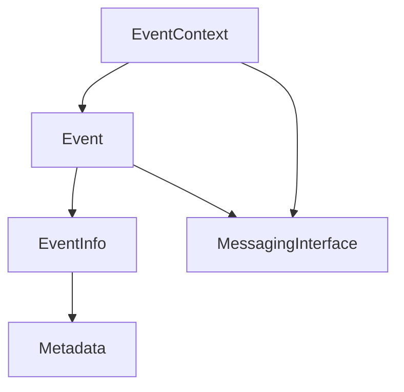

# Events Crate Overview

## Purpose and Responsibilities

The `events` crate provides a generic event handling system for the Hyperswitch platform. It establishes a flexible framework for event generation, processing, and distribution throughout the application. This crate is responsible for:

- Defining a consistent API for creating and emitting events
- Managing event metadata and context
- Supporting various event publishing mechanisms (logging, message queues, databases)
- Ensuring proper serialization and error handling for events
- Providing integration with the web framework (Actix Web)

## Architecture and Design

The `events` crate follows a modular design pattern centered around four main components:



### Key Components

1. **Event Sink (`MessagingInterface` trait)**: 
   - Defines how events are published
   - Can be implemented for various backends (loggers, message queues, databases)
   - Handles the actual dispatching of events

2. **EventContext**:
   - Holds the event sink and metadata about events
   - Provides methods to record additional event information
   - Creates and manages EventBuilders

3. **EventInfo trait**:
   - Defines metadata that is sent with events
   - Works with EventContext to add metadata to all events
   - Simplifies attaching common information to events

4. **Event trait**:
   - Defines the event itself (data, type, identifier)
   - Specifies timestamps and classification
   - Provides structure for event serialization

### Error Handling

The crate implements comprehensive error handling through the `EventsError` enum, with specialized error types for serialization and publishing problems. It uses the `error-stack` crate for error context and management.

## Implementation Details

### Core Traits and Structures

- **Event trait**: Represents an event that can be published
  ```rust
  pub trait Event: EventInfo {
      type EventType;
      fn timestamp(&self) -> PrimitiveDateTime;
      fn identifier(&self) -> String;
      fn class(&self) -> Self::EventType;
      fn metadata(&self) -> HashMap<String, String> {
          HashMap::new()
      }
  }
  ```

- **EventInfo trait**: Adds metadata to events
  ```rust
  pub trait EventInfo {
      type Data: ErasedMaskSerialize;
      fn data(&self) -> Result<Self::Data, EventsError>;
      fn key(&self) -> String;
  }
  ```

- **MessagingInterface trait**: Interface for event publishing backends
  ```rust
  pub trait MessagingInterface {
      type MessageClass;
      fn send_message<T>(
          &self,
          data: T,
          metadata: HashMap<String, String>,
          timestamp: PrimitiveDateTime,
      ) -> Result<(), EventsError>
      where
          T: Message<Class = Self::MessageClass> + ErasedMaskSerialize;
  }
  ```

- **EventContext**: Main structure for creating and emitting events
  ```rust
  pub struct EventContext<T, A>
  where
      A: MessagingInterface<MessageClass = T>,
  {
      message_sink: Arc<A>,
      metadata: HashMap<String, Value>,
  }
  ```

### Builder Pattern

The crate uses a builder pattern through `EventBuilder` to provide a flexible and fluent API for constructing events:

```rust
// Example usage of the builder pattern
context.event(my_event)
    .with(additional_info)
    .with(more_info)
    .emit();
```

### Integration with Actix Web

The crate provides integration with Actix Web through the `actix.rs` module:

```rust
impl EventInfo for RequestId {
    type Data = String;
    fn data(&self) -> error_stack::Result<String, crate::EventsError> {
        Ok(self.as_hyphenated().to_string())
    }
    fn key(&self) -> String {
        "request_id".to_string()
    }
}
```

This integration allows automatic tracking of request IDs in events, which is crucial for distributed tracing and debugging.

## Security and Performance Considerations

### Security

- The crate uses the `masking` crate for serialization, ensuring sensitive data is properly masked in events
- Errors during event processing are logged but don't disrupt the main application flow
- Event data is handled through a serialization abstraction that can be customized for different security requirements

### Performance

- Events are processed asynchronously when possible
- The crate uses `Arc` for efficient sharing of the message sink
- Event emission can be performed in non-blocking mode (with `emit`) or with error handling (with `try_emit`)

## Example Usage

### Basic Event Creation and Emission

```rust
// Create a messaging interface implementation
let sink = MyMessageSink::new();

// Create an event context
let mut context = EventContext::new(sink);

// Add global metadata
context.record_info(("user_id", "usr_123456"));

// Create and emit an event
let payment_event = PaymentCompletedEvent::new(/* ... */);
context.emit(payment_event);

// Alternative using builder pattern
context.event(PaymentCompletedEvent::new(/* ... */))
    .with(("merchant_id", "mer_abcdef"))
    .emit();
```

### Implementing a Custom Event

```rust
struct PaymentCompletedEvent {
    payment_id: String,
    amount: i64,
    currency: String,
    timestamp: PrimitiveDateTime,
}

impl Event for PaymentCompletedEvent {
    type EventType = PaymentEventType;
    
    fn timestamp(&self) -> PrimitiveDateTime {
        self.timestamp
    }
    
    fn identifier(&self) -> String {
        format!("payment_{}", self.payment_id)
    }
    
    fn class(&self) -> Self::EventType {
        PaymentEventType::Completed
    }
}

impl EventInfo for PaymentCompletedEvent {
    type Data = Self;
    
    fn data(&self) -> Result<Self::Data, EventsError> {
        Ok(self.clone())
    }
    
    fn key(&self) -> String {
        "payment_completed".to_string()
    }
}
```

## Integration with Other Crates

The `events` crate has minimal dependencies, primarily:

- `masking`: For handling sensitive data in events
- `router_env`: For integration with the logging framework
- Standard serialization libraries (`serde`, `serde_json`)
- Error handling through `error-stack` and `thiserror`

These integrations allow events to be properly masked, logged, and tracked throughout the system.

## Links to Detailed Documentation

- [Hyperswitch Events Framework](../../../crates/events/src/lib.rs) - Source code with detailed documentation
- [Router Environment Documentation](../router_env/overview.md) - Documentation for the related router_env crate
- [Masking Crate Documentation](../masking/overview.md) - Documentation for the masking crate used in events
