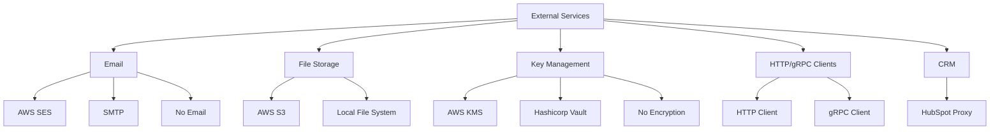

# External Services Crate Overview

## Purpose and Responsibilities

The `external_services` crate provides standardized interfaces and implementations for interacting with various external systems needed by the Hyperswitch platform. It acts as an abstraction layer that isolates the core application logic from the specifics of external service interactions. The crate handles several critical functionalities:

- Email delivery through various providers (AWS SES, SMTP)
- File storage operations (S3, local file system)
- Key management and encryption (AWS KMS, Hashicorp Vault)
- HTTP client operations and metrics
- gRPC client functionality for dynamic routing
- CRM and customer engagement integrations (HubSpot)
- Secrets management and secure storage

By centralizing these external interactions, the crate provides consistent error handling, configuration management, and performance metrics across all external dependencies.

## Architecture and Design

The `external_services` crate follows a well-structured pattern across its various modules:

1. **Trait-based abstraction**: Core interfaces are defined as traits, allowing for multiple implementations
2. **Configuration structures**: Each service has associated configuration types
3. **Error handling**: Specialized error types for each service category
4. **Manager modules**: Coordinate between different service implementations
5. **Metric collection**: Monitoring and performance tracking



### Feature Flags

The crate uses compile-time feature flags to allow selective inclusion of functionality:

- `email`: Email service integrations
- `aws_kms`: AWS Key Management Service integration
- `hashicorp-vault`: Hashicorp Vault integration

This approach allows consumers to include only the required dependencies, reducing the build size and dependency surface.

## Key Components

### 1. Email Services

The email module provides an abstraction for sending emails with different providers:

```rust
#[async_trait::async_trait]
pub trait EmailClient: Sync + Send + dyn_clone::DynClone {
    type RichText;

    async fn send_email(
        &self,
        recipient: pii::Email,
        subject: String,
        body: Self::RichText,
        proxy_url: Option<&String>,
    ) -> EmailResult<()>;

    fn convert_to_rich_text(
        &self,
        intermediate_string: IntermediateString,
    ) -> CustomResult<Self::RichText, EmailError>;
}
```

Implementations include:
- **Amazon SES**: Email service through AWS
- **SMTP**: Standard email protocol for various providers
- **No Email**: A null implementation for environments where email is disabled

### 2. File Storage

The file storage module abstracts file operations across different storage systems:

- **AWS S3**: Cloud-based object storage
- **Local File System**: Storage on the local filesystem

This abstraction enables the application to switch storage backends without changing application code.

### 3. Encryption and Key Management

Multiple encryption providers are supported:

- **AWS KMS**: AWS Key Management Service for encryption operations
- **Hashicorp Vault**: Secure secrets storage and encryption
- **No Encryption**: A passthrough implementation for development or testing

### 4. HTTP Client

A standardized HTTP client with features like:

- Metrics collection
- Configurable timeouts and retries
- Request/response logging
- Proxy support

### 5. gRPC Client

gRPC client implementations for service-to-service communication:

- **Dynamic Routing**: Clients for routing decisions
- **Health Check**: Service health monitoring
- Support for various routing strategies (contract-based, elimination-based, success rate)

### 6. CRM Integration

Interfaces for customer relationship management systems:

- **HubSpot Proxy**: Integration with HubSpot CRM

## Implementation Details

### Trait-Based Design

The crate uses Rust's trait system extensively to provide polymorphic behavior:

```rust
// Email trait example
#[async_trait::async_trait]
pub trait EmailService: Sync + Send + dyn_clone::DynClone {
    async fn compose_and_send_email(
        &self,
        base_url: &str,
        email_data: Box<dyn EmailData + Send>,
        proxy_url: Option<&String>,
    ) -> EmailResult<()>;
}
```

This approach allows different implementations to be used interchangeably, and enables testing through mock implementations.

### Configuration Management

Each service component has associated configuration types:

```rust
#[derive(Debug, Clone, Default, Deserialize)]
#[serde(tag = "active_email_client")]
#[serde(rename_all = "SCREAMING_SNAKE_CASE")]
pub enum EmailClientConfigs {
    #[default]
    NoEmailClient,
    Ses {
        aws_ses: ses::SESConfig,
    },
    Smtp {
        smtp: smtp::SmtpServerConfig,
    }
}
```

These configurations can be loaded from environment variables or configuration files.

### Error Handling

Each service module defines its own error types that implement the standard `Error` trait:

```rust
#[derive(Debug, thiserror::Error)]
pub enum EmailError {
    #[error("Error building email client")]
    ClientBuildingFailure,
    
    #[error("Error sending email to recipient")]
    EmailSendingFailure,
    
    // ...other error variants
}
```

This allows for specialized error handling while maintaining a consistent approach.

### Metrics and Monitoring

The crate includes metrics collection for performance monitoring:

```rust
counter_metric!(AWS_KMS_DECRYPTION_FAILURES, GLOBAL_METER);
counter_metric!(AWS_KMS_ENCRYPTION_FAILURES, GLOBAL_METER);
histogram_metric_f64!(AWS_KMS_DECRYPT_TIME, GLOBAL_METER);
histogram_metric_f64!(AWS_KMS_ENCRYPT_TIME, GLOBAL_METER);
```

These metrics provide visibility into the performance and reliability of external service interactions.

## Security and Performance Considerations

### Security

The crate implements several security best practices:

- **PII Protection**: Email addresses and other sensitive data use the `pii` type for masking
- **Encryption**: Support for standards-compliant encryption through AWS KMS and Hashicorp Vault
- **Secure Configuration**: Validation of security-related configuration parameters
- **Error Sanitization**: Ensuring errors don't expose sensitive information

### Performance

Performance considerations include:

- **Connection Pooling**: Reuse of connections for HTTP and database operations
- **Metrics Collection**: Tracking of operation durations for performance monitoring
- **Asynchronous Operations**: Non-blocking I/O using async/await for external service calls
- **Feature Flags**: Conditional compilation to avoid unnecessary dependencies

## Example Usage

### Sending an Email

```rust
// Configure email client
let email_settings = EmailSettings {
    aws_region: "us-east-1".to_string(),
    sender_email: "no-reply@example.com".to_string(),
    client_config: EmailClientConfigs::Ses {
        aws_ses: SESConfig {
            // Configuration details
        }
    },
    // Other settings
};

// Create email client
let email_client = ses::SesEmailClient::new(email_settings)?;

// Send email
email_client.compose_and_send_email(
    "https://example.com",
    Box::new(MyEmailData {}),
    None,
).await?;
```

### File Storage Operations

```rust
// Create S3 storage client
let s3_client = aws_s3::S3FileStorage::new(
    S3Config {
        bucket_name: "my-bucket".to_string(),
        region: "us-east-1".to_string(),
    },
)?;

// Store a file
s3_client.store_file("path/to/file.txt", b"file contents", None).await?;

// Retrieve a file
let file_contents = s3_client.get_file("path/to/file.txt").await?;
```

## Integration with Other Crates

The `external_services` crate integrates with several other crates in the Hyperswitch ecosystem:

- **router_env**: For configuration and environment settings
- **common_utils**: For shared utilities and error handling
- **masking**: For handling PII and sensitive data
- **api_models**: For some shared data models

## Links to Detailed Documentation

- [AWS SES Documentation](https://docs.aws.amazon.com/ses/) - Amazon Simple Email Service docs
- [AWS KMS Documentation](https://docs.aws.amazon.com/kms/) - AWS Key Management Service docs
- [Hashicorp Vault Documentation](https://developer.hashicorp.com/vault/docs) - Vault for secret management
- [AWS S3 Documentation](https://docs.aws.amazon.com/s3/) - Amazon Simple Storage Service docs
- [HubSpot API Documentation](https://developers.hubspot.com/) - HubSpot CRM integration
