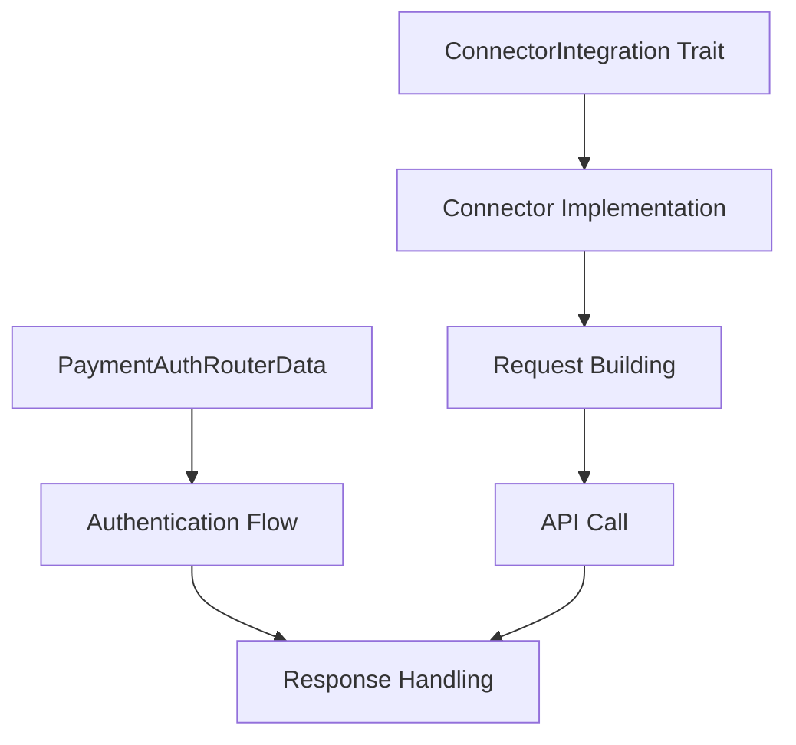

# Payment Method Authentication (pm_auth) Crate Overview

## Purpose and Responsibilities

The `pm_auth` crate manages payment method authentication and verification within the Hyperswitch platform. It serves as the interface between Hyperswitch and external authentication services such as Plaid. This crate handles several critical aspects of the payment experience:

- Authentication of bank accounts and payment methods
- Secure exchange of authentication tokens
- Retrieval of payment method credentials
- Creation and management of payment recipients
- Integration with open banking and financial services

The crate enables secure and seamless authentication flows for various payment methods, particularly for bank account-based payments that require verification and authentication before being used.

## Architecture and Design

The `pm_auth` crate follows a connector-based architecture pattern, similar to the main payment connectors in Hyperswitch. This approach enables:

1. **Standardized Interfaces**: Common traits define standard operations for all authentication services
2. **Connector Abstraction**: Concrete implementations for specific providers (currently Plaid)
3. **Flow-based Processing**: Distinct flows for different authentication operations
4. **Type Safety**: Generics and type parameters ensure type-safe authentication flows

### Key Design Patterns



- **Trait-based Polymorphism**: The crate uses traits like `ConnectorIntegration` and `AuthService` to establish standard interfaces across different authentication providers
- **Generic Flow Types**: Authentication flows are represented as type parameters, enabling type-safe routing and processing
- **Builder Pattern**: Request construction follows a builder pattern for flexibility and clarity
- **Transformer Pattern**: Conversion between domain models and connector-specific formats

## Key Components

### 1. Authentication Flows

The crate defines several authentication flows to handle different aspects of payment method authentication:

- **Link Token**: Creates authentication sessions for users to connect their bank accounts
- **Exchange Token**: Converts temporary public tokens to long-lived access tokens
- **Bank Account Credentials**: Retrieves account details and credentials after authentication
- **Recipient Creation**: Creates payment recipients for future transactions

### 2. Connector Framework

The connector framework provides a standardized approach to integrating with different authentication providers:

```rust
pub trait ConnectorIntegration<Flow, Request, Response> {
    fn get_headers(
        &self,
        req: &PaymentAuthRouterData<Flow, Request, Response>,
        connectors: &PaymentMethodAuthConnectors,
    ) -> errors::CustomResult<Vec<(String, Maskable<String>)>, errors::ConnectorError>;
    
    fn get_content_type(&self) -> &'static str;
    
    fn get_url(
        &self,
        req: &PaymentAuthRouterData<Flow, Request, Response>,
        connectors: &PaymentMethodAuthConnectors,
    ) -> errors::CustomResult<String, errors::ConnectorError>;
    
    fn get_request_body(
        &self,
        req: &PaymentAuthRouterData<Flow, Request, Response>,
    ) -> errors::CustomResult<RequestContent, errors::ConnectorError>;
    
    fn build_request(
        &self,
        req: &PaymentAuthRouterData<Flow, Request, Response>,
        connectors: &PaymentMethodAuthConnectors,
    ) -> errors::CustomResult<Option<Request>, errors::ConnectorError>;
    
    fn handle_response(
        &self,
        data: &PaymentAuthRouterData<Flow, Request, Response>,
        res: Response,
    ) -> errors::CustomResult<PaymentAuthRouterData<Flow, Request, Response>, errors::ConnectorError>;
    
    fn get_error_response(
        &self,
        res: Response,
    ) -> errors::CustomResult<ErrorResponse, errors::ConnectorError>;
}
```

### 3. Router Data Structures

The router data structures act as containers for request and response data as they flow through the authentication process:

```rust
pub struct PaymentAuthRouterData<F, Request, Response> {
    pub flow: PhantomData<F>,
    pub merchant_id: Option<id_type::MerchantId>,
    pub connector: Option<String>,
    pub request: Request,
    pub response: Result<Response, ErrorResponse>,
    pub connector_auth_type: ConnectorAuthType,
    pub connector_http_status_code: Option<u16>,
}
```

This structure allows for type-safe routing and processing of different authentication flows.

### 4. Connector Implementation

Currently, the crate implements Plaid as the primary authentication connector, providing:

- Token creation and exchange
- Bank account data retrieval
- Error handling
- Authentication headers and request building

The implementation follows the `ConnectorIntegration` trait pattern for each supported flow type.

## Implementation Details

### Plaid Integration

The Plaid connector implementation provides several key functionalities:

1. **Link Token Creation**: Establishes a Plaid Link token for initiating user authentication
   ```rust
   impl ConnectorIntegration<LinkToken, LinkTokenRequest, LinkTokenResponse> for Plaid {
       // Implementation details for creating Plaid Link tokens
   }
   ```

2. **Token Exchange**: Exchanges public tokens for access tokens
   ```rust
   impl ConnectorIntegration<ExchangeToken, ExchangeTokenRequest, ExchangeTokenResponse> for Plaid {
       // Implementation details for exchanging tokens
   }
   ```

3. **Bank Account Details**: Retrieves bank account numbers, routing numbers, and other credentials
   ```rust
   impl ConnectorIntegration<BankAccountCredentials, BankAccountCredentialsRequest, BankAccountCredentialsResponse> for Plaid {
       // Implementation details for fetching account details
   }
   ```

### Data Structures

The crate defines several data structures for handling payment method details:

- `BankAccountDetails`: Contains account information and credentials
- `PaymentMethodTypeDetails`: Represents different payment method types (ACH, BACS, SEPA)
- `RecipientCreateRequest`/`Response`: For creating payment recipients

### Error Handling

Error handling is implemented through a custom error type system:

```rust
pub enum ConnectorError {
    FailedToObtainAuthType,
    MissingRequiredField { field_name: &'static str },
    ProcessingStepFailed(Option<bytes::Bytes>),
    ResponseDeserializationFailed,
    RequestEncodingFailed,
}
```

These errors provide detailed information about failures in the authentication process.

## Security and Performance Considerations

### Security

The `pm_auth` crate implements several security measures:

- **Sensitive Data Masking**: Uses the `masking` crate to protect sensitive information like account numbers
- **Secure Token Handling**: Treats tokens as sensitive data with appropriate protection
- **Auth Types**: Supports different authentication mechanisms with secure credential handling
- **Error Sanitization**: Ensures errors don't expose sensitive information

### Performance

- **Minimal Dependencies**: Maintains a focused set of dependencies
- **Efficient Request Handling**: Optimized request building and response processing
- **Stateless Design**: Uses a stateless design for better scalability

## Example Usage

### Bank Account Authentication Flow

```rust
// Create a request to initiate the bank account link flow
let link_token_request = LinkTokenRequest {
    client_name: "Example Merchant".to_string(),
    country_codes: Some(vec!["US".to_string()]),
    language: Some("en".to_string()),
    user_info: Some(customer_id),
    client_platform: Some(api_enums::ClientPlatform::Web),
    redirect_uri: Some("https://example.com/callback".to_string()),
    android_package_name: None,
};

// Process through the authentication connector (Plaid)
let plaid = Plaid {};
let link_token_response = plaid.handle_response(
    &router_data,
    connector_response,
)?;

// Exchange the public token for an access token
let exchange_token_request = ExchangeTokenRequest {
    public_token: "public-token-from-plaid-link".to_string(),
};

let access_token_response = plaid.handle_response(
    &router_data,
    connector_response,
)?;

// Retrieve bank account details
let bank_details_request = BankAccountCredentialsRequest {
    access_token: access_token_response.access_token.into(),
    optional_ids: None,
};

let bank_details = plaid.handle_response(
    &router_data,
    connector_response,
)?;

// Use the bank account details for payment processing
// ...
```

## Integration with Other Crates

The `pm_auth` crate integrates with several other crates in the Hyperswitch ecosystem:

- **api_models**: For shared API request and response models
- **common_enums**: For enumerations used across the system
- **common_types**: For shared type definitions
- **hyperswitch_domain_models**: For core domain entities
- **masking**: For secure handling of sensitive data

## Links to Detailed Documentation

- [API Models Documentation](../api_models/overview.md) - Documentation for API request and response models
- [Common Enums Documentation](../common_enums/overview.md) - Documentation for shared enumerations
- [Common Types Documentation](../common_types/overview.md) - Documentation for shared type definitions
- [Hyperswitch Domain Models Documentation](../hyperswitch_domain_models/overview.md) - Documentation for core domain entities
