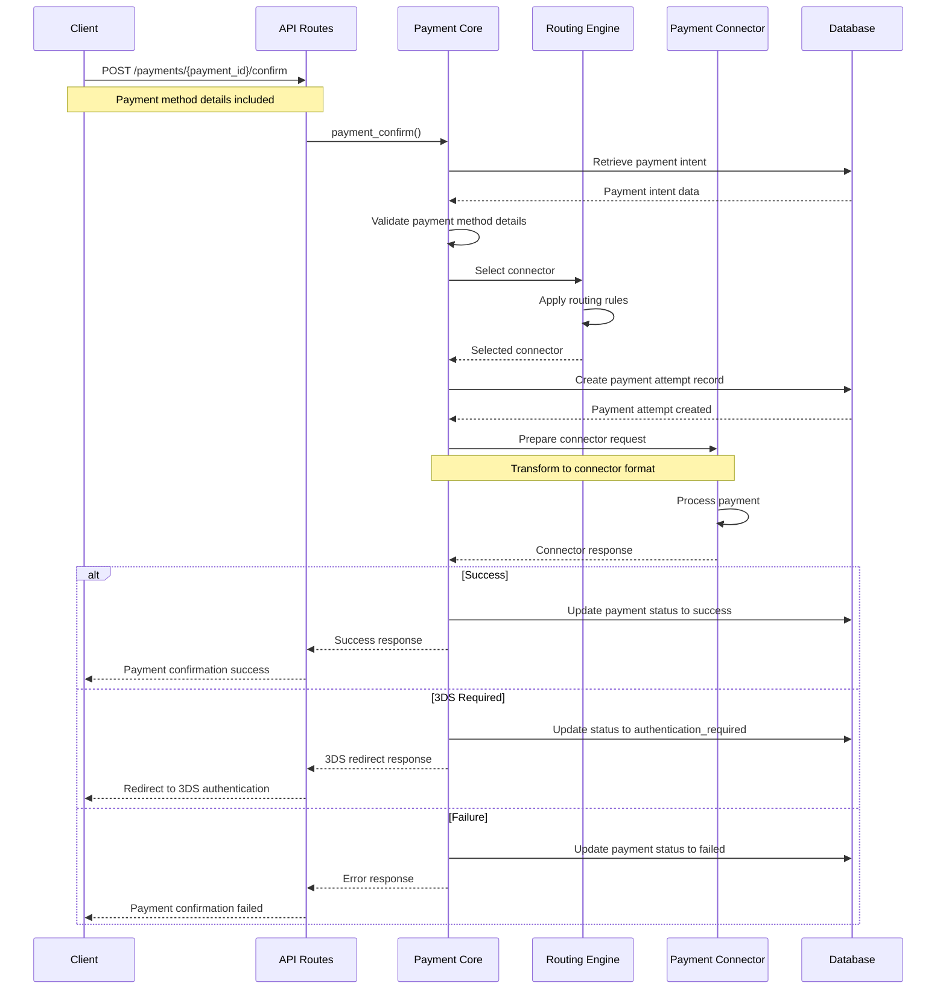
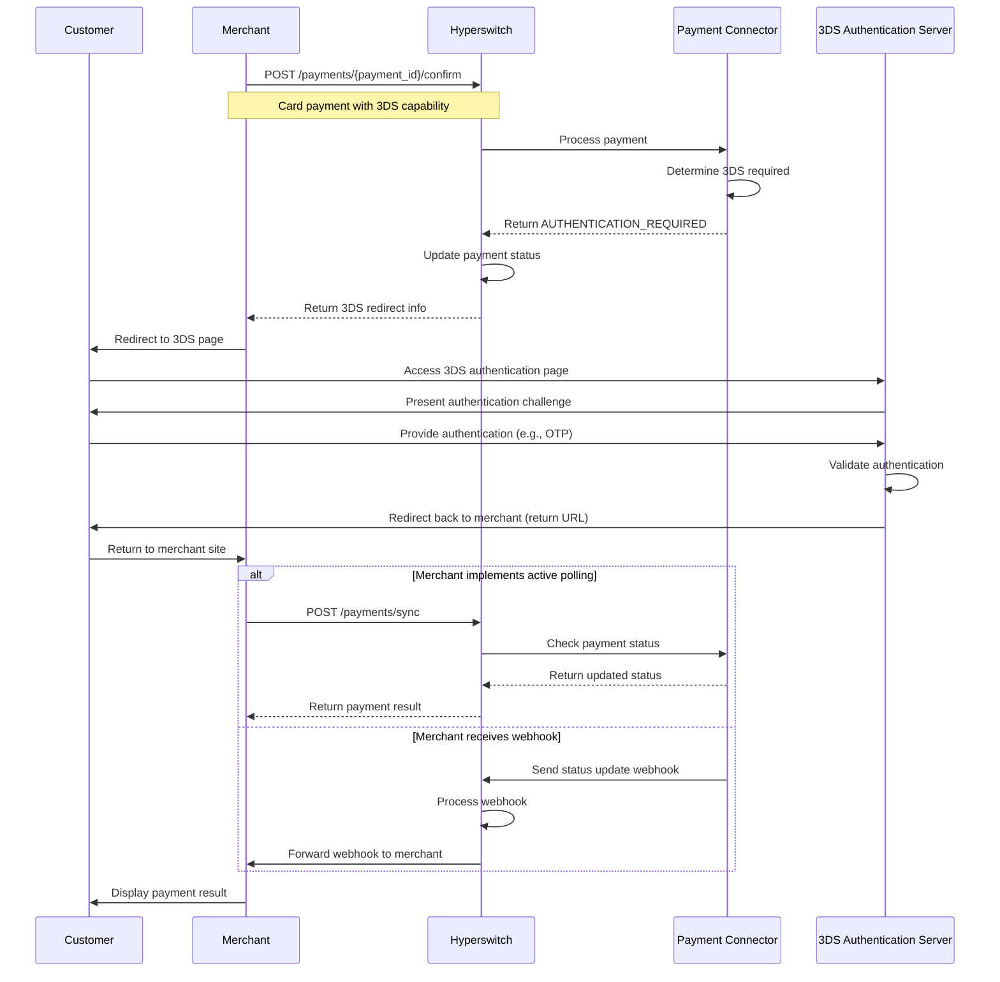
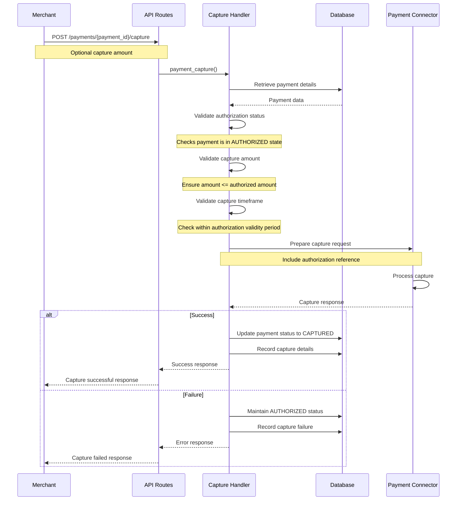
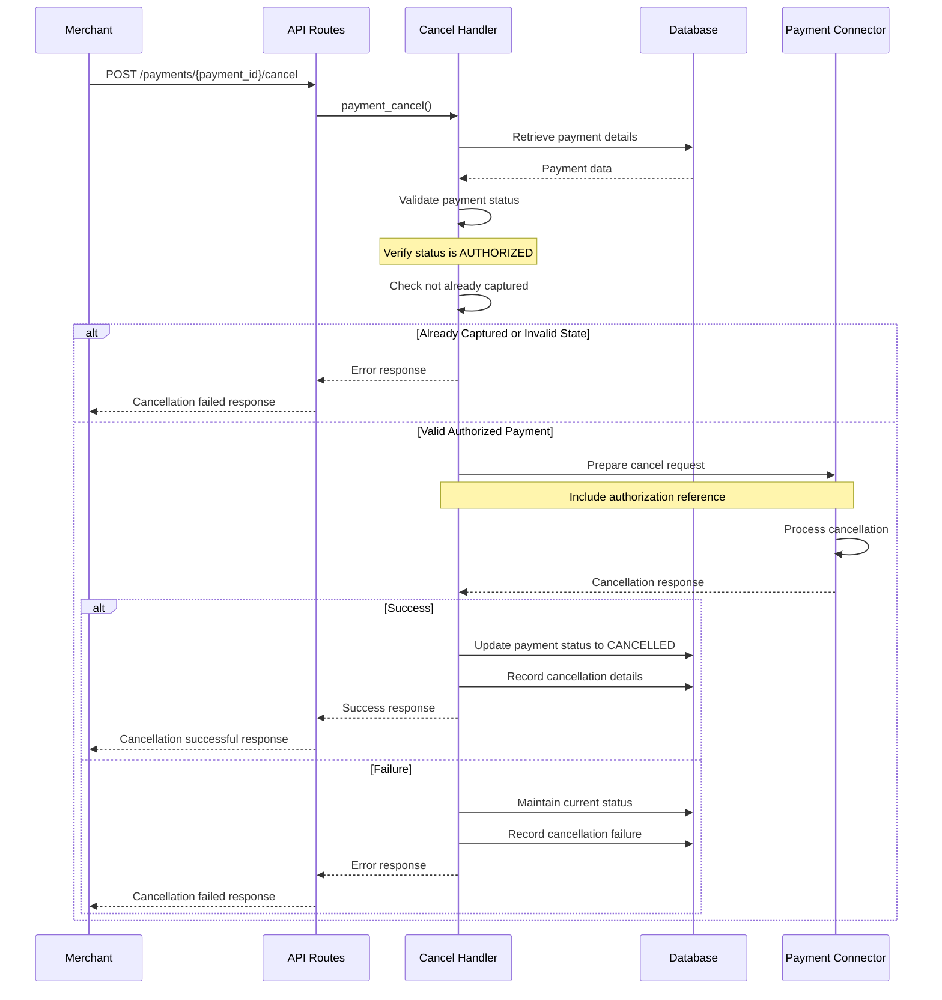
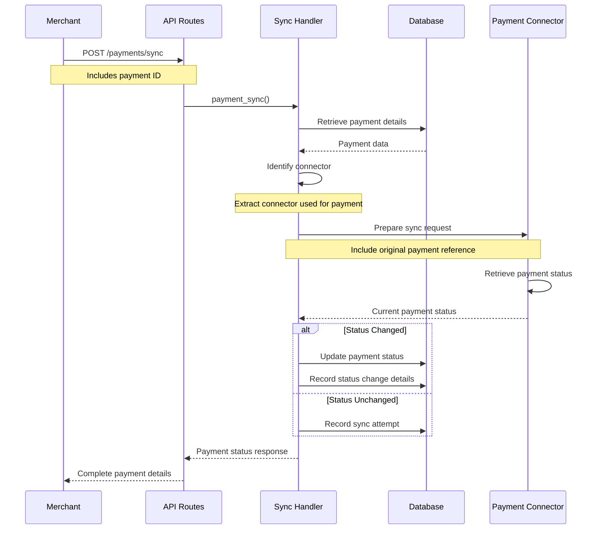

# Router Payment Flows

---
**Parent:** [Router Overview](../overview.md)  
**Last Updated:** 2025-05-27  
**Documentation Status:** Complete  
**Related Files:**
- [Core Module](../modules/core.md)
- [Refund Flows](./refund_flows.md)
- [Webhook Flows](./webhook_flows.md)
---

[← Back to Router Overview](../overview.md)

## Overview

Payment flows represent the core transaction processing sequences in the Hyperswitch platform. These flows define how payments are initiated, processed, and completed through various stages. This document details the critical payment flows implemented in the router crate.

## Key Payment Flows

### Payment Creation Flow

The payment creation flow establishes a payment intent in the system:

1. **API Request Reception**: 
   - Client submits a `POST /payments` request with payment details
   - Request is validated and parsed

2. **Payment Intent Creation**:
   - A payment intent record is created in the database
   - Payment parameters are validated (currency, amount, etc.)
   - A unique payment ID is generated

3. **Initial Status Assignment**:
   - Payment is assigned an initial status of `PAYMENT_INITIALIZED`
   - No actual payment processing occurs at this stage

4. **Response Formatting**:
   - Payment intent details are returned to the client
   - Client receives the payment ID for subsequent operations

This flow is implemented in the `payments` module of the core component.

### Payment Confirmation Flow

The payment confirmation flow processes the actual payment:

1. **Confirmation Request Reception**:
   - Client submits a `POST /payments/{payment_id}/confirm` request
   - Payment method details are included in the request
   - Request is validated and parsed

2. **Payment Method Processing**:
   - Payment method details are validated and processed
   - For cards: card details are validated, tokenized if needed
   - For wallets: wallet-specific parameters are processed
   - For bank transfers: bank details are validated

3. **Connector Selection**:
   - Routing logic selects the appropriate payment processor
   - Selection based on configured rules, payment method, currency, etc.
   - Fallback connectors may be identified for retry scenarios

4. **Payment Attempt Initialization**:
   - A payment attempt record is created
   - Attempt is linked to the payment intent
   - Attempt status is set to `PENDING`

5. **Connector Request Preparation**:
   - Domain models are transformed to connector-specific formats
   - Connector credentials are retrieved from secure storage
   - Request to the payment processor is constructed

6. **Connector Communication**:
   - Request is sent to the selected payment processor
   - Response is received and parsed
   - Connector-specific error handling is applied

7. **Payment Status Update**:
   - Payment status is updated based on connector response
   - Successful payments: status set to `AUTHORIZED`, `COMPLETED`, etc.
   - Failed payments: status set to `FAILED` with appropriate error codes

8. **Response Formatting**:
   - Payment result is returned to the client
   - Response includes next actions if applicable (3DS redirection, etc.)

This flow is implemented in the `payments` module of the core component.

#### Payment Confirmation Flow Sequence Diagram

#### Error Handling in Payment Confirmation

- **Validation Errors**: If payment method details are invalid, the flow fails early with appropriate error codes
- **Routing Failures**: If no suitable connector can be found, the flow fails with a routing error
- **Connector Communication Failures**: Network errors or timeouts are handled with retry mechanisms
- **Connector Processing Errors**: Connector-specific error codes are mapped to standardized error responses
- **Database Errors**: Failures in payment state persistence trigger error responses and logging

#### Edge Cases and Special Scenarios

- **Idempotency**: Duplicate confirmation requests are detected using idempotency keys
- **Partial Authorizations**: Some connectors support partial authorizations where only part of the requested amount is approved
- **Connector Fallbacks**: If the primary connector fails, the system can retry with fallback connectors
- **Delayed Processing**: Some payment methods result in delayed processing outcomes requiring status polling

#### Implementation Details

The payment confirmation flow is primarily implemented in:
- `crates/router/src/core/payments/operations/payment_confirm.rs`
- `crates/router/src/core/payments/flows/authorize_flow.rs`

Key interfaces include:
- `PaymentConfirm` trait: Defines the core payment confirmation operations
- `ConnectorIntegration` trait: Defines connector-specific payment processing functions

The flow leverages the routing engine from `crates/router/src/core/payments/routing.rs` for connector selection.

### 3D Secure Authentication Flow

For card payments requiring 3D Secure authentication:

1. **Authentication Requirement Detection**:
   - Connector response indicates 3DS authentication requirement
   - Payment status is set to `AUTHENTICATION_REQUIRED`

2. **Authentication Data Preparation**:
   - 3DS authentication URL is extracted from connector response
   - Authentication parameters are prepared

3. **Client Redirection**:
   - Client is provided with redirection URL and parameters
   - Client redirects the customer to the 3DS authentication page

4. **Authentication Completion**:
   - After authentication, customer is redirected back to merchant
   - Merchant calls payment status endpoint or webhook receives update
   - Payment status is updated based on authentication result

This flow is an extension of the payment confirmation flow and handles the additional authentication step required for secure card payments.

#### 3D Secure Authentication Flow Sequence Diagram

#### Error Handling in 3DS Authentication

- **Authentication Timeout**: If customer doesn't complete 3DS within the allowed time window, the authentication fails
- **Authentication Failure**: If customer provides incorrect authentication details, the payment is declined
- **Technical Failures**: Browser compatibility or connectivity issues are handled with appropriate error messages
- **Redirect Failures**: If return URL navigation fails, merchants can still use payment sync to retrieve status
- **Issuer Unavailability**: If the issuing bank's authentication system is down, the payment may fall back to non-3DS processing (depending on rules)

#### Edge Cases and Special Scenarios

- **3DS Frictionless Flow**: In some cases, risk assessment allows authentication without customer interaction
- **3DS Fallback**: When 3DS authentication fails for technical reasons, configurable fallback rules may apply
- **Device Fingerprinting**: Some 3DS implementations collect device data before authentication
- **Version Handling**: The system supports both 3DS 1.0 and 3DS 2.0/2.1/2.2 with different flows
- **Challenge vs. Frictionless**: The flow adapts based on whether a challenge is required or not

#### Implementation Details

The 3DS authentication flow is primarily implemented in:
- `crates/router/src/core/payments/operations/payment_confirm.rs`
- `crates/router/src/core/payments/flows/complete_authorize_flow.rs`

Key interfaces include:
- `CompleteAuthorize` trait: Handles the post-authentication verification
- `ConnectorIntegration` trait: Contains connector-specific 3DS processing logic

The flow interacts with the connector's 3DS implementation which may vary based on the payment processor and the card networks involved.

### Payment Capture Flow

For payments that require separate capture after authorization:

1. **Capture Request Reception**:
   - Client submits a `POST /payments/{payment_id}/capture` request
   - Capture amount can be specified (defaults to full authorization amount)
   - Request is validated and parsed

2. **Authorization Verification**:
   - System verifies payment is in `AUTHORIZED` status
   - Validates capture amount doesn't exceed authorized amount
   - Checks capture is within authorization validity period

3. **Connector Selection**:
   - Uses the same connector that processed the authorization
   - Retrieves connector details and credentials

4. **Capture Request Preparation**:
   - Transforms request to connector-specific format
   - Includes original authorization reference

5. **Connector Communication**:
   - Sends capture request to payment processor
   - Receives and processes response

6. **Payment Status Update**:
   - Updates payment status to `CAPTURED` on success
   - On failure, maintains `AUTHORIZED` status with error details

7. **Response Formatting**:
   - Returns capture result to client
   - Includes transaction details and status

This flow allows merchants to capture funds at a later time after initial authorization, which is useful for businesses that authorize at checkout but only capture upon shipping.

#### Payment Capture Flow Sequence Diagram

#### Error Handling in Payment Capture

- **Invalid Payment State**: If payment is not in AUTHORIZED state, the capture fails with appropriate error code
- **Amount Validation Errors**: If capture amount exceeds authorized amount, the flow fails early
- **Expired Authorization**: If authorization has expired, capture is rejected with expiration error
- **Connector Communication Failures**: Network errors or timeouts are handled with retry mechanisms
- **Connector Processing Errors**: Capture may be rejected by processor for various reasons (e.g., fraud suspicion, technical issues)
- **Partial Capture Failures**: Some connectors may reject partial captures, handled with specific error codes

#### Edge Cases and Special Scenarios

- **Multiple Partial Captures**: Some payment processors support multiple partial captures against a single authorization
- **Capture Expiry Windows**: Different payment processors have different timeframes for capture after authorization
- **Automatic Captures**: Some authorization types automatically convert to captures after a defined period
- **Asynchronous Captures**: Some payment processors handle captures asynchronously, requiring status polling
- **Capture Adjustments**: Some processors allow modifying capture amount slightly (for tips, taxes, etc.)

#### Implementation Details

The payment capture flow is primarily implemented in:
- `crates/router/src/core/payments/operations/payment_capture.rs`
- `crates/router/src/core/payments/flows/capture_flow.rs`

Key interfaces include:
- `PaymentCapture` trait: Defines the core capture operations
- `ConnectorIntegration` trait: Contains connector-specific capture processing logic

The flow ensures idempotency by checking for existing captures with the same capture_id and returning cached results for duplicate requests.

### Payment Cancellation (Void) Flow

For cancelling authorized payments before capture:

1. **Cancellation Request Reception**:
   - Client submits a `POST /payments/{payment_id}/cancel` request
   - Request is validated and parsed

2. **Payment Status Verification**:
   - Verifies payment is in `AUTHORIZED` status
   - Ensures payment hasn't been captured already

3. **Connector Selection**:
   - Uses the same connector that processed the authorization
   - Retrieves connector details and credentials

4. **Cancellation Request Preparation**:
   - Transforms request to connector-specific format
   - Includes original authorization reference

5. **Connector Communication**:
   - Sends void/cancellation request to payment processor
   - Receives and processes response

6. **Payment Status Update**:
   - Updates payment status to `CANCELLED` on success
   - On failure, maintains current status with error details

7. **Response Formatting**:
   - Returns cancellation result to client
   - Includes transaction details and status

This flow allows merchants to release authorization holds on customer accounts when the transaction will not be completed.

#### Payment Cancellation Flow Sequence Diagram

#### Error Handling in Payment Cancellation

- **Invalid Payment State**: If payment is not in AUTHORIZED state, the cancellation fails with appropriate error code
- **Already Captured**: If payment has already been captured, cancellation is rejected
- **Cancellation Timeframe**: Some processors have time limits for cancellation after authorization
- **Connector Communication Failures**: Network errors or timeouts are handled with retry mechanisms
- **Connector Processing Errors**: Cancellation may be rejected by processor for various reasons
- **Authorization Expiry**: If authorization has already expired, cancellation may be unnecessary

#### Edge Cases and Special Scenarios

- **Auto-Expiring Authorizations**: Some authorizations auto-expire, making explicit cancellation optional
- **Partial Authorization Cancellation**: Some processors support cancelling only part of an authorization
- **Authentication-Only Transactions**: Special handling for transactions that were only authenticated, not authorized
- **Processor-Specific Rules**: Different payment processors have different rules for cancellation eligibility
- **Refund vs. Void**: System intelligently determines whether to void or refund based on payment state

#### Implementation Details

The payment cancellation flow is primarily implemented in:
- `crates/router/src/core/payments/operations/payment_cancel.rs`
- `crates/router/src/core/payments/flows/cancel_flow.rs`

Key interfaces include:
- `PaymentCancel` trait: Defines the core cancellation operations
- `ConnectorIntegration` trait: Contains connector-specific cancellation processing logic

The flow ensures idempotency by checking for existing cancellation attempts and returning cached results for duplicate requests.

### Payment Status Sync Flow

For synchronizing payment status with the payment processor:

1. **Sync Request Reception**:
   - Client submits a `POST /payments/sync` request with payment ID
   - Request is validated and parsed

2. **Connector Selection**:
   - Identifies connector used for the original payment
   - Retrieves connector details and credentials

3. **Sync Request Preparation**:
   - Transforms request to connector-specific format
   - Includes original payment reference

4. **Connector Communication**:
   - Sends status inquiry to payment processor
   - Receives and processes response

5. **Payment Status Update**:
   - Updates payment status if changed in the processor's system
   - Records latest payment details and status

6. **Response Formatting**:
   - Returns current payment status to client
   - Includes complete payment details

This flow allows merchants to explicitly check the current status of a payment with the payment processor, which is useful for resolving discrepancies or handling cases where webhook notifications might have been missed.

#### Payment Status Sync Flow Sequence Diagram

#### Error Handling in Payment Status Sync

- **Payment Not Found**: If the specified payment ID doesn't exist, the flow returns an appropriate error
- **Connector Determination Failures**: If the original connector can't be determined, the sync fails
- **Connector Communication Failures**: Network errors or timeouts are handled with retry mechanisms
- **Reference Mapping Issues**: If the payment processor reference is missing, the sync returns an error
- **Status Interpretation Errors**: If the connector returns an ambiguous status, the system applies status resolution rules

#### Edge Cases and Special Scenarios

- **Asynchronous Processing**: Some payment methods involve asynchronous processing, requiring status sync to determine final state
- **Long-running Payments**: Payments that take a long time to process may require multiple sync attempts
- **Webhook vs. Sync Conflicts**: If a webhook and a sync occur simultaneously, locking mechanisms prevent conflicts
- **Status Transition Rules**: Only certain status transitions are allowed, enforced during sync updates
- **Automatic Retries**: For certain payment methods, sync operations may be automatically retried if they return transient errors

#### Implementation Details

The payment status sync flow is primarily implemented in:
- `crates/router/src/core/payments/operations/payment_status.rs`
- `crates/router/src/core/payments/flows/psync_flow.rs`

Key interfaces include:
- `PaymentStatus` trait: Defines the core status synchronization operations
- `ConnectorIntegration` trait: Contains connector-specific status retrieval logic

The flow is essential for payment methods that don't provide reliable webhooks or where payment processing can take a significant amount of time.

## Error Handling in Payment Flows

Payment flows implement comprehensive error handling:

- **Validation Errors**: Handled early in the flow, returning appropriate error responses
- **Connector Errors**: Normalized and translated to consistent error codes
- **Network Errors**: Handled with appropriate retry mechanisms
- **Timeout Handling**: Implements proper timeout handling with status reconciliation
- **Idempotency**: Ensures operations are idempotent to prevent duplicate processing

## Retry Strategies

Payment flows implement sophisticated retry strategies:

1. **Same Connector Retry**: Retries with the same connector for transient errors
2. **Fallback Connector**: Routes to fallback connectors on permanent failures
3. **Exponential Backoff**: Implements increasing delays between retry attempts
4. **Circuit Breaking**: Temporarily disables problematic connectors
5. **Retry Limits**: Enforces maximum retry attempts to prevent infinite loops

## Dependencies

Payment flows depend on several key components:

- **Core Payment Logic**: Implements the business rules for payment processing
- **Connector Implementations**: Provides communication with payment processors
- **Database Services**: Stores and retrieves payment state
- **Redis Services**: Manages distributed locks and caching
- **Domain Models**: Defines the data structures for payment operations

## See Also

- [Core Module Documentation](../modules/core.md)
- [Refund Flows Documentation](./refund_flows.md)
- [Webhook Flows Documentation](./webhook_flows.md)

## Document History

| Date | Changes |
|------|---------|
| 2025-05-27 | Updated metadata to include documentation status |
| 2025-05-20 | Initial version |
