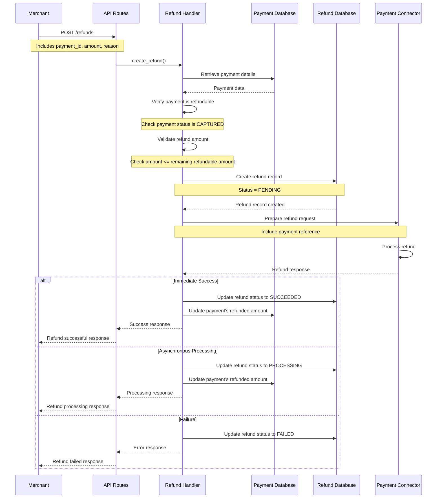
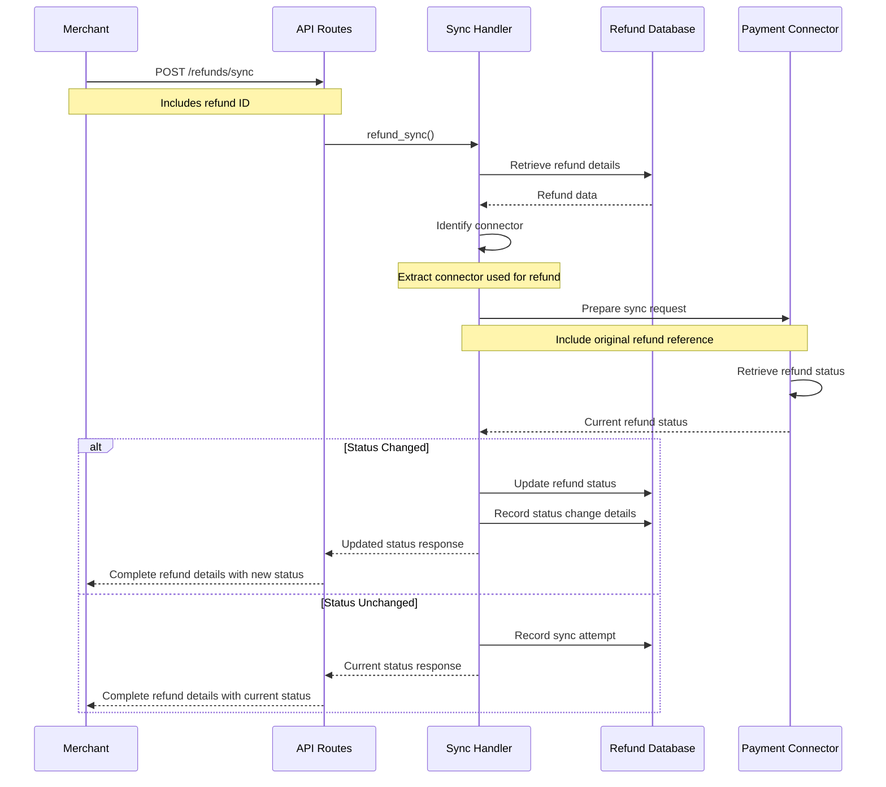
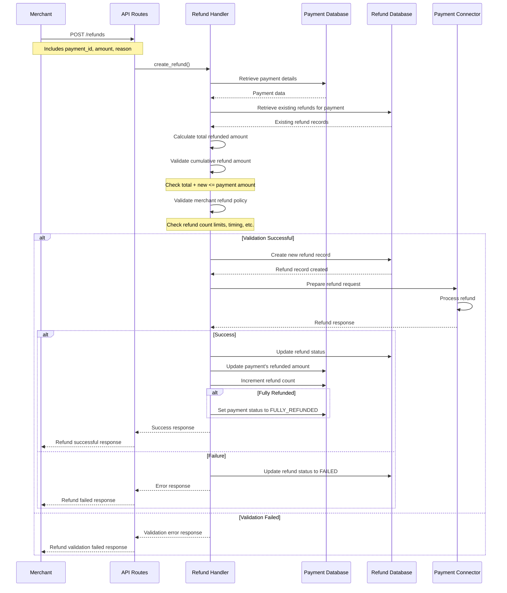

---
**Last Updated:** 2025-05-27  
**Documentation Status:** Complete
---

# Router Refund Flows

---
**Parent:** [Router Overview](../overview.md)  
**Related Files:**
- [Core Module](../modules/core.md)
- [Payment Flows](./payment_flows.md)
- [Webhook Flows](./webhook_flows.md)
---

[← Back to Router Overview](../overview.md)

## Overview

Refund flows represent the processes for returning funds to customers after a successful payment. The Hyperswitch platform provides comprehensive refund capabilities, supporting full and partial refunds, as well as multiple refunds against a single payment. This document details the refund flows implemented in the router crate.

## Key Refund Flows

### Refund Creation Flow

The refund creation flow initiates a refund for a previously captured payment:

1. **API Request Reception**: 
   - Client submits a `POST /refunds` request with refund details
   - Request includes payment ID, amount, and optional reason
   - Request is validated and parsed

2. **Payment Verification**:
   - System verifies the referenced payment exists
   - Checks payment is in a refundable state (typically `CAPTURED`)
   - Validates merchant owns the payment

3. **Refund Amount Validation**:
   - Validates refund amount doesn't exceed remaining refundable amount
   - Checks currency matches the original payment
   - For partial refunds, ensures amount is within valid ranges

4. **Refund Record Creation**:
   - Creates a refund record in the database
   - Generates a unique refund ID
   - Links refund to the original payment
   - Sets initial status to `PENDING`

5. **Connector Selection**:
   - Uses the same connector that processed the original payment
   - Retrieves connector details and credentials

6. **Refund Request Preparation**:
   - Transforms refund request to connector-specific format
   - Includes original payment reference
   - Adds refund-specific metadata

7. **Connector Communication**:
   - Sends refund request to payment processor
   - Receives and processes response
   - Handles connector-specific error mapping

8. **Refund Status Update**:
   - Updates refund status based on connector response
   - Successful refunds: status set to `SUCCEEDED` or `PROCESSING`
   - Failed refunds: status set to `FAILED` with appropriate error codes

9. **Payment Update**:
   - Updates the original payment's refunded amount
   - Updates payment's refund status if fully refunded

10. **Response Formatting**:
    - Returns refund result to client
    - Includes refund ID, status, and amount

This flow is implemented in the `refunds` module of the core component.

#### Refund Creation Flow Sequence Diagram

#### Error Handling in Refund Creation

- **Payment Not Found**: If the specified payment ID doesn't exist, the flow returns a "payment not found" error
- **Invalid Payment State**: If payment is not in a refundable state (not CAPTURED), the flow fails with "payment not refundable" error
- **Authorization Error**: If merchant doesn't own the payment, the flow fails with an authorization error
- **Amount Validation Errors**:
  - If refund amount exceeds payment amount, the flow fails with "amount exceeds payment" error
  - If refund amount exceeds remaining refundable amount, the flow fails with "amount exceeds refundable amount" error
  - If currency doesn't match original payment, the flow fails with "currency mismatch" error
- **Connector Communication Failures**: Network errors or timeouts are handled with retry mechanisms
- **Connector Processing Errors**: Refund may be rejected by processor for various reasons (e.g., too late, fraud suspicion)
- **Database Errors**: Failures in refund state persistence trigger error responses and logging

#### Edge Cases and Special Scenarios

- **Minimum Refund Amounts**: Some payment processors enforce minimum refund amounts, which are validated before processing
- **Partial vs. Full Refunds**: System handles both partial refunds and full refunds with appropriate validations
- **Currency Conversion**: For cross-currency refunds (if supported), exchange rates and rounding rules are applied
- **Metadata Handling**: Special metadata fields required by specific processors are included in the refund request
- **Refund Fees**: Some processors charge fees for refunds, which may need to be accounted for
- **Tax Implications**: Refunds may have tax implications that need to be tracked in the response
- **Refund Timing Limits**: Many processors have time limits after which refunds are no longer allowed

#### Implementation Details

The refund creation flow is primarily implemented in:
- `crates/router/src/core/refunds.rs` and `crates/router/src/core/refunds_v2.rs`
- `crates/router/src/db/refund.rs`

Key interfaces include:
- `RefundInterface` trait: Defines the core refund operations
- `ConnectorIntegration` trait: Contains connector-specific refund processing logic

The flow ensures idempotency by checking for existing refunds with the same refund_id and returning cached results for duplicate requests.

### Refund Status Sync Flow

For synchronizing refund status with the payment processor:

1. **Sync Request Reception**:
   - Client submits a `POST /refunds/sync` request with refund ID
   - Request is validated and parsed

2. **Connector Selection**:
   - Identifies connector used for the original refund
   - Retrieves connector details and credentials

3. **Sync Request Preparation**:
   - Transforms request to connector-specific format
   - Includes original refund reference

4. **Connector Communication**:
   - Sends status inquiry to payment processor
   - Receives and processes response

5. **Refund Status Update**:
   - Updates refund status if changed in the processor's system
   - Records latest refund details

6. **Response Formatting**:
   - Returns current refund status to client
   - Includes complete refund details

This flow allows merchants to explicitly check the current status of a refund with the payment processor, which is useful for resolving discrepancies or handling cases where webhook notifications might have been missed.

#### Refund Status Sync Flow Sequence Diagram

#### Error Handling in Refund Status Sync

- **Refund Not Found**: If the specified refund ID doesn't exist, the flow returns a "refund not found" error
- **Authorization Error**: If merchant doesn't own the refund, the flow fails with an authorization error
- **Connector Determination Failures**: If the original connector can't be determined, the sync fails
- **Connector Communication Failures**: Network errors or timeouts are handled with retry mechanisms
- **Reference Mapping Issues**: If the refund processor reference is missing, the sync returns an error
- **Status Interpretation Errors**: If the connector returns an ambiguous status, the system applies status resolution rules

#### Edge Cases and Special Scenarios

- **Processor-Specific Timeframes**: Some processors only allow status checks for a limited time after the refund
- **Delayed Processing**: For refunds that take several days to process (e.g., bank transfers), status may remain in PROCESSING for extended periods
- **Processor Outages**: If a processor's status API is temporarily unavailable, the system uses cached status with appropriate flags
- **Webhook vs. Sync Race Conditions**: When webhook updates and status syncs occur simultaneously, locking prevents conflicts
- **Status Transition Validation**: Only certain status transitions are allowed (e.g., PROCESSING → SUCCEEDED, not FAILED → SUCCEEDED)
- **Multiple Status Checks**: Repeated status checks within short timeframes may be rate-limited to prevent processor API abuse

#### Implementation Details

The refund status sync flow is primarily implemented in:
- `crates/router/src/core/refunds.rs` and `crates/router/src/core/refunds_v2.rs`
- `crates/router/src/workflows/refund_router.rs`

Key interfaces include:
- `RefundSyncInterface` trait: Defines the core status synchronization operations
- `ConnectorIntegration` trait: Contains connector-specific status retrieval logic

The flow is particularly important for payment methods where refunds are processed asynchronously and final status may not be known for hours or days.

### Multiple Refunds Flow

For processing multiple refunds against a single payment:

1. **Refund Request Reception**:
   - Same as standard refund creation
   - System recognizes this is not the first refund for the payment

2. **Cumulative Refund Validation**:
   - Calculates total previously refunded amount
   - Ensures new refund plus previous refunds don't exceed payment amount
   - Validates against merchant's multiple refund policies

3. **Refund Processing**:
   - Processes the refund similar to standard refund flow
   - Updates payment with additional refund information

4. **Aggregate Refund Tracking**:
   - Maintains a record of all refunds against the payment
   - Updates payment's refunded amount and refund count
   - Updates payment status to `FULLY_REFUNDED` if applicable

This flow extends the standard refund creation flow to handle the complexities of multiple refunds for a single payment.

#### Multiple Refunds Flow Sequence Diagram

#### Error Handling in Multiple Refunds

- **Amount Exceeded Error**: If the new refund would cause total refunds to exceed the payment amount, the flow fails with "refund amount exceeds payment amount" error
- **Refund Count Limit**: If merchant policy limits the number of refunds per payment, the flow enforces this limit
- **Time Window Validation**: Some merchants only allow refunds within specific time windows, which are enforced
- **Minimum Amount Restrictions**: If the refund amount is below connector minimum (for subsequent refunds), the flow fails with appropriate error
- **Payment Already Fully Refunded**: If payment is already marked as fully refunded but another refund is attempted, an error is returned
- **Concurrent Refund Conflicts**: Locking mechanisms prevent race conditions when multiple refund requests occur simultaneously

#### Edge Cases and Special Scenarios

- **Partial Refund Tracking**: The system maintains detailed records of all partial refunds with individual amounts and statuses
- **Multi-Currency Refunds**: For payments with multiple currency conversions, special handling may be required for multiple refunds
- **Connector-Specific Limits**: Some connectors limit the number of partial refunds, which is enforced by the system
- **Refund Sequencing**: Some connectors require specific ordering or timing between multiple refunds
- **Aggregated Reporting**: The system provides aggregated refund reporting for analytics purposes
- **Differential Fee Handling**: Different refund instances may have different fee structures that need to be tracked separately

#### Implementation Details

The multiple refunds flow extends the standard refund creation flow and is implemented in:
- `crates/router/src/core/refunds.rs` and `crates/router/src/core/refunds_v2.rs`
- `crates/router/src/core/utils/refunds_validator.rs`

Key components include:
- `PaymentRefundTracker`: Tracks the cumulative refund status for a payment
- `RefundValidationService`: Validates refund requests against business rules and connector constraints
- `RefundIntegrityChecker`: Ensures data consistency between payment and refund records

Idempotency is particularly important in this flow to prevent duplicate refunds from being processed, especially when retry logic is involved.

## Asynchronous Refund Processing

Many payment processors handle refunds asynchronously, which requires special handling:

1. **Initial Acceptance**:
   - Processor acknowledges refund request but doesn't process immediately
   - System sets refund status to `PROCESSING`

2. **Status Monitoring**:
   - System periodically checks refund status with processor
   - Alternatively, waits for webhook notification of status change

3. **Final Status Update**:
   - Once processor completes refund, status is updated to `SUCCEEDED` or `FAILED`
   - Merchant is notified of final status via webhook (if configured)

This asynchronous flow ensures proper tracking of refunds that may take time to process, particularly for certain payment methods like bank transfers or some digital wallets.

## Error Handling in Refund Flows

Refund flows implement comprehensive error handling:

- **Validation Errors**: Errors in refund parameters or constraints
- **Payment State Errors**: Errors when payment is in a non-refundable state
- **Connector Errors**: Errors from the payment processor
- **Timing Errors**: Errors related to refund time limits
- **Amount Errors**: Errors related to refund amount constraints

Each error type is handled appropriately with clear error messages and status codes.

## Refund Time Limits

Refund flows enforce time limits based on:

1. **Connector Constraints**: Respects the payment processor's refund time limits
2. **Merchant Configuration**: Applies merchant-specific refund window settings
3. **Regulatory Requirements**: Complies with relevant financial regulations

The system validates refund requests against these time constraints before processing.

## Dependencies

Refund flows depend on several key components:

- **Core Refund Logic**: Implements the business rules for refund processing
- **Connector Implementations**: Provides communication with payment processors
- **Database Services**: Stores and retrieves refund state
- **Payment Services**: Accesses and updates payment records
- **Domain Models**: Defines the data structures for refund operations

## Document History
| Date | Changes |
|------|---------|
| 2025-05-27 | Updated to new documentation standard format |
| 2025-05-20 | Last content update before standardization |
| Prior | Initial version |

## See Also

- [Core Module Documentation](../modules/core.md)
- [Payment Flows Documentation](./payment_flows.md)
- [Webhook Flows Documentation](./webhook_flows.md)
