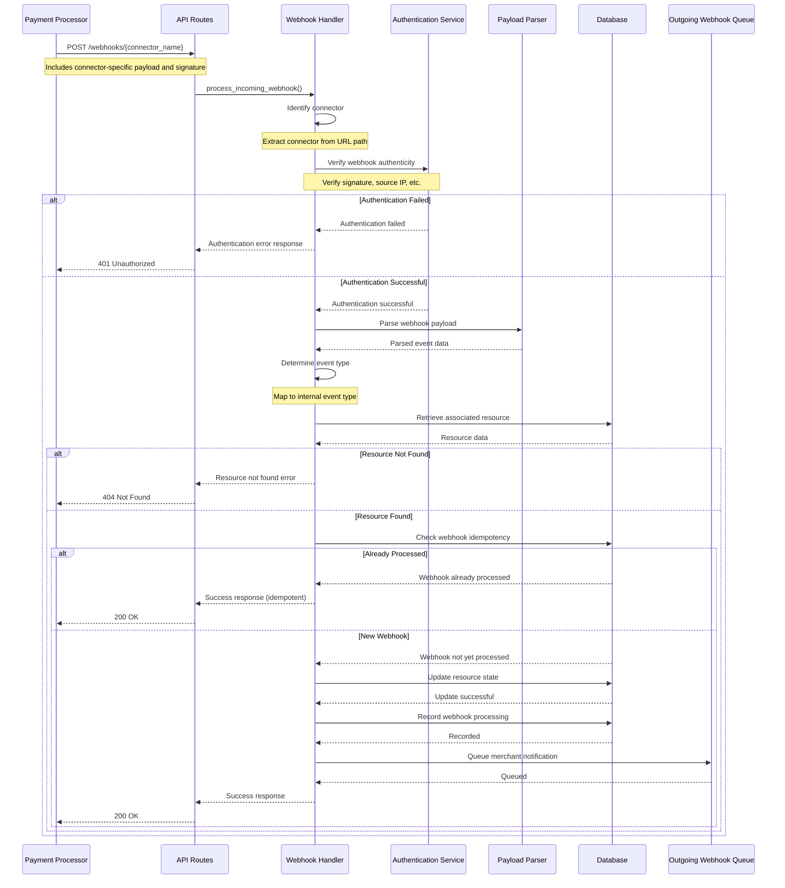
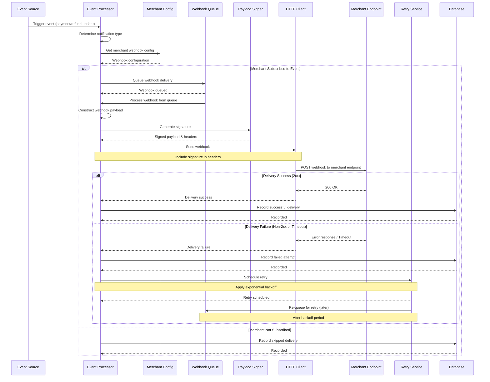

---
**Last Updated:** 2025-05-27  
**Documentation Status:** Complete
---

# Router Webhook Flows

---
**Parent:** [Router Overview](../overview.md)  
**Related Files:**
- [Core Module](../modules/core.md)
- [Payment Flows](./payment_flows.md)
- [Refund Flows](./refund_flows.md)
---

[← Back to Router Overview](../overview.md)

## Overview

Webhook flows handle asynchronous notifications within the Hyperswitch platform. These flows encompass both incoming webhooks from payment processors and outgoing webhooks to merchants. Webhooks are critical for handling state changes that occur asynchronously, such as payment status updates, refund completions, and dispute notifications.

## Key Webhook Flows

### Incoming Webhook Flow

The incoming webhook flow processes notifications from payment processors:

1. **Webhook Reception**:
   - Payment processor sends a webhook to the dedicated endpoint (`POST /webhooks/{connector_name}`)
   - Request includes connector-specific payload and signature/authentication data
   - Webhook is received and initial metadata is logged

2. **Connector Identification**:
   - System identifies the connector based on the URL path
   - Loads connector-specific webhook handling configuration

3. **Webhook Authentication**:
   - Verifies webhook authenticity using connector-specific methods
   - Typical authentication methods include:
     - HMAC signatures
     - Shared secrets
     - API keys
     - Source IP validation
   - Rejects unauthorized webhooks with appropriate error responses

4. **Payload Parsing**:
   - Parses the webhook payload according to connector-specific format
   - Handles different content types (JSON, XML, form data, etc.)
   - Extracts key information like event type, resource ID, and status

5. **Event Type Determination**:
   - Identifies the type of event (payment update, refund update, dispute notification, etc.)
   - Maps connector-specific event types to standardized internal event types
   - Routes the webhook to the appropriate handler based on event type

6. **Resource Retrieval**:
   - Identifies the associated resource (payment, refund, etc.) using reference IDs in the webhook
   - Retrieves the current state of the resource from the database
   - Validates the webhook pertains to a valid resource

7. **State Update Processing**:
   - Updates the resource state based on the webhook information
   - For payment updates: updates payment status, adds additional data
   - For refund updates: updates refund status, adds processing details
   - For disputes: creates or updates dispute records

8. **Idempotency Handling**:
   - Checks if this exact webhook has been processed before
   - Prevents duplicate processing of the same event
   - Maintains idempotency keys for webhook events

9. **Outgoing Webhook Triggering**:
   - If state changes occur, triggers outgoing webhooks to merchants
   - Queues outgoing webhook delivery

10. **Response Formatting**:
    - Returns appropriate response to the payment processor
    - Typically a simple acknowledgment (HTTP 200) to confirm receipt

This flow is implemented in the `webhooks` module of the core component.

#### Incoming Webhook Flow Sequence Diagram

#### Error Handling in Incoming Webhooks

- **Authentication Failures**: If signature verification fails, the webhook is rejected with a 401 Unauthorized response
- **Malformed Payloads**: If the payload cannot be parsed, an appropriate error response is returned (400 Bad Request)
- **Unknown Event Types**: If the event type cannot be determined, the webhook is logged for investigation and a 422 Unprocessable Entity response is returned
- **Resource Not Found**: If the referenced resource (payment, refund, etc.) cannot be found, a 404 Not Found response is returned
- **Concurrent Updates**: Database locking mechanisms prevent race conditions when multiple webhooks arrive simultaneously
- **Processing Failures**: If resource state cannot be updated, the error is logged and an appropriate error response is returned

#### Edge Cases and Special Scenarios

- **Test Webhooks**: Some processors send test webhooks that should be acknowledged but not processed
- **Delayed Webhooks**: Webhooks may arrive out of order or significantly delayed, requiring careful state transition validation
- **Duplicate Webhooks**: Many processors send duplicate webhooks for reliability, requiring robust idempotency handling
- **Partial Updates**: Some webhooks contain only partial resource data, requiring merging with existing data
- **Webhook Replay Attacks**: Defense mechanisms are in place to detect and prevent malicious webhook replay
- **Webhook Format Changes**: Versioning and fallback mechanisms handle changes in processor webhook formats

#### Implementation Details

The incoming webhook flow is primarily implemented in:
- `crates/router/src/core/webhooks/incoming.rs` and `crates/router/src/core/webhooks/incoming_v2.rs`
- `crates/router/src/routes/webhooks.rs`

Key interfaces include:
- `WebhookProcessor` trait: Defines the core webhook processing operations
- `ConnectorWebhookFlow` trait: Contains connector-specific webhook handling logic
- `WebhookEventInterface` trait: Manages webhook event mapping and routing

The implementation includes specialized handling for each connector's unique webhook format and authentication requirements. Webhook processing is designed to be non-blocking, with potential use of background processing for time-consuming operations.

### Outgoing Webhook Flow

The outgoing webhook flow delivers notifications to merchants:

1. **Event Detection**:
   - System detects an event that requires merchant notification
   - Events typically include payment status changes, refund updates, dispute notifications
   - Determines which merchants should be notified

2. **Merchant Webhook Configuration Retrieval**:
   - Retrieves merchant's webhook configuration
   - Checks if the merchant has subscribed to this event type
   - Retrieves endpoint URL, authentication details, and retry settings

3. **Payload Construction**:
   - Constructs the webhook payload in Hyperswitch's standard format
   - Includes event type, resource data, and timestamp
   - May include additional metadata based on event type

4. **Signature Generation**:
   - Generates a signature for the webhook payload
   - Typically uses HMAC with the merchant's webhook secret
   - Includes signature in HTTP headers

5. **Delivery Attempt**:
   - Sends HTTP POST request to merchant's webhook endpoint
   - Includes appropriate headers (Content-Type, Signature, etc.)
   - Sets appropriate timeout for the request

6. **Response Handling**:
   - Processes the HTTP response from the merchant endpoint
   - Successful delivery: HTTP 2xx status code
   - Failed delivery: Non-2xx status code or timeout

7. **Retry Management**:
   - For failed deliveries, schedules retry attempts
   - Implements exponential backoff for successive retries
   - Respects merchant-configured retry settings

8. **Delivery Tracking**:
   - Records webhook delivery attempts and results
   - Tracks successful deliveries, failures, and retry counts
   - Provides delivery status for troubleshooting

9. **Webhook Logs**:
   - Maintains detailed logs of webhook deliveries
   - Logs include payload, headers, response codes, and timing
   - May be used for auditing or troubleshooting

This flow is implemented using a combination of the `webhooks` module and potentially the scheduler crate for retry management.

#### Outgoing Webhook Flow Sequence Diagram

#### Error Handling in Outgoing Webhooks

- **Network Failures**: When the merchant endpoint is unreachable, the system schedules retries with exponential backoff
- **Timeout Errors**: When the merchant endpoint takes too long to respond, the delivery is considered failed and scheduled for retry
- **Authentication Failures**: If signature or authentication is rejected, errors are logged for investigation
- **Configuration Errors**: Invalid webhook URLs or configurations trigger alerts and error logging
- **Payload Size Limits**: Large payloads may be truncated or split according to configurable limits
- **Rate Limiting**: If merchants impose rate limits, the system adapts delivery frequency accordingly

#### Edge Cases and Special Scenarios

- **Endpoint Unavailability**: If a merchant endpoint is consistently unavailable, the system may implement circuit breaking
- **Retry Exhaustion**: After configured maximum retries, webhooks are marked as permanently failed and stored for manual review
- **Event Coalescence**: Multiple rapid events of the same type may be combined into a single notification in some cases
- **Event Ordering**: For ordered events, the system ensures delivery order matches event order through queuing mechanisms
- **Webhook Versioning**: The system supports multiple webhook payload formats for backward compatibility
- **Critical vs. Non-Critical**: Events are categorized by criticality, with different retry policies for each category

#### Implementation Details

The outgoing webhook flow is primarily implemented in:
- `crates/router/src/core/webhooks/outgoing.rs` and `crates/router/src/core/webhooks/outgoing_v2.rs`
- `crates/router/src/workflows/outgoing_webhook_retry.rs`

Key components include:
- `WebhookDeliveryService`: Manages the actual delivery of webhooks to merchant endpoints
- `WebhookRetryManager`: Handles the retry logic for failed webhook deliveries
- `WebhookLogService`: Records detailed logs of webhook delivery attempts

The implementation uses a queue-based architecture to ensure reliable delivery, with a scheduler for managing retries. Critical webhooks may use a separate priority queue to ensure timely delivery. The system is designed to be horizontally scalable, allowing for high-volume webhook processing across multiple instances.

## Webhook Types

The webhook system handles several types of notifications:

### Payment Webhooks

Notifications related to payment status changes:

- **Payment Success**: When a payment is successfully completed
- **Payment Failure**: When a payment fails
- **Authorization**: When a payment is authorized
- **Capture**: When a previously authorized payment is captured
- **Cancellation**: When a payment is cancelled or voided
- **Expiration**: When an uncaptured authorization expires

### Refund Webhooks

Notifications related to refund processing:

- **Refund Success**: When a refund is successfully processed
- **Refund Failure**: When a refund fails
- **Refund Pending**: When a refund is pending processor action

### Dispute Webhooks

Notifications related to payment disputes:

- **Dispute Created**: When a new dispute/chargeback is initiated
- **Dispute Updated**: When dispute status changes
- **Dispute Evidence Required**: When evidence is required
- **Dispute Resolved**: When a dispute is resolved

### Setup Webhooks

Notifications related to account setup:

- **Setup Success**: When account setup is completed
- **Setup Failure**: When account setup fails
- **Setup Update**: When account details are updated

## Webhook Security

The webhook system implements several security measures:

### Incoming Webhook Security

- **Signature Verification**: Validates authenticity of processor webhooks
- **IP Whitelisting**: Optionally restricts webhooks to known processor IPs
- **Request Validation**: Validates request format and required fields
- **Rate Limiting**: Protects against excessive webhook requests

### Outgoing Webhook Security

- **Payload Signing**: Signs outgoing webhooks with merchant-specific secrets
- **TLS Enforcement**: Ensures webhooks are delivered over secure connections
- **Sensitive Data Handling**: Follows PCI compliance for sensitive payment data
- **Retry Limiting**: Prevents excessive retry attempts

## Webhook Configuration

Both incoming and outgoing webhooks are highly configurable:

### Processor Webhook Configuration

- **Endpoint Configuration**: Configures connector-specific webhook endpoints
- **Authentication Settings**: Sets up verification methods for each connector
- **Payload Mapping**: Defines how to interpret different connector formats

### Merchant Webhook Configuration

- **Subscription Settings**: Allows merchants to subscribe to specific event types
- **Endpoint Management**: Manages merchant endpoint URLs
- **Secret Management**: Manages signing secrets for webhooks
- **Retry Settings**: Configures retry attempts, intervals, and timeouts

## Dependencies

Webhook flows depend on several key components:

- **Core Webhook Logic**: Implements the business rules for webhook processing
- **Connector Implementations**: Provides connector-specific webhook handling
- **Database Services**: Stores and retrieves resource state
- **HTTP Client**: For outgoing webhook delivery
- **Scheduler**: For managing webhook delivery retries

## Document History
| Date | Changes |
|------|---------|
| 2025-05-27 | Updated to new documentation standard format |
| 2025-05-20 | Last content update before standardization |
| Prior | Initial version |

## See Also

- [Core Module Documentation](../modules/core.md)
- [Payment Flows Documentation](./payment_flows.md)
- [Refund Flows Documentation](./refund_flows.md)
