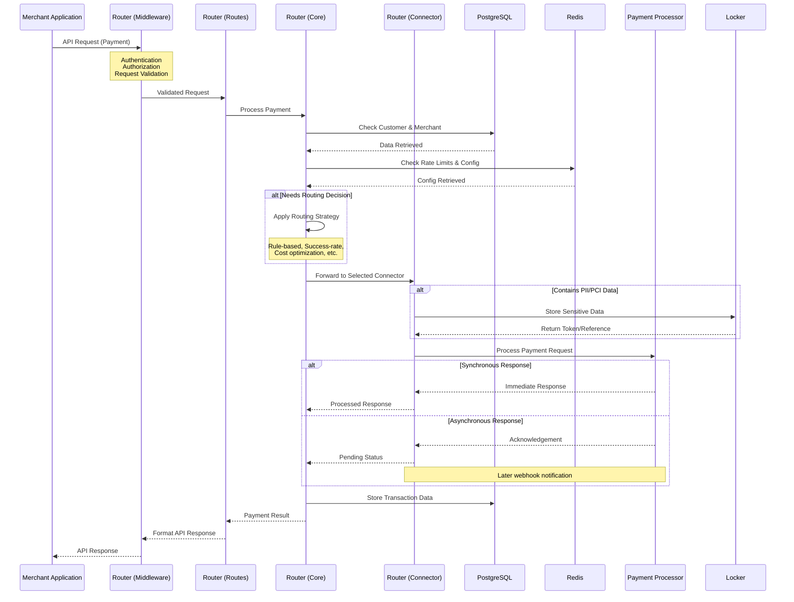
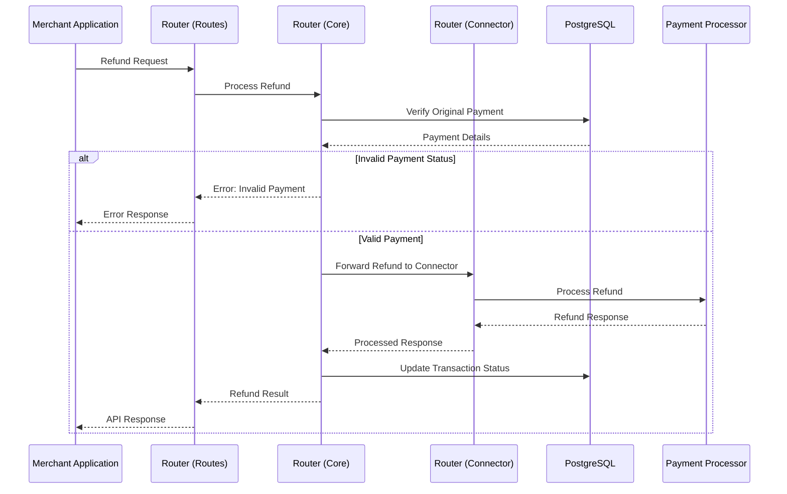
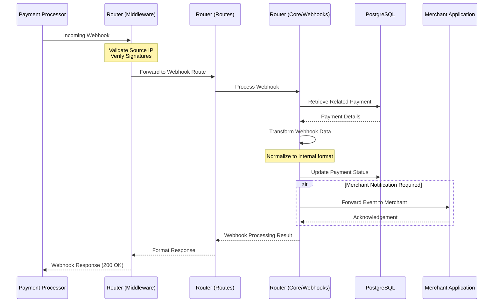
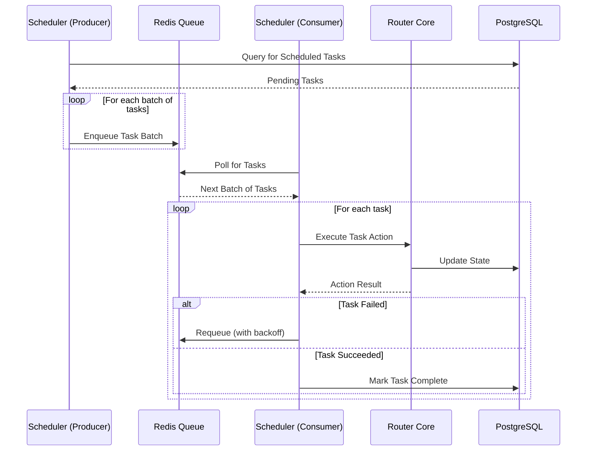

# Hyperswitch Component Interaction Diagram

---
**Last Updated:** 2025-05-27  
**Documentation Status:** Complete
---

This document provides a detailed component interaction diagram showing how the major components of the Hyperswitch system interact with each other during key operations.

## Component Interaction Overview

The following diagram illustrates the interactions between major components during payment processing:

## Refund Flow Component Interaction

The following diagram shows component interactions during the refund process:

## Webhook Processing Component Interaction

The following diagram illustrates the component interactions during webhook processing:

## Scheduler Task Execution

The following diagram shows how the Scheduler component interacts with other components:

## Key Component Responsibilities

### Router Components
- **Middleware**: Handles cross-cutting concerns like authentication, logging, and request validation
- **Routes**: Defines API endpoints and routes requests to appropriate core components
- **Core**: Contains the business logic for payment processing, refunds, webhooks, etc.
- **Connector**: Interfaces with external payment processors, handling the specific requirements of each

### Data Stores
- **PostgreSQL**: Persistent storage for all transaction data
- **Redis**: Used for caching configuration, rate limiting, and as a task queue
- **Locker**: Secure storage for sensitive payment data (PCI/PII)

### Scheduler Components
- **Producer**: Identifies tasks that need to be executed and places them in the Redis queue
- **Consumer**: Retrieves tasks from the queue and executes them

## Important Interaction Patterns

1. **Request Validation & Authentication**: All incoming requests pass through middleware layers for validation and authentication before reaching business logic.

2. **Data Transformation**: The system handles data transformation at connector boundaries, converting between internal formats and connector-specific formats.

3. **Secure Storage**: Sensitive data is tokenized through the Locker component before storage or transmission.

4. **Asynchronous Processing**: Many operations use asynchronous processing patterns, especially for long-running operations.

5. **Stateful Transactions**: The system maintains transaction state in the database, allowing for status tracking and eventual consistency.

## See Also
- [Payment Flows Documentation](../crates/router/flows/payment_flows.md)
- [Refund Flows Documentation](../crates/router/flows/refund_flows.md)
- [Webhook Flows Documentation](../crates/router/flows/webhook_flows.md)
