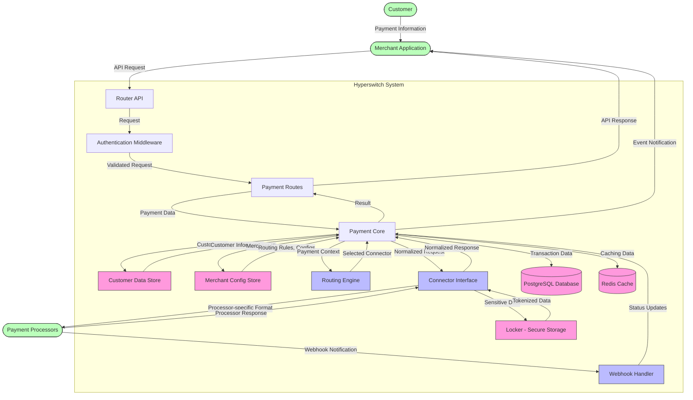
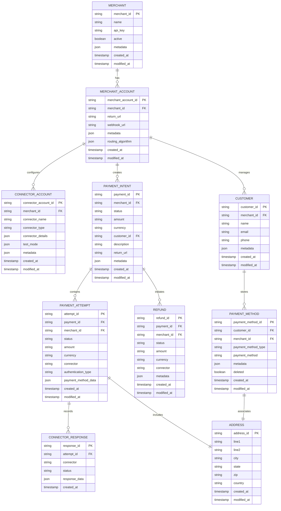

# Hyperswitch Data Flow Diagram

---
**Last Updated:** 2025-05-27  
**Documentation Status:** Complete
---

This document provides a data flow diagram for the Hyperswitch payment orchestration platform, illustrating how data moves through the system during key processes.

## Payment Data Flow

The following diagram illustrates how payment data flows through the Hyperswitch system:

## Data Transformations

The following diagram illustrates the key data transformations that occur as a payment request moves through the system:

```mermaid
flowchart LR
    %% Data format transformations
    MerchantReq[Merchant API Request] --> |Validation & Parsing| InternalPayment[Internal Payment Model]
    InternalPayment --> |Normalization| RouterPayment[Router Payment Model]
    RouterPayment --> |Connector Selection| RoutedPayment[Routed Payment Model]
    RoutedPayment --> |Connector Transformation| ConnectorRequest[Connector-specific Request]
    
    %% PCI/PII Data handling
    ConnectorRequest --> |Tokenization| TokenizedRequest[Tokenized Connector Request]
    
    %% Response transformations
    ConnectorResponse[Connector Response] --> |Normalization| InternalResponse[Internal Response Model]
    InternalResponse --> |Error Handling| EnrichedResponse[Enriched Response]
    EnrichedResponse --> |API Formatting| MerchantResponse[Merchant API Response]
    
    %% Asynchronous updates
    WebhookData[Webhook Data] --> |Parsing & Validation| ValidatedWebhook[Validated Webhook]
    ValidatedWebhook --> |Normalization| InternalEvent[Internal Event Model]
    InternalEvent --> |Status Mapping| PaymentUpdate[Payment Status Update]
    PaymentUpdate --> |Event Generation| MerchantEvent[Merchant Event Notification]
    
    %% Data transformation types
    classDef input fill:#bfb,stroke:#333,stroke-width:1px;
    classDef internal fill:#bbf,stroke:#333,stroke-width:1px;
    classDef output fill:#f9d,stroke:#333,stroke-width:1px;
    
    class MerchantReq,ConnectorResponse,WebhookData input;
    class InternalPayment,RouterPayment,RoutedPayment,InternalResponse,EnrichedResponse,ValidatedWebhook,InternalEvent,PaymentUpdate internal;
    class ConnectorRequest,TokenizedRequest,MerchantResponse,MerchantEvent output;
```

## Data Storage Models

The following diagram shows the key data entities and their relationships in the Hyperswitch database:

## Redis Data Storage

The following diagram illustrates how data is organized in the Redis cache:

```mermaid
graph TD
    Redis[(Redis Database)]
    
    subgraph Caching["Caching Data"]
        MerchantConfig[Merchant Configuration]
        ConnectorConfig[Connector Configuration]
        RoutingRules[Routing Rules]
        APIKeys[API Keys Cache]
    end
    
    subgraph RateLimiting["Rate Limiting"]
        GlobalLimits[Global Rate Limits]
        MerchantLimits[Merchant-specific Limits]
        IPLimits[IP-based Limits]
    end
    
    subgraph TaskQueue["Scheduler Task Queues"]
        HighPriority[High Priority Tasks]
        MediumPriority[Medium Priority Tasks]
        LowPriority[Low Priority Tasks]
        FailedTasks[Failed Tasks]
    end
    
    Redis --> Caching
    Redis --> RateLimiting
    Redis --> TaskQueue
    
    %% Data types and TTL examples
    MerchantConfig -.-> |Hash, TTL: 1 hour| KeyExample1["merchant:{merchant_id}:config"]
    ConnectorConfig -.-> |Hash, TTL: 1 hour| KeyExample2["connector:{connector_name}:config"]
    RoutingRules -.-> |Sorted Set, TTL: 30 mins| KeyExample3["merchant:{merchant_id}:routing_rules"]
    APIKeys -.-> |String, TTL: 15 mins| KeyExample4["api_key:{api_key_hash}"]
    
    GlobalLimits -.-> |Counter, TTL: 1 min| KeyExample5["rate_limit:global:{endpoint}"]
    MerchantLimits -.-> |Counter, TTL: 1 min| KeyExample6["rate_limit:merchant:{merchant_id}:{endpoint}"]
    IPLimits -.-> |Counter, TTL: 5 mins| KeyExample7["rate_limit:ip:{ip_address}"]
    
    HighPriority -.-> |List, No TTL| KeyExample8["scheduler:queue:high"]
    MediumPriority -.-> |List, No TTL| KeyExample9["scheduler:queue:medium"]
    LowPriority -.-> |List, No TTL| KeyExample10["scheduler:queue:low"]
    FailedTasks -.-> |Hash, TTL: 24 hours| KeyExample11["scheduler:failed:{task_id}"]
```

## Key Data Flows

### Customer Data Flow

1. **Input**: Customer payment information entered in merchant application
2. **Processing**:
   - Customer data is validated and normalized
   - Sensitive data is tokenized through Locker
   - Customer profile is created or retrieved from database
3. **Storage**:
   - Customer records in PostgreSQL
   - Payment methods (tokenized) in PostgreSQL
   - Temporary session data in Redis
4. **Output**: Tokenized customer data used for payment processing

### Payment Data Flow

1. **Input**: Payment request from merchant application
2. **Processing**:
   - Payment validation and normalization
   - Routing determination
   - Connector-specific transformation
   - Processing by payment processor
3. **Storage**:
   - Payment intent in PostgreSQL
   - Payment attempts in PostgreSQL
   - Connector responses in PostgreSQL
   - Transaction status in PostgreSQL
4. **Output**: Payment result to merchant application

### Webhook Data Flow

1. **Input**: Webhook notification from payment processor
2. **Processing**:
   - Webhook validation and verification
   - Normalization to internal format
   - Payment status update
   - Merchant notification generation
3. **Storage**:
   - Updated payment status in PostgreSQL
   - Webhook received record in PostgreSQL
   - Merchant notification record in PostgreSQL
4. **Output**: Event notification to merchant application

## See Also
- [System Architecture Diagram](./system_architecture_diagram.md)
- [Component Interaction Diagram](./component_interaction_diagram.md)
- [Router Code Structure Documentation](../crates/router/architecture/code_structure.md)
