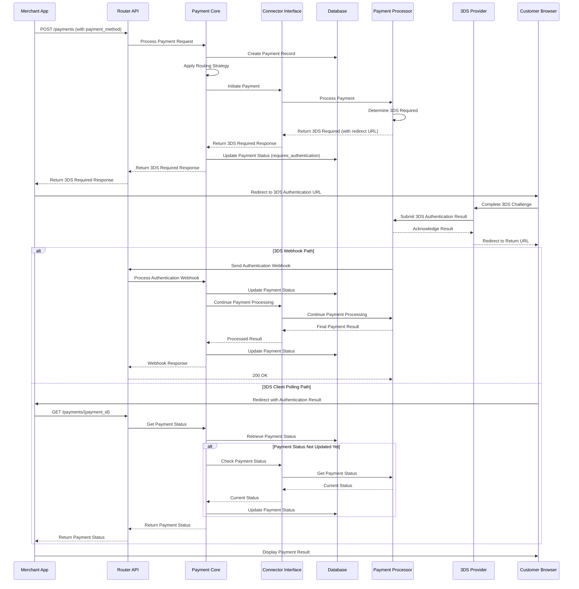
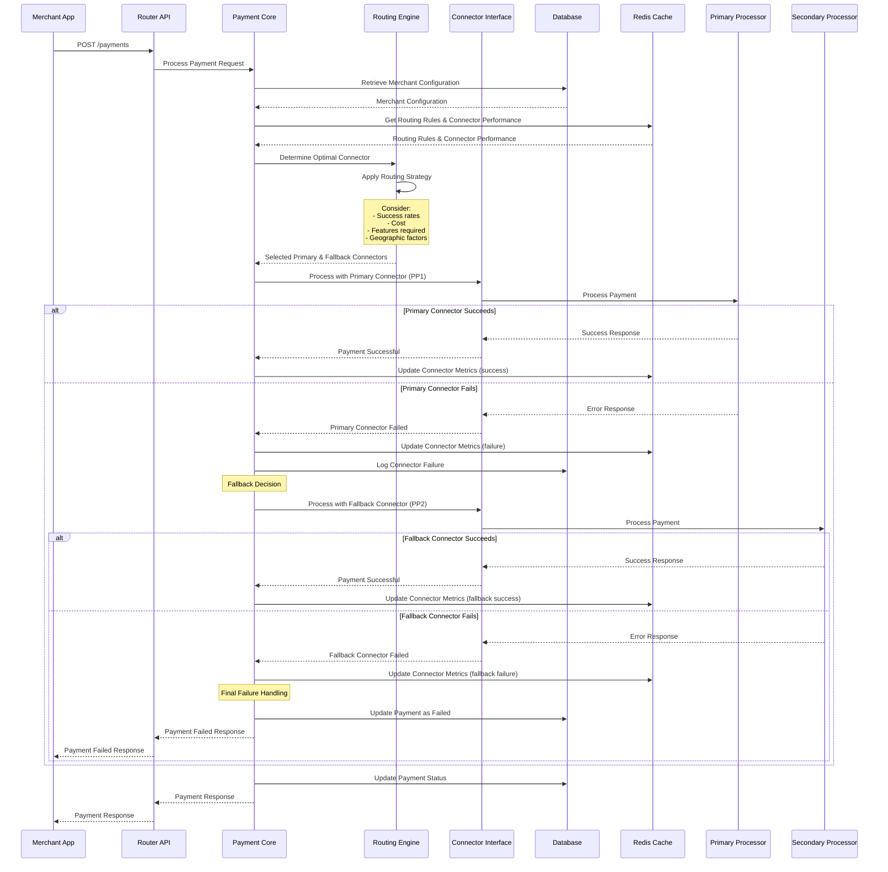
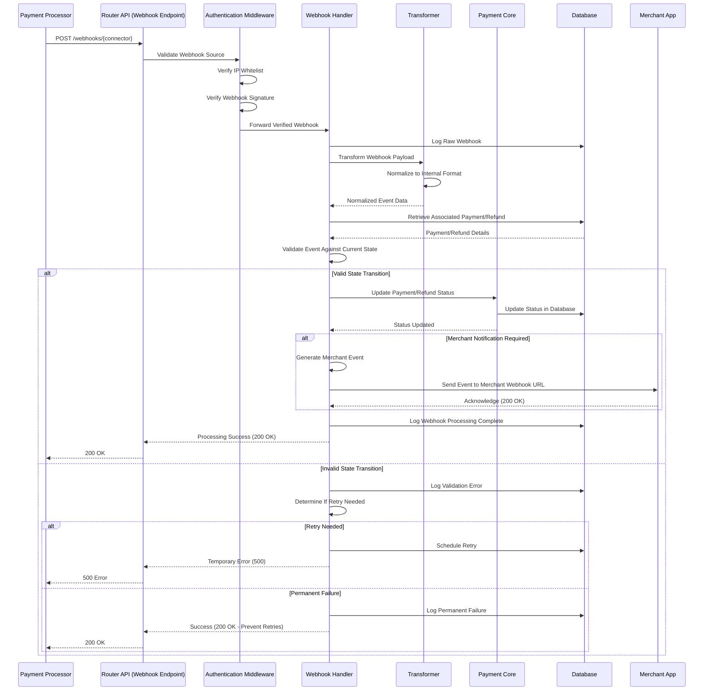
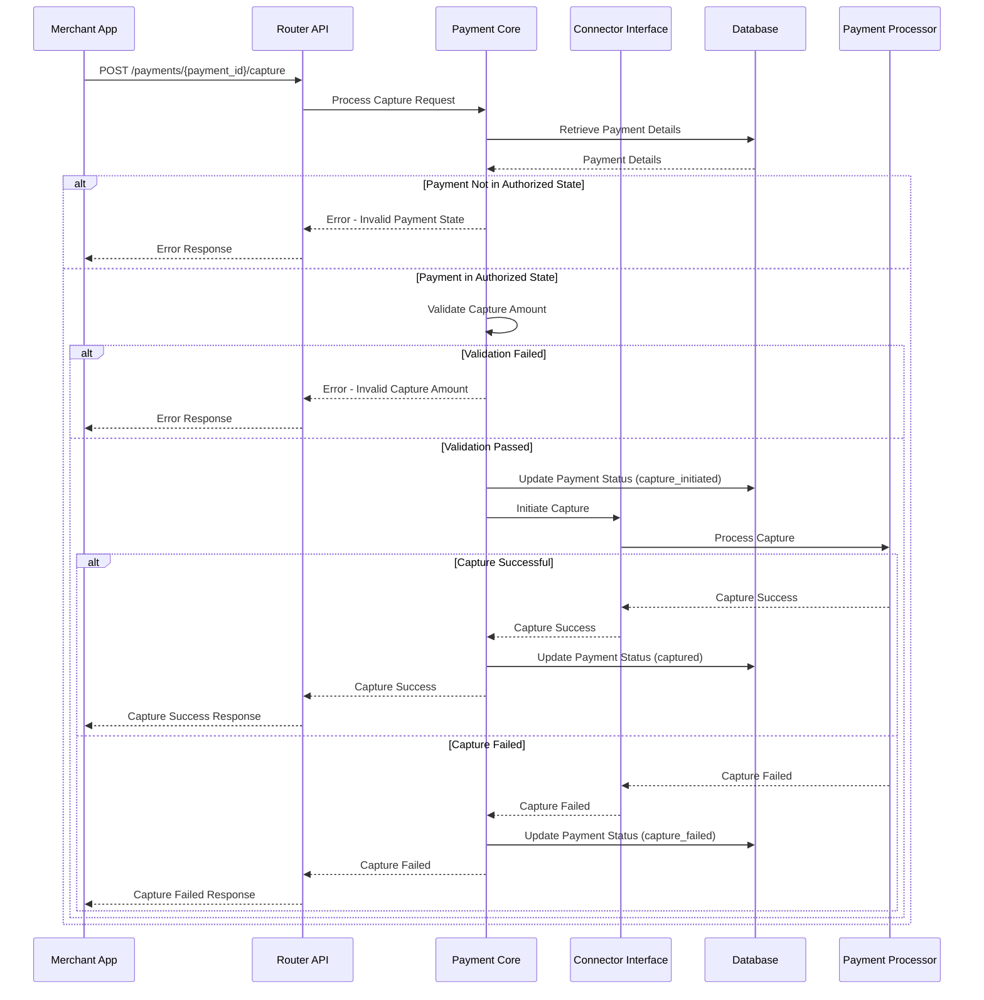
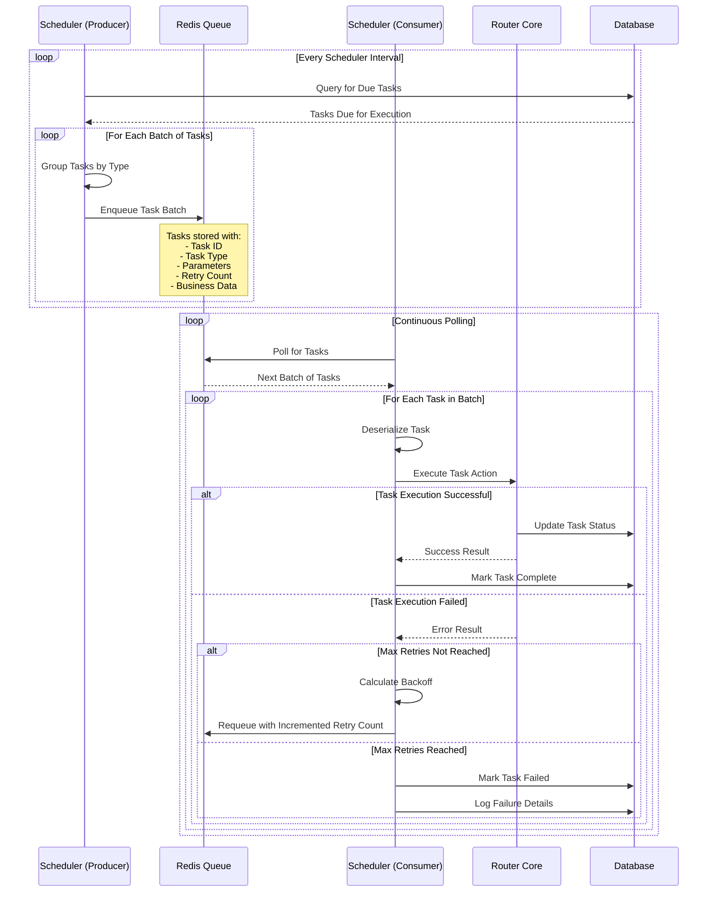

# Hyperswitch Detailed Sequence Diagrams

---
**Last Updated:** 2025-05-27  
**Documentation Status:** Complete
---

This document provides detailed sequence diagrams for complex flows in the Hyperswitch payment orchestration platform, illustrating the step-by-step interactions for specific scenarios.

## 3D Secure (3DS) Authentication Flow

The following diagram illustrates the detailed sequence of interactions during a 3DS authentication flow:

## Payment Routing with Fallback Mechanism

The following diagram illustrates the payment routing process with fallback to alternative connectors when the primary connector fails:

## Webhook Processing Sequence

The following diagram illustrates the detailed sequence for processing webhooks from payment processors:

## Payment Capture Sequence

The following diagram illustrates the capture flow for payments that use separate authorization and capture steps:

## Scheduled Task Execution Sequence

The following diagram illustrates the sequence for executing scheduled tasks via the Scheduler component:

## Key Implementation Notes

### 3DS Flow Implementation
- The system supports both synchronous and asynchronous 3DS flows
- Webhook processing is the primary mechanism for updating 3DS authentication results
- Client-side polling serves as a fallback mechanism
- The system maintains payment state through the entire 3DS redirect flow

### Routing Mechanism Implementation
- Routing decisions consider multiple factors including success rates, costs, and features
- Success and failure metrics are continuously updated for each connector
- Fallback mechanisms can include multiple levels of fallbacks with conditional logic
- Connector selection is logged for auditing and analysis

### Webhook Processing Implementation
- All webhooks are verified for authenticity before processing
- Raw webhook data is logged before transformation
- Events are normalized to a standard internal format independent of the source connector
- State validation ensures consistency during asynchronous processing
- Merchant notifications are sent only after successful internal processing

### Security Considerations
- All sensitive data is tokenized through the Locker component (not shown in diagrams for simplicity)
- Authentication is verified at multiple layers
- Webhook signatures are validated cryptographically
- IP whitelisting provides additional security for webhook endpoints

## See Also
- [System Architecture Diagram](./system_architecture_diagram.md)
- [Component Interaction Diagram](./component_interaction_diagram.md)
- [Data Flow Diagram](./data_flow_diagram.md)
- [State Transition Diagram](./state_transition_diagram.md)
