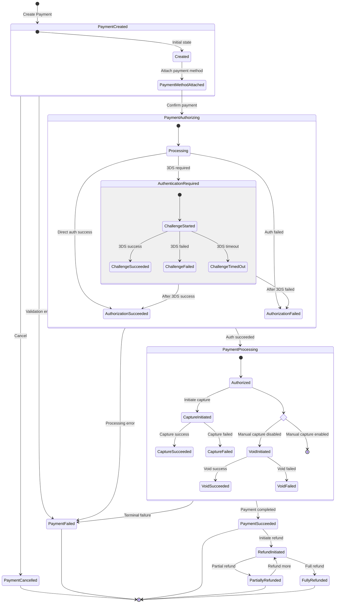
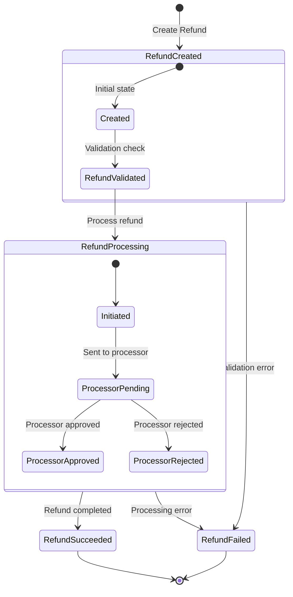
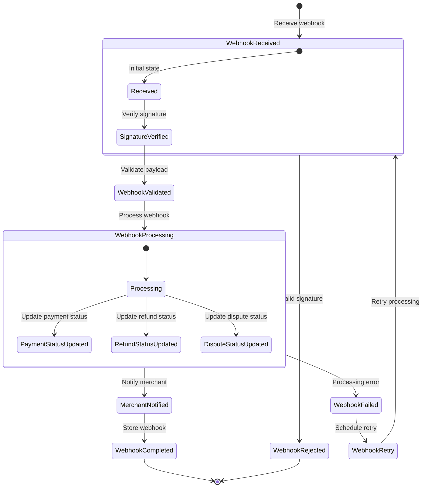

# Hyperswitch State Transition Diagrams

---
**Last Updated:** 2025-05-27  
**Documentation Status:** Complete
---

This document provides state transition diagrams for key processes in the Hyperswitch payment orchestration platform, illustrating the various states and the transitions between them.

## Payment State Transitions

The following diagram shows the possible states and transitions for a payment in the Hyperswitch system:

## Payment Status Definitions

| Status | Description |
|--------|-------------|
| **Created** | Payment has been created but no payment method is attached yet |
| **PaymentMethodAttached** | Payment method information has been attached to the payment |
| **Processing** | Payment is being processed with the payment processor |
| **AuthenticationRequired** | Additional authentication (like 3DS) is required |
| **ChallengeStarted** | 3DS challenge has been initiated |
| **ChallengeSucceeded** | 3DS challenge completed successfully |
| **ChallengeFailed** | 3DS challenge failed |
| **ChallengeTimedOut** | 3DS challenge timed out |
| **AuthorizationSucceeded** | Payment has been authorized successfully |
| **AuthorizationFailed** | Payment authorization failed |
| **Authorized** | Payment is in authorized state awaiting capture |
| **CaptureInitiated** | Capture process has been initiated |
| **CaptureSucceeded** | Capture completed successfully |
| **CaptureFailed** | Capture failed |
| **VoidInitiated** | Void process has been initiated |
| **VoidSucceeded** | Void completed successfully |
| **VoidFailed** | Void failed |
| **PaymentSucceeded** | Payment has been completed successfully |
| **PaymentFailed** | Payment has failed |
| **PaymentCancelled** | Payment has been cancelled |
| **RefundInitiated** | Refund process has been initiated |
| **PartiallyRefunded** | Payment has been partially refunded |
| **FullyRefunded** | Payment has been fully refunded |

## Refund State Transitions

The following diagram shows the possible states and transitions for a refund in the Hyperswitch system:

## Refund Status Definitions

| Status | Description |
|--------|-------------|
| **Created** | Refund has been created but not validated yet |
| **RefundValidated** | Refund has been validated against the original payment |
| **Initiated** | Refund has been initiated with the payment processor |
| **ProcessorPending** | Refund is pending with the payment processor |
| **ProcessorApproved** | Refund has been approved by the payment processor |
| **ProcessorRejected** | Refund has been rejected by the payment processor |
| **RefundSucceeded** | Refund has been completed successfully |
| **RefundFailed** | Refund has failed |

## Webhook Processing State Transitions

The following diagram shows the possible states and transitions for webhook processing in the Hyperswitch system:

## Webhook Status Definitions

| Status | Description |
|--------|-------------|
| **Received** | Webhook has been received but not processed yet |
| **SignatureVerified** | Webhook signature has been verified |
| **WebhookValidated** | Webhook payload has been validated |
| **Processing** | Webhook is being processed |
| **PaymentStatusUpdated** | Payment status has been updated based on webhook |
| **RefundStatusUpdated** | Refund status has been updated based on webhook |
| **DisputeStatusUpdated** | Dispute status has been updated based on webhook |
| **MerchantNotified** | Merchant has been notified about the webhook |
| **WebhookCompleted** | Webhook processing has been completed successfully |
| **WebhookFailed** | Webhook processing has failed |
| **WebhookRetry** | Webhook processing will be retried |
| **WebhookRejected** | Webhook has been rejected due to validation errors |

## Key State Transition Rules

### Payment Processing Rules

1. **State Persistence**: All state transitions are persisted in the database to ensure recoverability.

2. **Idempotency**: Repeated operations on the same payment ID result in the same outcome, preventing duplicate processing.

3. **Webhooks Update States**: External processor webhooks can trigger state transitions even for payments in terminal states.

4. **Required State Sequence**: Certain states must be traversed in sequence (e.g., a payment cannot go from Created directly to Succeeded).

5. **Terminal States**: Some states are terminal (PaymentSucceeded, PaymentFailed, PaymentCancelled, FullyRefunded) and cannot transition further except in special cases.

### Error Handling Rules

1. **Retry Mechanism**: Certain failure states can trigger automatic retries with alternative connectors.

2. **Recovery Paths**: Non-terminal failure states can have recovery paths back to successful processing.

3. **Manual Intervention**: Some states may require manual intervention to proceed (e.g., dispute handling).

## See Also
- [Payment Flows Documentation](../crates/router/flows/payment_flows.md)
- [Refund Flows Documentation](../crates/router/flows/refund_flows.md)
- [Webhook Flows Documentation](../crates/router/flows/webhook_flows.md)
