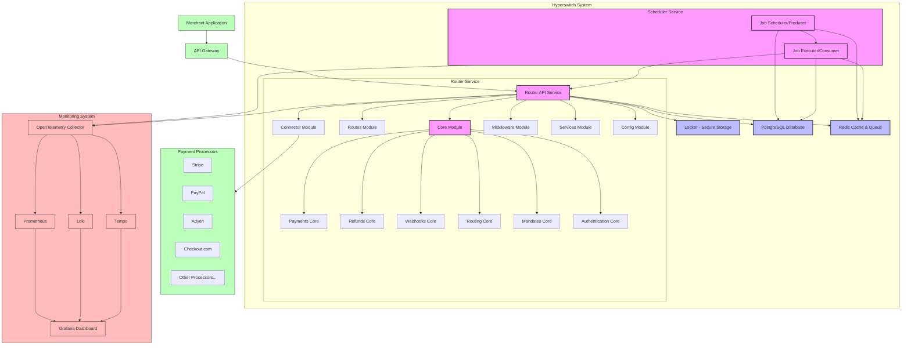

# Hyperswitch System Architecture Diagram

---
**Last Updated:** 2025-05-27  
**Documentation Status:** Complete
---

This document provides a comprehensive system architecture diagram for the Hyperswitch payment orchestration platform, showing the key components and their relationships.

## High-Level System Architecture

The following diagram illustrates the high-level architecture of the Hyperswitch system, including all major components, their relationships, and data flows:

## Architecture Components

### Client-Facing Components
- **Merchant Application**: External applications that integrate with Hyperswitch
- **API Gateway**: Entry point for all client requests

### Core Hyperswitch Components
- **Router Service**: Main application processing all payment requests
  - **Core Module**: Contains essential business logic
  - **Routes Module**: Defines API endpoints
  - **Connector Module**: Interfaces with payment processors
  - **Middleware Module**: Handles cross-cutting concerns
  - **Services Module**: Provides shared services
  - **Config Module**: Manages configuration

- **Scheduler Service**:
  - **Job Scheduler/Producer**: Schedules tasks for later execution
  - **Job Executor/Consumer**: Executes scheduled tasks

- **Locker**: Secure storage component for sensitive data

### Data Stores
- **PostgreSQL**: Primary database for persistent storage
- **Redis**: Used for caching and task queuing

### External Systems
- **Payment Processors**: Third-party payment services integrated with Hyperswitch

### Monitoring Components
- **OpenTelemetry Collector**: Collects metrics, logs, and traces
- **Prometheus**: Stores and processes metrics
- **Loki**: Stores and processes logs
- **Tempo**: Stores and processes traces
- **Grafana**: Visualizes monitoring data

## Key Design Considerations

1. **Modularity**: The system is designed with clear separation of concerns, allowing components to be developed and scaled independently.

2. **Security**: Sensitive payment data is handled through the dedicated Locker component.

3. **Reliability**: The system includes monitoring and observability tools to ensure reliable operation.

4. **Extensibility**: The Connector Module provides a standardized interface for adding new payment processors.

5. **Performance**: Redis caching and asynchronous task processing through the Scheduler optimize performance.

## See Also
- [Router Code Structure](../crates/router/architecture/code_structure.md)
- [System Patterns Documentation](../../systemPatterns.md)
