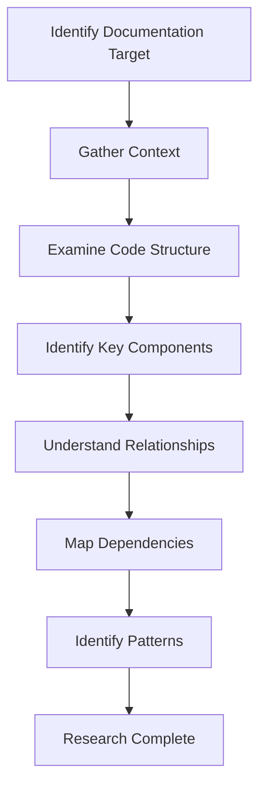

# Memory Bank Generation Plan

This document outlines the structured approach for generating and maintaining Memory Bank documentation for the Hyperswitch project, with a special focus on leveraging advanced tools like Sequential Thinking and Knowledge Graphs for complex documentation tasks.

## Table of Contents

1. [Overall Documentation Strategy](#overall-documentation-strategy)
2. [Document Generation Process](#document-generation-process)
3. [Sequential Thinking for Complex Documentation](#sequential-thinking-for-complex-documentation)
4. [Knowledge Graph for System Understanding](#knowledge-graph-for-system-understanding)
5. [Templates](#templates)
6. [Quality Standards](#quality-standards)
7. [Maintenance Workflow](#maintenance-workflow)

## Overall Documentation Strategy

The Memory Bank follows a hierarchical structure:

```
memory-bank/
├── projectbrief.md         # Project overview and goals
├── productContext.md       # Product purpose and user experience
├── activeContext.md        # Current development focus
├── systemPatterns.md       # Architecture and design patterns
├── techContext.md          # Technical stack and environment
├── progress.md             # Project status and roadmap
├── crateIndex.md           # Index of all crates with links to detailed docs
├── thematic/               # Organized by topic/domain
│   ├── crates/             # Documentation for individual crates
│   ├── architecture/       # System architecture details
│   ├── workflows/          # Key process flows
│   ├── decisions/          # Important design decisions
│   └── documentation_process/  # Meta-documentation on process
└── archive/                # Historical context
```

Documentation should be:
- **Comprehensive**: Cover all critical aspects of the system
- **Accurate**: Reflect the current state of the code
- **Accessible**: Organized for easy navigation and comprehension
- **Maintainable**: Structured for efficient updates

## Document Generation Process

### 1. Research Phase



**Practical Implementation**:

1. **Code Exploration**:
   ```
   <use_mcp_tool>
   <server_name>github.com/modelcontextprotocol/servers/tree/main/src/filesystem</server_name>
   <tool_name>list_directory</tool_name>
   <arguments>
   {
     "path": "/Users/arunraj/github/hyperswitch/crates/target_crate"
   }
   </arguments>
   </use_mcp_tool>
   ```

2. **Key File Analysis**:
   ```
   <use_mcp_tool>
   <server_name>github.com/modelcontextprotocol/servers/tree/main/src/filesystem</server_name>
   <tool_name>read_multiple_files</tool_name>
   <arguments>
   {
     "paths": [
       "/Users/arunraj/github/hyperswitch/crates/target_crate/src/lib.rs",
       "/Users/arunraj/github/hyperswitch/crates/target_crate/Cargo.toml"
     ]
   }
   </arguments>
   </use_mcp_tool>
   ```

3. **Pattern Identification**:
   ```
   <use_mcp_tool>
   <server_name>github.com/modelcontextprotocol/servers/tree/main/src/filesystem</server_name>
   <tool_name>search_files</tool_name>
   <arguments>
   {
     "path": "/Users/arunraj/github/hyperswitch/crates/target_crate",
     "pattern": "pub trait|pub struct|pub fn",
     "excludePatterns": ["target/", "tests/"]
   }
   </arguments>
   </use_mcp_tool>
   ```

### 2. Knowledge Organization Phase

This phase uses Sequential Thinking and Knowledge Graph tools to organize the gathered information:

#### Knowledge Graph Building:

```
<use_mcp_tool>
<server_name>github.com/modelcontextprotocol/servers/tree/main/src/memory</server_name>
<tool_name>create_entities</tool_name>
<arguments>
{
  "entities": [
    {
      "name": "TargetCrate",
      "entityType": "Crate",
      "observations": ["Core purpose", "Key modules", "Responsibilities"]
    },
    {
      "name": "ModuleOne",
      "entityType": "Module",
      "observations": ["Handles specific functionality", "Contains key structs"]
    },
    {
      "name": "StructOne",
      "entityType": "Struct",
      "observations": ["Main data structure", "Used by these components"]
    }
  ]
}
</arguments>
</use_mcp_tool>
```

```
<use_mcp_tool>
<server_name>github.com/modelcontextprotocol/servers/tree/main/src/memory</server_name>
<tool_name>create_relations</tool_name>
<arguments>
{
  "relations": [
    {
      "from": "TargetCrate",
      "to": "ModuleOne",
      "relationType": "contains"
    },
    {
      "from": "ModuleOne",
      "to": "StructOne",
      "relationType": "defines"
    },
    {
      "from": "StructOne",
      "to": "DependentStructure",
      "relationType": "uses"
    }
  ]
}
</arguments>
</use_mcp_tool>
```

#### Sequential Thinking for Structure Planning:

```
<use_mcp_tool>
<server_name>github.com/modelcontextprotocol/servers/tree/main/src/sequentialthinking</server_name>
<tool_name>sequentialthinking</tool_name>
<arguments>
{
  "thought": "Initial analysis of the crate structure and purpose. This crate appears to be responsible for...",
  "nextThoughtNeeded": true,
  "thoughtNumber": 1,
  "totalThoughts": 5
}
</arguments>
</use_mcp_tool>
```

Continue with additional thoughts to progressively refine understanding:

```
<use_mcp_tool>
<server_name>github.com/modelcontextprotocol/servers/tree/main/src/sequentialthinking</server_name>
<tool_name>sequentialthinking</tool_name>
<arguments>
{
  "thought": "Looking at the dependencies and imports, I can identify several key integrations with other crates...",
  "nextThoughtNeeded": true,
  "thoughtNumber": 2,
  "totalThoughts": 5
}
</arguments>
</use_mcp_tool>
```

### 3. Documentation Drafting Phase

Structure the documentation based on the knowledge graph and sequential thinking output:

1. **Create Framework**:
   ```
   <write_to_file>
   <path>/Users/arunraj/github/hyperswitch/memory-bank/thematic/crates/target_crate/overview.md</path>
   <content># Target Crate Overview

## Purpose

Brief description of the crate's purpose and responsibilities.

## Key Modules

List and describe the main modules...

## Configuration Options

...
