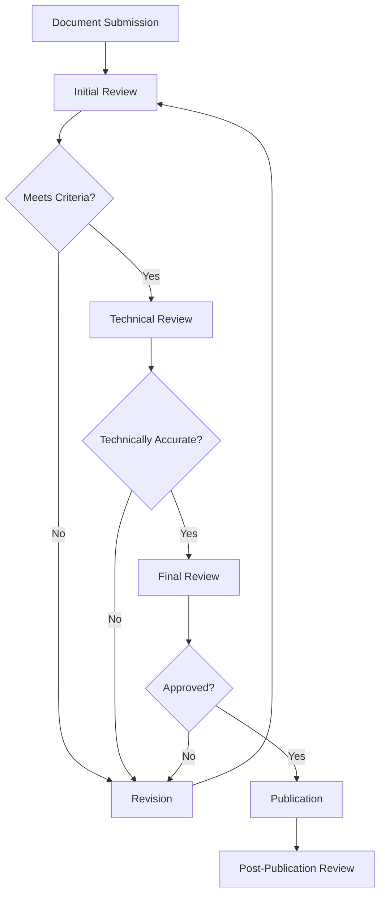

# Documentation Review Workflow

## Overview

This document defines the step-by-step workflow for reviewing Memory Bank documentation. A structured review process ensures consistency, accuracy, and quality across all documentation. This workflow applies to new documentation, significant updates to existing documentation, and periodic reviews of critical documentation.

## Review Process Goals

- Ensure technical accuracy of all documentation
- Maintain consistent style, formatting, and terminology
- Verify completeness and appropriate cross-referencing
- Identify and address potential gaps or areas for improvement
- Provide constructive feedback to documentation authors

## Workflow Stages

The documentation review process consists of the following stages:

### 1. Document Submission

**Activities:**
- Author completes document using appropriate template
- Author performs self-review against basic criteria
- Author submits document for review via pull request
- Automated checks run (formatting, links, etc.)

**Outputs:**
- Document ready for review
- Initial automated check results

**Timeframe:** N/A (author-dependent)

### 2. Initial Review

**Activities:**
- Reviewer checks document against basic criteria
- Reviewer verifies document structure and completeness
- Reviewer checks for adherence to style guidelines
- Reviewer identifies any missing sections or information

**Outputs:**
- Initial review feedback
- Decision to proceed or request revisions

**Timeframe:** 1-2 business days

### 3. Revision (if needed)

**Activities:**
- Author addresses feedback from initial review
- Author resubmits updated document
- Reviewer verifies that feedback has been addressed

**Outputs:**
- Updated document addressing initial feedback
- Verification that initial issues are resolved

**Timeframe:** 1-3 business days (depending on scope)

### 4. Technical Review

**Activities:**
- Technical expert reviews document for accuracy
- Verification of code examples, API references, etc.
- Confirmation that architectural descriptions are accurate
- Assessment of technical completeness

**Outputs:**
- Technical review feedback
- Decision to proceed or request further revisions

**Timeframe:** 2-3 business days

### 5. Final Review

**Activities:**
- Documentation lead conducts final review
- Verification that all feedback has been addressed
- Final check for consistency with other documentation
- Approval decision

**Outputs:**
- Final approval or revision request
- Documentation sign-off (if approved)

**Timeframe:** 1 business day

### 6. Publication

**Activities:**
- Merge documentation into main branch
- Update related documentation if needed
- Notify relevant stakeholders of new/updated documentation

**Outputs:**
- Published documentation
- Notification to team

**Timeframe:** Same day as approval

### 7. Post-Publication Review

**Activities:**
- Gather feedback from documentation users
- Schedule periodic reviews for critical documentation
- Monitor for any issues or improvement suggestions

**Outputs:**
- Ongoing improvement suggestions
- Scheduled review dates for critical documents

**Timeframe:** Continuous, with formal reviews every 3-6 months

## Automated Checks

Where possible, the review process incorporates automated checks to streamline reviews and ensure consistency:

1. **Formatting Validation**
   - Verify Markdown syntax
   - Check heading structure and nesting
   - Validate code block syntax highlighting

2. **Link Validation**
   - Verify internal links between documents
   - Check external references
   - Ensure no broken links

3. **Style Consistency**
   - Check for consistent terminology
   - Verify adherence to style guide
   - Flag potential style issues

4. **Size Management**
   - Verify document size is within guidelines (under 300 lines)
   - Flag documents approaching size limits

## Special Considerations

### Expedited Reviews

For urgent documentation needs, an expedited review process is available:

1. Author requests expedited review with justification
2. Documentation lead assigns priority reviewers
3. Reviews are completed within 1 business day per stage
4. Final approval may be conditional with follow-up review

### Documentation Dependencies

When documentation has dependencies on other documents:

1. Identify all dependent documents
2. Consider reviewing documents as a set
3. Ensure cross-references are updated consistently
4. Verify that changes don't create inconsistencies

## Review Process Governance

The documentation review process is overseen by:

- **Documentation Lead**: Responsible for the overall process and final approvals
- **Technical Reviewers**: Subject matter experts who verify technical accuracy
- **Style Reviewers**: Ensure consistency and adherence to documentation standards

The process itself should be reviewed quarterly and updated as needed based on feedback and changing project needs.

## Related Documents

- [Review Criteria](02_review_criteria.md)
- [Review Checklists](03_review_checklists.md)
- [Roles and Responsibilities](04_roles_and_responsibilities.md)
- [Feedback Incorporation Process](05_feedback_incorporation.md)
