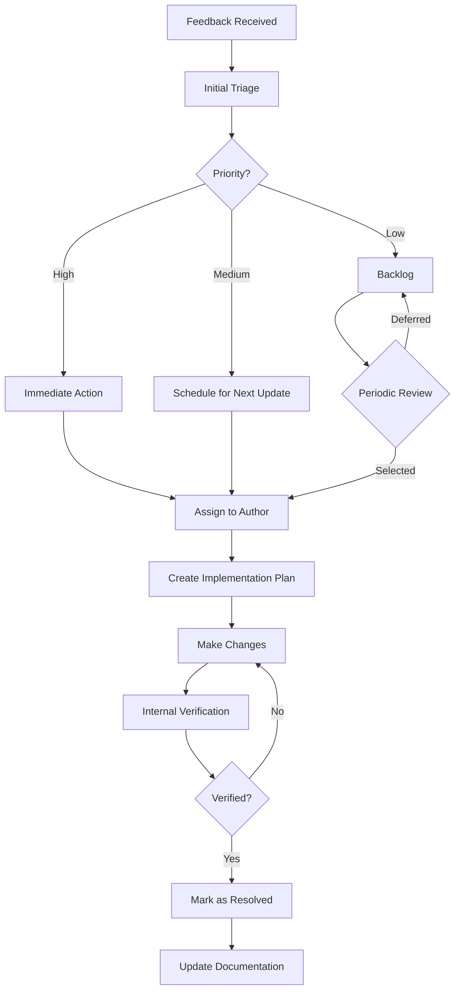

# Feedback Incorporation Process

## Overview

This document outlines the process for collecting, managing, and incorporating feedback received during the Memory Bank documentation review process. A structured approach to feedback management ensures that all feedback is properly evaluated and addressed, resulting in continuous improvement of documentation quality.

## Feedback Collection

Feedback is collected at multiple stages of the documentation lifecycle:

1. **During formal reviews**: Through the structured review process
2. **Post-publication**: From documentation users
3. **Periodic assessments**: During scheduled reviews of existing documentation

### Review Feedback Collection

During formal reviews, feedback should be:

- **Specific and actionable**: Clearly identifying what needs to be changed
- **Referenced**: Tied to specific sections or content
- **Categorized**: Labeled by type and severity
- **Constructive**: Focused on improving the documentation

Reviewers should provide feedback using a consistent format:

```
Section: [Section reference]
Issue: [Brief description of the issue]
Severity: [Critical/Major/Minor/Suggestion]
Details: [Detailed explanation]
Recommendation: [Specific suggestion for improvement]
```

### User Feedback Collection

Feedback from documentation users should be:

- Encouraged through visible feedback mechanisms
- Collected in a central location
- Acknowledged promptly
- Triaged for importance and urgency

## Feedback Management

All feedback should be tracked and managed systematically:

### Feedback Tracking System

1. **Repository**: All feedback should be stored in a centralized location
   - For formal reviews: Use pull request comments or a dedicated review document
   - For user feedback: Use an issue tracking system

2. **Categorization**: Feedback should be categorized by:
   - Type (Technical accuracy, Clarity, Completeness, Structure, Style)
   - Severity (Critical, Major, Minor, Suggestion)
   - Status (New, In Progress, Resolved, Deferred)
   - Document (Which document the feedback applies to)

3. **Prioritization**: Feedback should be prioritized based on:
   - Severity of the issue
   - Impact on documentation usability
   - Frequency of the issue across documents
   - Alignment with documentation goals

## Feedback Evaluation Process

Not all feedback will be incorporated. Each piece of feedback should be evaluated through a consistent process:

### Evaluation Steps

1. **Initial Triage**
   - Assess severity and priority
   - Determine if immediate action is required
   - Assign an owner for evaluation

2. **Detailed Assessment**
   - Validate technical accuracy of the feedback
   - Consult with SMEs if necessary
   - Consider impact on overall documentation
   - Estimate effort required to implement

3. **Decision**
   - Accept: Feedback will be incorporated
   - Modify: Feedback will be incorporated with modifications
   - Defer: Feedback will be considered for future updates
   - Decline: Feedback will not be incorporated (with reasons documented)

### Decision Criteria

Consider the following when evaluating feedback:

- **Accuracy**: Does the suggested change improve technical accuracy?
- **Alignment**: Does it align with documentation standards and goals?
- **Consistency**: Will it maintain consistency with other documentation?
- **User benefit**: Will it improve the user experience?
- **Effort vs. Impact**: Is the effort to implement proportional to the impact?

## Feedback Incorporation Workflow

The following workflow guides the process of incorporating accepted feedback:



### Implementation Steps

1. **Plan Changes**
   - Document intended changes
   - Consider dependencies and impacts
   - Create a timeline for implementation

2. **Make Changes**
   - Implement changes according to plan
   - Follow documentation standards
   - Track changes for later verification

3. **Verify Changes**
   - Ensure changes address the original feedback
   - Verify technical accuracy
   - Check for unintended consequences
   - Ensure consistency with other documentation

4. **Finalize**
   - Update feedback status
   - Notify stakeholders of changes
   - Document rationale for changes

## Feedback Response Guidelines

Authors should provide clear responses to all feedback:

### Response Types

1. **Accepted**: Changes implemented as suggested
   ```
   Thank you for your feedback. The suggested changes have been implemented in [section/file].
   ```

2. **Modified**: Changes implemented with modifications
   ```
   Thank you for your feedback. We've addressed your concern by [explanation of the modified approach].
   ```

3. **Deferred**: Changes will be considered for future updates
   ```
   Thank you for your feedback. This suggestion has been added to our backlog for consideration in a future update because [reason].
   ```

4. **Declined**: Changes will not be implemented
   ```
   Thank you for your feedback. After careful consideration, we have decided not to implement this suggestion because [reason]. We appreciate your understanding.
   ```

### Response Principles

All feedback responses should:

- Be respectful and appreciative
- Clearly communicate the decision
- Provide rationale for the decision
- Indicate next steps or timeline when applicable

## Special Scenarios

### Conflicting Feedback

When different reviewers provide conflicting feedback:

1. Identify the conflicting points
2. Consult with the Documentation Lead
3. Seek input from SMEs if needed
4. Prioritize technical accuracy
5. Document the decision and rationale

### Large-Scale Changes

When feedback suggests large-scale changes:

1. Assess the full scope of impact
2. Create a detailed implementation plan
3. Consider breaking down into smaller changes
4. Schedule changes across multiple documentation updates
5. Communicate the plan to stakeholders

### High-Priority Issues

For critical issues requiring immediate attention:

1. Initiate an expedited review process
2. Implement changes as quickly as possible
3. Notify affected users of the updates
4. Conduct a post-mortem to prevent similar issues

## Continuous Improvement

The feedback incorporation process itself should be regularly evaluated and improved:

1. Track metrics:
   - Time to respond to feedback
   - Time to implement changes
   - Feedback resolution rate
   - User satisfaction with documentation

2. Collect meta-feedback:
   - From authors about the feedback they receive
   - From reviewers about the feedback incorporation process
   - From users about their experience with the documentation

3. Regular process reviews:
   - Quarterly assessment of the feedback process
   - Identification of common feedback patterns
   - Updates to templates and guidelines based on lessons learned

## Templates

### Feedback Collection Template

```markdown
# Documentation Feedback

## Document Information
- **Document Title**: [Title]
- **Document Path**: [Path]
- **Version/Date**: [Version or date]

## Feedback Details

### Item 1
- **Section**: [Specific section reference]
- **Type**: [Technical accuracy/Clarity/Completeness/Structure/Style]
- **Severity**: [Critical/Major/Minor/Suggestion]
- **Description**: [Detailed description of the issue]
- **Suggestion**: [Proposed solution or improvement]

### Item 2
[repeat as needed]

## General Comments
[Any overall feedback that doesn't fit into specific sections]
```

### Feedback Implementation Plan Template

```markdown
# Feedback Implementation Plan

## Document Information
- **Document Title**: [Title]
- **Document Path**: [Path]

## Feedback Summary
[Brief summary of feedback received]

## Implementation Approach
[Overall approach to addressing the feedback]

## Specific Changes

### Change 1
- **Section**: [Specific section]
- **Original Feedback**: [Summary of original feedback]
- **Planned Change**: [Description of the planned change]
- **Rationale**: [Explanation of why this approach was chosen]
- **Dependencies**: [Any dependencies for this change]

### Change 2
[repeat as needed]

## Timeline
- **Estimated Start**: [Date]
- **Estimated Completion**: [Date]
- **Review Date**: [Date]

## Resources Needed
[Any additional resources required]
```

## Related Documents

- [Review Workflow](01_review_workflow.md)
- [Review Criteria](02_review_criteria.md)
- [Review Checklists](03_review_checklists.md)
- [Roles and Responsibilities](04_roles_and_responsibilities.md)
