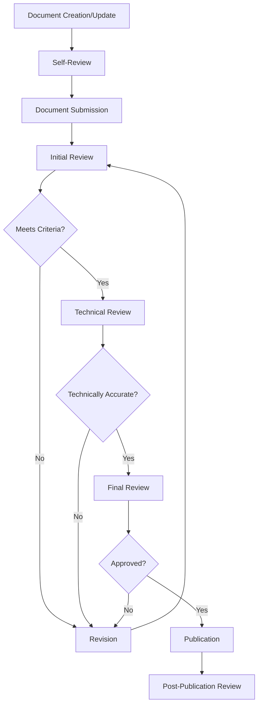

# Memory Bank Documentation Review Process

## Overview

This directory contains the complete documentation for the Memory Bank documentation review process. The review process is designed to ensure high-quality, consistent, and accurate documentation across the Memory Bank.

## Purpose

The documentation review process serves several key purposes:

1. **Ensure technical accuracy** of all Memory Bank documentation
2. **Maintain consistency** across documentation components
3. **Verify completeness** of documentation coverage
4. **Improve clarity and usability** for documentation users
5. **Establish standards** for documentation quality

## Process Components

The review process consists of several interconnected components, each documented in detail:

1. [**Review Workflow**](01_review_workflow.md) - The step-by-step process for documentation review
2. [**Review Criteria**](02_review_criteria.md) - The standards against which documentation is evaluated
3. [**Review Checklists**](03_review_checklists.md) - Practical checklists for different types of reviews
4. [**Roles and Responsibilities**](04_roles_and_responsibilities.md) - The roles involved in the review process
5. [**Feedback Incorporation Process**](05_feedback_incorporation.md) - How feedback is collected and addressed

## Quick Start Guide

For new participants in the documentation review process:

1. **Authors**: Start by reviewing the [Review Criteria](02_review_criteria.md) to understand the standards your documentation should meet. Before submitting documentation for review, use the appropriate checklist from [Review Checklists](03_review_checklists.md) to self-review your work.

2. **Reviewers**: Familiarize yourself with the [Review Workflow](01_review_workflow.md) and the [Roles and Responsibilities](04_roles_and_responsibilities.md) document to understand your role in the process. Use the appropriate checklist from [Review Checklists](03_review_checklists.md) to guide your review.

3. **Documentation Lead**: Review all documents in this directory to understand the complete process. Pay special attention to the [Feedback Incorporation Process](05_feedback_incorporation.md) to ensure effective management of feedback.

## Process Flow Diagram

The following diagram illustrates the high-level flow of the documentation review process:

## Applying the Process

The review process should be applied to:

- All new Memory Bank documentation
- Significant updates to existing documentation
- Periodic reviews of critical documentation

## Process Governance

The documentation review process is overseen by the Documentation Lead. The process itself should be reviewed quarterly and updated as needed based on feedback and changing project needs.

## Related Resources

- [Documentation Templates](../templates/) - Templates for different types of documentation
- [Memory Bank Generation Plan](../memory_bank_generation_plan.md) - Overall plan for Memory Bank documentation
