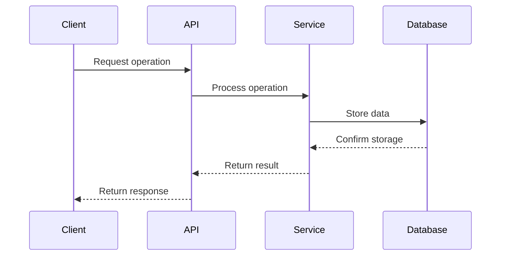
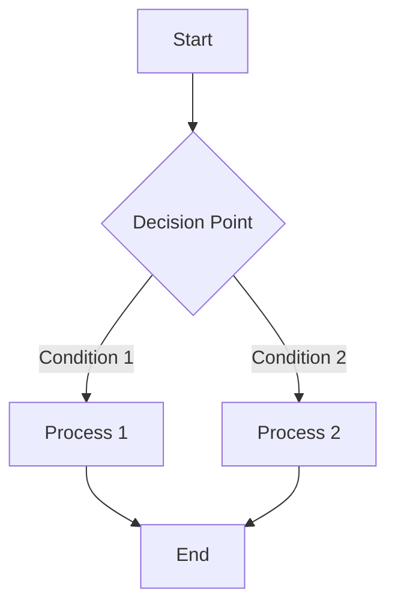

# [Flow Category] Flows

---
**Parent:** [Parent Document](../path/to/parent.md)  
**Last Updated:** [YYYY-MM-DD]  
**Related Files:**
- [Related Document 1](../path/to/related1.md)
- [Related Document 2](../path/to/related2.md)
- [Related Document 3](../path/to/related3.md)
---

[← Back to Parent Document](../path/to/parent.md)

## Overview

[Provide a concise overview of the flows covered in this document. Explain their purpose in the system, their importance, and any key concepts that apply to all flows in this category.]

## Key Flows

### [Flow Name 1]

[Describe the first major flow with an overview paragraph]

1. **[Step 1 Title]**: 
   - [Detailed description of what happens in this step]
   - [Additional details about this step]
   - [Any special considerations or edge cases]

2. **[Step 2 Title]**:
   - [Detailed description of what happens in this step]
   - [Additional details about this step]
   - [Any special considerations or edge cases]

3. **[Step 3 Title]**:
   - [Detailed description of what happens in this step]
   - [Additional details about this step]
   - [Any special considerations or edge cases]

4. **[Step 4 Title]**:
   - [Detailed description of what happens in this step]
   - [Additional details about this step]
   - [Any special considerations or edge cases]

5. **[Step 5 Title]**:
   - [Detailed description of what happens in this step]
   - [Additional details about this step]
   - [Any special considerations or edge cases]

This flow is implemented in the `[module_name]` module of the `[component_name]` component.

### [Flow Name 2]

[Describe the second major flow with an overview paragraph]

1. **[Step 1 Title]**: 
   - [Detailed description of what happens in this step]
   - [Additional details about this step]
   - [Any special considerations or edge cases]

2. **[Step 2 Title]**:
   - [Detailed description of what happens in this step]
   - [Additional details about this step]
   - [Any special considerations or edge cases]

3. **[Step 3 Title]**:
   - [Detailed description of what happens in this step]
   - [Additional details about this step]
   - [Any special considerations or edge cases]

4. **[Step 4 Title]**:
   - [Detailed description of what happens in this step]
   - [Additional details about this step]
   - [Any special considerations or edge cases]

This flow is implemented in the `[module_name]` module of the `[component_name]` component.

### [Flow Name 3]

[Describe the third major flow with an overview paragraph]

1. **[Step 1 Title]**: 
   - [Detailed description of what happens in this step]
   - [Additional details about this step]
   - [Any special considerations or edge cases]

2. **[Step 2 Title]**:
   - [Detailed description of what happens in this step]
   - [Additional details about this step]
   - [Any special considerations or edge cases]

[...additional steps as needed...]

This flow is implemented in the `[module_name]` module of the `[component_name]` component.

## Flow Diagrams

[Include sequence diagrams or flowcharts for complex flows. Use Mermaid syntax for diagrams.]

### [Flow Name 1] Sequence Diagram



### [Flow Name 2] Flowchart



## Error Handling

[Describe the error handling strategies employed across these flows. Include common error scenarios and how they are handled.]

### Common Error Scenarios

- **[Error Scenario 1]**: [Describe how this error is handled]
- **[Error Scenario 2]**: [Describe how this error is handled]
- **[Error Scenario 3]**: [Describe how this error is handled]

### Retry Strategies

[If applicable, describe retry strategies used in these flows]

1. **[Retry Strategy 1]**: [Describe this retry approach]
2. **[Retry Strategy 2]**: [Describe this retry approach]
3. **[Retry Strategy 3]**: [Describe this retry approach]

## Edge Cases and Special Scenarios

[Document important edge cases and special scenarios that these flows handle]

### [Edge Case 1]

[Describe how the flow handles this edge case]

### [Edge Case 2]

[Describe how the flow handles this edge case]

## Performance Considerations

[Document any performance considerations for these flows]

- **[Performance Aspect 1]**: [Description]
- **[Performance Aspect 2]**: [Description]
- **[Performance Aspect 3]**: [Description]

## Dependencies

[List and describe the components, services, or external systems these flows depend on]

- **[Dependency 1]**: [Describe how this dependency is used in the flows]
- **[Dependency 2]**: [Describe how this dependency is used in the flows]
- **[Dependency 3]**: [Describe how this dependency is used in the flows]

## Implementation Details

### Code Structure

[Provide information about where these flows are implemented in the codebase]

```
[crate_name]/
└── src/
    ├── [module_path]/
    │   ├── [file1].rs     # Implements [flow 1]
    │   ├── [file2].rs     # Implements [flow 2]
    │   └── [file3].rs     # Implements [flow 3]
    └── ...
```

### Key Interfaces

[Document the key interfaces, traits, or functions involved in these flows]

```rust
// Example key interface for these flows
pub trait FlowHandler {
    async fn handle_flow(&self, input: Input) -> Result<Output, Error>;
}
```

## Configuration Options

[Document any configuration options that affect the behavior of these flows]

- **[Config Option 1]**: [Description and possible values]
- **[Config Option 2]**: [Description and possible values]
- **[Config Option 3]**: [Description and possible values]

## Testing Strategy

[Describe how these flows are tested]

- **Unit Tests**: [Description of unit testing approach]
- **Integration Tests**: [Description of integration testing approach]
- **End-to-End Tests**: [Description of E2E testing approach]

## See Also

- [Related Documentation 1](path/to/related1.md)
- [Related Documentation 2](path/to/related2.md)
- [Related Documentation 3](path/to/related3.md)
