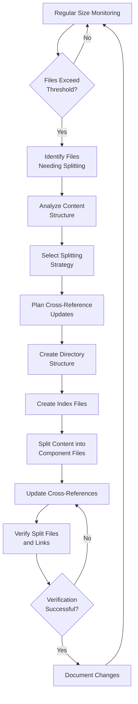

# File Size Management Process

This document provides a comprehensive guide to implementing and maintaining file size management in the Memory Bank documentation. It integrates the tools, techniques, and workflows established in the previous documents to create a complete process for managing file sizes effectively.

## Overview

The file size management process ensures that Memory Bank documentation remains within optimal size limits (300 lines per file) while maintaining structural integrity, navigability, and content coherence. This process allows documentation to remain accessible and efficient for both human readers and AI tools.

## Process Workflow

The file size management process follows this workflow:



## Phase 1: Identification and Analysis

### 1.1 Regular Monitoring

Schedule regular file size monitoring using the identification script:

```bash
# Run monthly to identify large files
./memory-bank/thematic/project_management/file_size_management/identify_large_files.sh
```

The script generates a report at:
```
/memory-bank/thematic/project_management/file_size_management/large_files_report.md
```

### 1.2 File Identification

Review the generated report to identify files requiring action:

1. **Critical Priority**: Files exceeding 300 lines
2. **High Priority**: Files at 270-300 lines with high update frequency
3. **Medium Priority**: Files at 270-300 lines with low update frequency

Refer to the [File Identification Criteria](file_identification_criteria.md) document for detailed criteria.

### 1.3 Content Analysis

For each file identified for splitting:

1. **Map Content Structure**
   - Identify major sections and topics
   - Measure section sizes (line count)
   - Note logical divisions in content

2. **Identify Reference Patterns**
   - Document internal references (section to section)
   - Identify external references to this file
   - Note bidirectional reference relationships

3. **Assess Content Type**
   - Categorize content (flow documentation, API reference, etc.)
   - Determine appropriate splitting strategy
   - Consider content coherence requirements

## Phase 2: Planning and Preparation

### 2.1 Strategy Selection

Based on content analysis, select the appropriate splitting strategy:

1. **Topic-Based Splitting**
   - For files covering multiple distinct topics
   - Example: `crateIndex.md` → `/indices/` directory with category files

2. **Hierarchical Splitting**
   - For files with a parent-child information structure
   - Example: `payment_flows.md` → `/flows/payments/` directory with stage files

3. **Temporal Splitting**
   - For files containing current and historical content
   - Example: Current implementations and deprecated approaches

Refer to the [File Splitting Strategy](file_splitting_strategy.md) document for detailed guidelines.

### 2.2 Reference Management Planning

Create a reference update plan:

1. **Identify All References**
   ```bash
   # Find references to the file being split
   grep -r "payment_flows.md" --include="*.md" /Users/arunraj/github/hyperswitch/memory-bank
   ```

2. **Create Reference Mapping**
   ```
   Original: payment_flows.md → New: payments/overview.md
   Original: payment_flows.md#payment-initiation → New: payments/initiation.md
   ```

3. **Plan Update Sequence**
   - Determine order of file updates
   - Identify high-priority references
   - Plan any temporary redirects

Refer to the [Cross-Reference Update System](cross_reference_update_system.md) document for detailed guidelines.

### 2.3 Directory Structure Planning

Design the target directory structure:

1. **Create Directory Plan**
   ```
   /flows/
   ├── overview.md                 # Main index for all flows
   ├── payments/                   # Payment flows directory
   │   ├── overview.md             # Payment flows index
   │   ├── initiation.md           # Payment initiation details
   │   ├── processing.md           # Payment processing details
   │   └── completion.md           # Payment completion details
   └── [other flow directories]
   ```

2. **Plan Index Structure**
   - Design overview/index file structure
   - Plan navigation between component files
   - Consider breadcrumb implementation

Refer to the [Index Creation Process](index_creation_process.md) document for detailed guidelines.

## Phase 3: Implementation

### 3.1 Directory Creation

Create the necessary directory structure:

```bash
# Create directory structure for split files
mkdir -p /Users/arunraj/github/hyperswitch/memory-bank/thematic/flows/payments
```

### 3.2 Index File Creation

Create the index/overview file first:

1. **Main Index Content**
   - Include introduction and purpose
   - Add TOC with links to component files
   - Preserve key concepts at high level

2. **Add Navigation Aids**
   - Include breadcrumbs
   - Add "Next/Previous" links if appropriate
   - Provide "See Also" sections

3. **Add Metadata**
   ```markdown
   ---
   title: Payment Flows Overview
   last_updated: 2025-05-27
   position: 1
   ---
   ```

Refer to the templates in [Index Creation Process](index_creation_process.md).

### 3.3 Content Splitting

Split the content into component files:

1. **Extract Content Sections**
   - Move each section to its appropriate file
   - Maintain heading hierarchy in component files
   - Ensure each file is independently readable

2. **Add Cross-References**
   - Add links between related component files
   - Include "Back to Overview" links
   - Maintain section anchors for deep linking

3. **Add Metadata to All Files**
   ```markdown
   ---
   title: Payment Initiation
   parent: Payment Flows Overview
   parent_path: ../overview.md
   position: 2
   last_updated: 2025-05-27
   ---
   ```

### 3.4 Reference Updates

Update all references to maintain integrity:

1. **Update Internal References**
   - Convert section links to file links
   - Update anchor references
   - Add context when necessary

2. **Update External References**
   ```bash
   # Example update command (use with caution)
   find /Users/arunraj/github/hyperswitch/memory-bank -name "*.md" -type f -exec sed -i 's|payment_flows.md#payment-processing|flows/payments/processing.md|g' {} \;
   ```

3. **Add Redirection Anchors**
   ```markdown
   # Payment Flows Overview
   
   <a id="payment-processing"></a>
   ## Processing
   
   This content has moved to [Payment Processing](./processing.md).
   ```

Refer to the techniques in [Cross-Reference Update System](cross_reference_update_system.md).

## Phase 4: Verification and Documentation

### 4.1 Link Verification

Verify all links and references:

1. **Manual Testing**
   - Navigate through the documentation
   - Test all links from index to components
   - Verify cross-references between components

2. **Automated Checking**
   ```bash
   # Example command for link checking
   find /Users/arunraj/github/hyperswitch/memory-bank -name "*.md" -exec grep -l "payment_flows.md" {} \;
   ```

3. **Fix Any Issues**
   - Update any missed references
   - Correct any navigation problems
   - Ensure consistent linking patterns

### 4.2 Documentation Update

Document the changes made:

1. **Update Implementation Status**
   - Add entry to the implementation status table
   - Document splitting strategy used
   - Note any special considerations

2. **Update File Size Management Guide**
   - Add any new techniques or patterns
   - Document lessons learned
   - Provide examples for future reference

3. **Notify Team**
   - Inform team of documentation structure changes
   - Provide guidance on new navigation patterns
   - Highlight any changed references

## Maintenance Guidelines

### Regular Reviews

Schedule periodic reviews of documentation size:

1. **Monthly Size Checks**
   - Run the identification script monthly
   - Review growth trends in documentation
   - Identify files approaching thresholds

2. **Quarterly Structure Reviews**
   - Review effectiveness of current structure
   - Identify any navigation pain points
   - Consider improvements to organization

3. **Biannual Cross-Reference Audits**
   - Verify all links and references
   - Fix any broken links
   - Update any outdated references

### Documentation Evolution

As the Memory Bank evolves:

1. **Proactive Splitting**
   - Split files before they reach size limits
   - Plan directory structures for growing areas
   - Implement modular documentation from the start

2. **Structure Refinement**
   - Refine directory structures as needed
   - Adjust navigation patterns based on usage
   - Consolidate underutilized directories

3. **Process Improvement**
   - Update this process based on experience
   - Refine tools and scripts
   - Share best practices with the team

## Implementation Case Studies

### Case Study 1: Payment Flows Documentation

The payment flows documentation (`payment_flows.md`, 617 lines) was split using hierarchical splitting:

1. **Directory Structure Created**
   ```
   /flows/
   ├── overview.md                 # Main index for all flows
   ├── payments/                   # Payment flows directory
   │   ├── overview.md             # Payment flows index
   │   ├── initiation.md           # Payment initiation details
   │   ├── processing.md           # Payment processing details
   │   └── completion.md           # Payment completion details
   ```

2. **Index Files Created**
   - Main flows index with links to all flow types
   - Payment-specific index with detailed overview

3. **References Updated**
   - 25 external references updated
   - Bidirectional references with webhook documentation maintained
   - Navigation links added between component files

4. **Results**
   - 5 files under 300 lines each replaced one 617-line file
   - Improved navigation and readability
   - All references maintained without breakage

### Case Study 2: Crate Index Documentation

The crate index (`crateIndex.md`, 693 lines) was split using category-based splitting:

1. **Directory Structure Created**
   ```
   /indices/
   ├── crate-index.md              # Main index with categorization
   ├── core-crates.md              # Details on core crates
   ├── utility-crates.md           # Details on utility crates
   ├── connector-crates.md         # Details on connector crates
   └── supporting-crates.md        # Details on other crates
   ```

2. **Category Organization**
   - Crates organized by functional category
   - Each category in a separate file
   - Index file providing organization overview

3. **References Updated**
   - Updated references in documentation index
   - Maintained alphabetical listing in categories
   - Added cross-references between related crates

4. **Results**
   - Improved organization and findability
   - Each file under size limits
   - Better maintainability for future crate additions

## Tools and Resources

### Scripts

The following scripts support the file size management process:

1. **[identify_large_files.sh](identify_large_files.sh)**
   - Identifies files exceeding size thresholds
   - Generates a report of files needing attention
   - Automatically detects files approaching thresholds

2. **Reference Checking (Future Development)**
   - Validate cross-references after splitting
   - Identify broken or outdated links
   - Generate reference update reports

### Templates

Templates to use when implementing file size management:

1. **[Overview Index Template](index_creation_process.md#overview-index-template)**
   - Use for main entry point files
   - Includes standard sections and navigation

2. **[Category Index Template](index_creation_process.md#category-index-template)**
   - Use for category-based organization
   - Includes grouping and classification structure

3. **[Component File Template](index_creation_process.md#component-file-template)**
   - Use for individual component files
   - Includes metadata and standard sections

### Documentation

Reference these documents for specific aspects of file size management:

1. **[File Identification Criteria](file_identification_criteria.md)**
   - Criteria for identifying files needing splitting
   - Size thresholds and other considerations

2. **[File Splitting Strategy](file_splitting_strategy.md)**
   - Strategies for different content types
   - Implementation guidelines by content type

3. **[Index Creation Process](index_creation_process.md)**
   - Process for creating effective index files
   - Templates and examples

4. **[Cross-Reference Update System](cross_reference_update_system.md)**
   - System for managing cross-references
   - Techniques for maintaining reference integrity

## Related Documents

- [File Identification Criteria](file_identification_criteria.md)
- [File Splitting Strategy](file_splitting_strategy.md)
- [Index Creation Process](index_creation_process.md)
- [Cross-Reference Update System](cross_reference_update_system.md)
- [File Size Management Guide](../file_size_management_guide.md)
