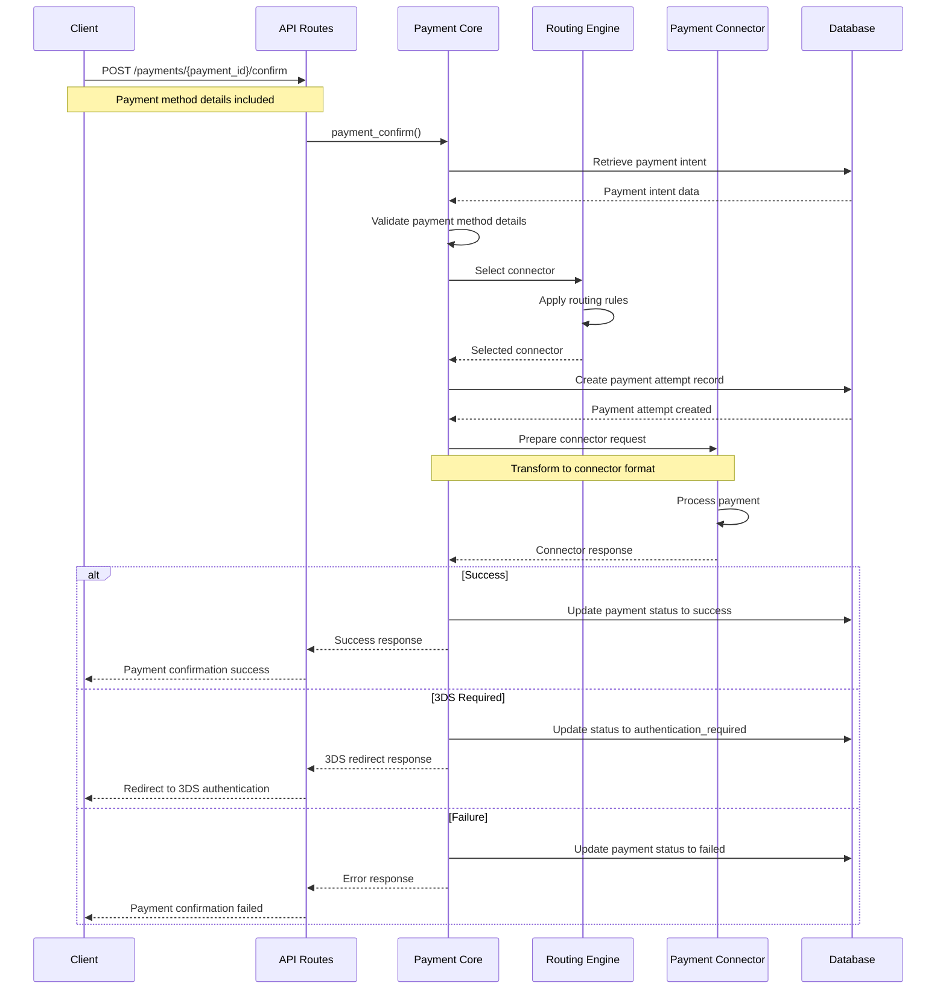

# Router Documentation Enhancement Plan

## Overview

This document outlines the implementation plan for Task 4: Router Documentation Enhancement. The task involves enhancing the router documentation with comprehensive flow diagrams and implementation details, focusing on payment flows, refund flows, webhook flows, configuration options, and extension points.

## Analysis of Current Documentation

The current router flow documentation exists in three files:
- `payment_flows.md`
- `refund_flows.md`
- `webhook_flows.md`

All three files are marked as "Complete" in their metadata, but they're missing key sections compared to the flow documentation template, such as:

1. Flow Diagrams (sequence diagrams and flowcharts)
2. Detailed Error Handling sections
3. Edge Cases and Special Scenarios
4. Implementation Details (code structure and key interfaces)
5. Performance Considerations
6. Testing Strategy

Additionally, documentation about configuration options and extension points for the router is minimal or missing entirely.

## Task Complexity Assessment

This is a high-complexity task for several reasons:

1. **Technical Understanding Required**: Creating accurate sequence diagrams and detailed implementation documentation requires deep understanding of the router codebase and component interactions.

2. **Scope**: The task covers three major flow types plus configuration options and extension points, representing a substantial amount of content.

3. **Diagram Creation**: Creating accurate sequence diagrams for complex payment flows requires careful analysis of component interactions.

4. **Ensuring Completeness**: Error handling and edge cases sections need to be comprehensive, requiring identification of all possible scenarios.

5. **Technical Accuracy**: All added documentation must be technically accurate and consistent with the actual implementation.

## Implementation Approach

To manage this complexity, the task will be broken down into the following subtasks:

### Subtask 1: Payment Flow Enhancement

1. Add sequence diagrams for each major payment flow:
   - Payment Creation Flow
   - Payment Confirmation Flow
   - 3D Secure Authentication Flow
   - Payment Capture Flow
   - Payment Cancellation (Void) Flow
   - Payment Status Sync Flow

2. Expand error handling section with comprehensive error scenarios
3. Document edge cases and special scenarios
4. Add implementation details section with code structure and key interfaces
5. Add performance considerations
6. Add testing strategy

### Subtask 2: Refund Flow Enhancement

1. Add sequence diagrams for each major refund flow:
   - Refund Creation Flow
   - Refund Status Sync Flow
   - Multiple Refunds Flow
   - Asynchronous Refund Processing Flow

2. Expand error handling section
3. Document edge cases and special scenarios
4. Add implementation details section
5. Add performance considerations
6. Add testing strategy

### Subtask 3: Webhook Flow Enhancement

1. Add sequence diagrams for webhook flows:
   - Incoming Webhook Flow
   - Outgoing Webhook Flow
   - Webhook Recovery Flow

2. Expand error handling section
3. Document webhook security in more detail
4. Add implementation details section
5. Add performance considerations
6. Add testing strategy

### Subtask 4: Router Configuration Documentation

1. Create or enhance documentation on configuration options related to flows
2. Document how configuration affects flow behavior
3. Provide examples of common configurations

### Subtask 5: Extension Points Documentation

1. Document how to extend router functionality
2. Provide examples of extension implementation
3. Document extension point interfaces and contracts

## Implementation Process

For each subtask, the following process will be followed:

1. **Start with one flow type**: Begin with Payment Flows since it's the most central and complex part of the router.

2. **Gather implementation details**: For each flow, review the actual code implementation in the router crate to ensure technical accuracy. This will involve examining code in directories like:
   - `crates/router/src/core/payments`
   - `crates/router/src/core/refunds.rs` and `refunds_v2.rs`
   - `crates/router/src/core/webhooks`

3. **Create sequence diagrams**: Use Mermaid syntax to create sequence diagrams for each major flow. Start with simple diagrams and iteratively add more detail. The diagrams should show:
   - All major components involved in the flow
   - The sequence of interactions between components
   - Decision points and branching paths
   - Error handling paths

4. **Document error handling comprehensively**: For each flow, document:
   - Common error scenarios
   - How errors are handled at each step
   - Recovery mechanisms
   - How errors are communicated to clients

5. **Add implementation details**: Document the code structure, key interfaces, and important implementation patterns used in each flow.

6. **Document configuration and extension points**: After completing the flow documentation, document configuration options and extension points that affect or interact with these flows.

## Example: Payment Confirmation Flow Diagram

Here's an example of how a sequence diagram for the Payment Confirmation Flow would look:

## Estimated Effort

Based on the complexity of each subtask:

1. Payment Flow Enhancement: High effort (complex flows, multiple diagrams)
2. Refund Flow Enhancement: Medium effort (fewer flows than payments)
3. Webhook Flow Enhancement: Medium effort (fewer flows than payments)
4. Router Configuration Documentation: Medium effort (requires gathering config details)
5. Extension Points Documentation: Medium-High effort (requires deep understanding of extension mechanisms)

## Next Steps

1. Start with Subtask 1: Payment Flow Enhancement
2. Create sequence diagrams for each payment flow
3. Enhance error handling documentation
4. Add implementation details
5. Move to subsequent subtasks

## Dependencies

This task requires:
1. Understanding of the router codebase structure
2. Knowledge of payment, refund, and webhook processing flows
3. Familiarity with the flow documentation template
4. Ability to create Mermaid sequence diagrams
